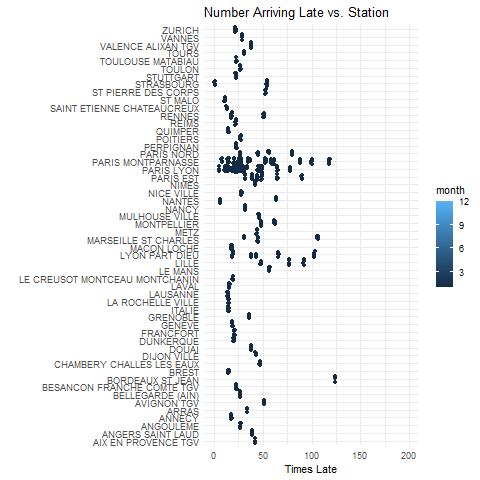

```r
library(tidyverse)     # for data cleaning and plotting
library(gardenR)       # for Lisa's garden data
library(lubridate)     # for date manipulation
library(openintro)     # for the abbr2state() function
library(palmerpenguins)# for Palmer penguin data
library(maps)          # for map data
library(ggmap)         # for mapping points on maps
library(gplots)        # for col2hex() function
library(RColorBrewer)  # for color palettes
library(sf)            # for working with spatial data
library(leaflet)       # for highly customizable mapping
library(ggthemes)      # for more themes (including theme_map())
library(plotly)        # for the ggplotly() - basic interactivity
library(gganimate)     # for adding animation layers to ggplots
library(transformr)    # for "tweening" (gganimate)
library(gifski)        # need the library for creating gifs but don't need to load each time
library(shiny)         # for creating interactive apps
theme_set(theme_minimal())
```


```r
# SNCF Train data
small_trains <- read_csv("https://raw.githubusercontent.com/rfordatascience/tidytuesday/master/data/2019/2019-02-26/small_trains.csv") 

# Lisa's garden data
data("garden_harvest")

# Lisa's Mallorca cycling data
mallorca_bike_day7 <- read_csv("https://www.dropbox.com/s/zc6jan4ltmjtvy0/mallorca_bike_day7.csv?dl=1") %>% 
  select(1:4, speed)

# Heather Lendway's Ironman 70.3 Pan Am championships Panama data
panama_swim <- read_csv("https://raw.githubusercontent.com/llendway/gps-data/master/data/panama_swim_20160131.csv")

panama_bike <- read_csv("https://raw.githubusercontent.com/llendway/gps-data/master/data/panama_bike_20160131.csv")

panama_run <- read_csv("https://raw.githubusercontent.com/llendway/gps-data/master/data/panama_run_20160131.csv")

#COVID-19 data from the New York Times
covid19 <- read_csv("https://raw.githubusercontent.com/nytimes/covid-19-data/master/us-states.csv")
```


## Instructions

* Put your name at the top of the document. 

* **For ALL graphs, you should include appropriate labels.** 

* Feel free to change the default theme, which I currently have set to `theme_minimal()`. 

* Use good coding practice. Read the short sections on good code with [pipes](https://style.tidyverse.org/pipes.html) and [ggplot2](https://style.tidyverse.org/ggplot2.html). **This is part of your grade!**

* **NEW!!** With animated graphs, add `eval=FALSE` to the code chunk that creates the animation and saves it using `anim_save()`. Add another code chunk to reread the gif back into the file. See the [tutorial](https://animation-and-interactivity-in-r.netlify.app/) for help. 

* When you are finished with ALL the exercises, uncomment the options at the top so your document looks nicer. Don't do it before then, or else you might miss some important warnings and messages.

## Warm-up exercises from tutorial

  1. Choose 2 graphs you have created for ANY assignment in this class and add interactivity using the `ggplotly()` function.
  

```r
gardengraph <- garden_harvest %>%
  mutate(week = week(date)) %>%
  group_by(week) %>%
  summarize(weeklycount = n_distinct(vegetable),
            totalweight = sum(weight)) %>%
  ggplot(aes(x = week, 
             y = weeklycount, 
             fill = totalweight)) +
  geom_col(bins = 20L) +
  labs(title = "      Weeks in the Year vs. Different Varieties of Plants Harvested", 
       x = "", 
       y = "", 
       fill = "Total Weight (by Color)") 
 
ggplotly(gardengraph)
```

<!--html_preserve--><div id="htmlwidget-16f569bef8b8899dbcc3" style="width:672px;height:480px;" class="plotly html-widget"></div>
<script type="application/json" data-for="htmlwidget-16f569bef8b8899dbcc3">{"x":{"data":[{"orientation":"v","width":0.899999999999999,"base":0,"x":[23],"y":[2],"text":"week: 23<br />weeklycount:  2<br />totalweight:    81","type":"bar","marker":{"autocolorscale":false,"color":"rgba(19,43,67,1)","line":{"width":1.88976377952756,"color":"transparent"}},"showlegend":false,"xaxis":"x","yaxis":"y","hoverinfo":"text","frame":null},{"orientation":"v","width":0.899999999999999,"base":0,"x":[24],"y":[5],"text":"week: 24<br />weeklycount:  5<br />totalweight:   192","type":"bar","marker":{"autocolorscale":false,"color":"rgba(19,43,67,1)","line":{"width":1.88976377952756,"color":"transparent"}},"showlegend":false,"xaxis":"x","yaxis":"y","hoverinfo":"text","frame":null},{"orientation":"v","width":0.899999999999999,"base":0,"x":[25],"y":[12],"text":"week: 25<br />weeklycount: 12<br />totalweight:  1721","type":"bar","marker":{"autocolorscale":false,"color":"rgba(20,45,70,1)","line":{"width":1.88976377952756,"color":"transparent"}},"showlegend":false,"xaxis":"x","yaxis":"y","hoverinfo":"text","frame":null},{"orientation":"v","width":0.899999999999999,"base":0,"x":[26],"y":[6],"text":"week: 26<br />weeklycount:  6<br />totalweight:  3678","type":"bar","marker":{"autocolorscale":false,"color":"rgba(22,48,74,1)","line":{"width":1.88976377952756,"color":"transparent"}},"showlegend":false,"xaxis":"x","yaxis":"y","hoverinfo":"text","frame":null},{"orientation":"v","width":0.899999999999999,"base":0,"x":[27],"y":[8],"text":"week: 27<br />weeklycount:  8<br />totalweight:  4483","type":"bar","marker":{"autocolorscale":false,"color":"rgba(22,50,76,1)","line":{"width":1.88976377952756,"color":"transparent"}},"showlegend":false,"xaxis":"x","yaxis":"y","hoverinfo":"text","frame":null},{"orientation":"v","width":0.899999999999999,"base":0,"x":[28],"y":[14],"text":"week: 28<br />weeklycount: 14<br />totalweight:  5693","type":"bar","marker":{"autocolorscale":false,"color":"rgba(23,51,78,1)","line":{"width":1.88976377952756,"color":"transparent"}},"showlegend":false,"xaxis":"x","yaxis":"y","hoverinfo":"text","frame":null},{"orientation":"v","width":0.900000000000006,"base":0,"x":[40],"y":[5],"text":"week: 40<br />weeklycount:  5<br />totalweight:  6015","type":"bar","marker":{"autocolorscale":false,"color":"rgba(24,52,79,1)","line":{"width":1.88976377952756,"color":"transparent"}},"showlegend":false,"xaxis":"x","yaxis":"y","hoverinfo":"text","frame":null},{"orientation":"v","width":0.900000000000006,"base":0,"x":[37],"y":[5],"text":"week: 37<br />weeklycount:  5<br />totalweight:  7014","type":"bar","marker":{"autocolorscale":false,"color":"rgba(24,53,81,1)","line":{"width":1.88976377952756,"color":"transparent"}},"showlegend":false,"xaxis":"x","yaxis":"y","hoverinfo":"text","frame":null},{"orientation":"v","width":0.899999999999999,"base":0,"x":[29],"y":[17],"text":"week: 29<br />weeklycount: 17<br />totalweight:  8681","type":"bar","marker":{"autocolorscale":false,"color":"rgba(26,56,84,1)","line":{"width":1.88976377952756,"color":"transparent"}},"showlegend":false,"xaxis":"x","yaxis":"y","hoverinfo":"text","frame":null},{"orientation":"v","width":0.899999999999999,"base":0,"x":[30],"y":[16],"text":"week: 30<br />weeklycount: 16<br />totalweight: 13759","type":"bar","marker":{"autocolorscale":false,"color":"rgba(30,64,95,1)","line":{"width":1.88976377952756,"color":"transparent"}},"showlegend":false,"xaxis":"x","yaxis":"y","hoverinfo":"text","frame":null},{"orientation":"v","width":0.900000000000006,"base":0,"x":[39],"y":[9],"text":"week: 39<br />weeklycount:  9<br />totalweight: 14449","type":"bar","marker":{"autocolorscale":false,"color":"rgba(30,65,97,1)","line":{"width":1.88976377952756,"color":"transparent"}},"showlegend":false,"xaxis":"x","yaxis":"y","hoverinfo":"text","frame":null},{"orientation":"v","width":0.899999999999999,"base":0,"x":[31],"y":[16],"text":"week: 31<br />weeklycount: 16<br />totalweight: 20122","type":"bar","marker":{"autocolorscale":false,"color":"rgba(35,74,109,1)","line":{"width":1.88976377952756,"color":"transparent"}},"showlegend":false,"xaxis":"x","yaxis":"y","hoverinfo":"text","frame":null},{"orientation":"v","width":0.900000000000006,"base":0,"x":[36],"y":[8],"text":"week: 36<br />weeklycount:  8<br />totalweight: 26434","type":"bar","marker":{"autocolorscale":false,"color":"rgba(40,84,123,1)","line":{"width":1.88976377952756,"color":"transparent"}},"showlegend":false,"xaxis":"x","yaxis":"y","hoverinfo":"text","frame":null},{"orientation":"v","width":0.900000000000002,"base":0,"x":[32],"y":[13],"text":"week: 32<br />weeklycount: 13<br />totalweight: 26785","type":"bar","marker":{"autocolorscale":false,"color":"rgba(40,85,123,1)","line":{"width":1.88976377952756,"color":"transparent"}},"showlegend":false,"xaxis":"x","yaxis":"y","hoverinfo":"text","frame":null},{"orientation":"v","width":0.900000000000006,"base":0,"x":[33],"y":[14],"text":"week: 33<br />weeklycount: 14<br />totalweight: 33453","type":"bar","marker":{"autocolorscale":false,"color":"rgba(46,96,138,1)","line":{"width":1.88976377952756,"color":"transparent"}},"showlegend":false,"xaxis":"x","yaxis":"y","hoverinfo":"text","frame":null},{"orientation":"v","width":0.900000000000006,"base":0,"x":[34],"y":[14],"text":"week: 34<br />weeklycount: 14<br />totalweight: 38617","type":"bar","marker":{"autocolorscale":false,"color":"rgba(50,105,150,1)","line":{"width":1.88976377952756,"color":"transparent"}},"showlegend":false,"xaxis":"x","yaxis":"y","hoverinfo":"text","frame":null},{"orientation":"v","width":0.900000000000006,"base":0,"x":[41],"y":[10],"text":"week: 41<br />weeklycount: 10<br />totalweight: 40680","type":"bar","marker":{"autocolorscale":false,"color":"rgba(52,108,155,1)","line":{"width":1.88976377952756,"color":"transparent"}},"showlegend":false,"xaxis":"x","yaxis":"y","hoverinfo":"text","frame":null},{"orientation":"v","width":0.900000000000006,"base":0,"x":[42],"y":[9],"text":"week: 42<br />weeklycount:  9<br />totalweight: 41810","type":"bar","marker":{"autocolorscale":false,"color":"rgba(53,110,157,1)","line":{"width":1.88976377952756,"color":"transparent"}},"showlegend":false,"xaxis":"x","yaxis":"y","hoverinfo":"text","frame":null},{"orientation":"v","width":0.900000000000006,"base":0,"x":[35],"y":[15],"text":"week: 35<br />weeklycount: 15<br />totalweight: 59756","type":"bar","marker":{"autocolorscale":false,"color":"rgba(69,142,200,1)","line":{"width":1.88976377952756,"color":"transparent"}},"showlegend":false,"xaxis":"x","yaxis":"y","hoverinfo":"text","frame":null},{"orientation":"v","width":0.900000000000006,"base":0,"x":[38],"y":[10],"text":"week: 38<br />weeklycount: 10<br />totalweight: 78832","type":"bar","marker":{"autocolorscale":false,"color":"rgba(86,177,247,1)","line":{"width":1.88976377952756,"color":"transparent"}},"showlegend":false,"xaxis":"x","yaxis":"y","hoverinfo":"text","frame":null},{"x":[25],"y":[1.11022302462516e-16],"name":"99_aa47d201a4d3022e32a1125781261d2e","type":"scatter","mode":"markers","opacity":0,"hoverinfo":"skip","showlegend":false,"marker":{"color":[0,1],"colorscale":[[0,"#132B43"],[0.00334448160535117,"#132B44"],[0.00668896321070234,"#132C44"],[0.0100334448160535,"#142C45"],[0.0133779264214047,"#142D45"],[0.0167224080267559,"#142D46"],[0.020066889632107,"#142D46"],[0.0234113712374582,"#142E47"],[0.0267558528428094,"#152E47"],[0.0301003344481605,"#152F48"],[0.0334448160535117,"#152F48"],[0.0367892976588629,"#152F49"],[0.040133779264214,"#153049"],[0.0434782608695652,"#16304A"],[0.0468227424749164,"#16304A"],[0.0501672240802676,"#16314B"],[0.0535117056856187,"#16314B"],[0.0568561872909699,"#16324C"],[0.0602006688963211,"#17324D"],[0.0635451505016722,"#17324D"],[0.0668896321070234,"#17334E"],[0.0702341137123746,"#17334E"],[0.0735785953177257,"#17344F"],[0.0769230769230769,"#18344F"],[0.0802675585284281,"#183450"],[0.0836120401337793,"#183550"],[0.0869565217391304,"#183551"],[0.0903010033444816,"#183651"],[0.0936454849498328,"#193652"],[0.0969899665551839,"#193652"],[0.100334448160535,"#193753"],[0.103678929765886,"#193754"],[0.107023411371237,"#193854"],[0.110367892976589,"#1A3855"],[0.11371237458194,"#1A3955"],[0.117056856187291,"#1A3956"],[0.120401337792642,"#1A3956"],[0.123745819397993,"#1A3A57"],[0.127090301003344,"#1B3A57"],[0.130434782608696,"#1B3B58"],[0.133779264214047,"#1B3B59"],[0.137123745819398,"#1B3B59"],[0.140468227424749,"#1C3C5A"],[0.1438127090301,"#1C3C5A"],[0.147157190635451,"#1C3D5B"],[0.150501672240803,"#1C3D5B"],[0.153846153846154,"#1C3D5C"],[0.157190635451505,"#1D3E5C"],[0.160535117056856,"#1D3E5D"],[0.163879598662207,"#1D3F5D"],[0.167224080267559,"#1D3F5E"],[0.17056856187291,"#1D3F5F"],[0.173913043478261,"#1E405F"],[0.177257525083612,"#1E4060"],[0.180602006688963,"#1E4160"],[0.183946488294314,"#1E4161"],[0.187290969899666,"#1E4261"],[0.190635451505017,"#1F4262"],[0.193979933110368,"#1F4263"],[0.197324414715719,"#1F4363"],[0.20066889632107,"#1F4364"],[0.204013377926421,"#1F4464"],[0.207357859531773,"#204465"],[0.210702341137124,"#204465"],[0.214046822742475,"#204566"],[0.217391304347826,"#204566"],[0.220735785953177,"#214667"],[0.224080267558528,"#214668"],[0.22742474916388,"#214768"],[0.230769230769231,"#214769"],[0.234113712374582,"#214769"],[0.237458193979933,"#22486A"],[0.240802675585284,"#22486A"],[0.244147157190635,"#22496B"],[0.247491638795987,"#22496C"],[0.250836120401338,"#224A6C"],[0.254180602006689,"#234A6D"],[0.25752508361204,"#234A6D"],[0.260869565217391,"#234B6E"],[0.264214046822742,"#234B6E"],[0.267558528428094,"#244C6F"],[0.270903010033445,"#244C70"],[0.274247491638796,"#244C70"],[0.277591973244147,"#244D71"],[0.280936454849498,"#244D71"],[0.284280936454849,"#254E72"],[0.287625418060201,"#254E72"],[0.290969899665552,"#254F73"],[0.294314381270903,"#254F74"],[0.297658862876254,"#254F74"],[0.301003344481605,"#265075"],[0.304347826086956,"#265075"],[0.307692307692308,"#265176"],[0.311036789297659,"#265176"],[0.31438127090301,"#275277"],[0.317725752508361,"#275278"],[0.321070234113712,"#275278"],[0.324414715719064,"#275379"],[0.327759197324415,"#275379"],[0.331103678929766,"#28547A"],[0.334448160535117,"#28547B"],[0.337792642140468,"#28557B"],[0.341137123745819,"#28557C"],[0.344481605351171,"#28567C"],[0.347826086956522,"#29567D"],[0.351170568561873,"#29567D"],[0.354515050167224,"#29577E"],[0.357859531772575,"#29577F"],[0.361204013377926,"#2A587F"],[0.364548494983278,"#2A5880"],[0.367892976588629,"#2A5980"],[0.37123745819398,"#2A5981"],[0.374581939799331,"#2A5982"],[0.377926421404682,"#2B5A82"],[0.381270903010033,"#2B5A83"],[0.384615384615385,"#2B5B83"],[0.387959866220736,"#2B5B84"],[0.391304347826087,"#2C5C85"],[0.394648829431438,"#2C5C85"],[0.397993311036789,"#2C5D86"],[0.40133779264214,"#2C5D86"],[0.404682274247492,"#2C5D87"],[0.408026755852843,"#2D5E87"],[0.411371237458194,"#2D5E88"],[0.414715719063545,"#2D5F89"],[0.418060200668896,"#2D5F89"],[0.421404682274247,"#2E608A"],[0.424749163879599,"#2E608A"],[0.42809364548495,"#2E618B"],[0.431438127090301,"#2E618C"],[0.434782608695652,"#2E618C"],[0.438127090301003,"#2F628D"],[0.441471571906354,"#2F628D"],[0.444816053511706,"#2F638E"],[0.448160535117057,"#2F638F"],[0.451505016722408,"#30648F"],[0.454849498327759,"#306490"],[0.45819397993311,"#306590"],[0.461538461538462,"#306591"],[0.464882943143813,"#306592"],[0.468227424749164,"#316692"],[0.471571906354515,"#316693"],[0.474916387959866,"#316793"],[0.478260869565217,"#316794"],[0.481605351170569,"#326895"],[0.48494983277592,"#326895"],[0.488294314381271,"#326996"],[0.491638795986622,"#326996"],[0.494983277591973,"#326997"],[0.498327759197324,"#336A98"],[0.501672240802676,"#336A98"],[0.505016722408027,"#336B99"],[0.508361204013378,"#336B99"],[0.511705685618729,"#346C9A"],[0.51505016722408,"#346C9B"],[0.518394648829431,"#346D9B"],[0.521739130434783,"#346D9C"],[0.525083612040134,"#346E9D"],[0.528428093645485,"#356E9D"],[0.531772575250836,"#356E9E"],[0.535117056856187,"#356F9E"],[0.538461538461538,"#356F9F"],[0.54180602006689,"#3670A0"],[0.545150501672241,"#3670A0"],[0.548494983277592,"#3671A1"],[0.551839464882943,"#3671A1"],[0.555183946488294,"#3772A2"],[0.558528428093645,"#3772A3"],[0.561872909698997,"#3773A3"],[0.565217391304348,"#3773A4"],[0.568561872909699,"#3773A4"],[0.57190635451505,"#3874A5"],[0.575250836120401,"#3874A6"],[0.578595317725752,"#3875A6"],[0.581939799331104,"#3875A7"],[0.585284280936455,"#3976A8"],[0.588628762541806,"#3976A8"],[0.591973244147157,"#3977A9"],[0.595317725752508,"#3977A9"],[0.598662207357859,"#3978AA"],[0.602006688963211,"#3A78AB"],[0.605351170568562,"#3A79AB"],[0.608695652173913,"#3A79AC"],[0.612040133779264,"#3A79AC"],[0.615384615384615,"#3B7AAD"],[0.618729096989966,"#3B7AAE"],[0.622073578595318,"#3B7BAE"],[0.625418060200669,"#3B7BAF"],[0.62876254180602,"#3C7CB0"],[0.632107023411371,"#3C7CB0"],[0.635451505016722,"#3C7DB1"],[0.638795986622073,"#3C7DB1"],[0.642140468227425,"#3C7EB2"],[0.645484949832776,"#3D7EB3"],[0.648829431438127,"#3D7FB3"],[0.652173913043478,"#3D7FB4"],[0.655518394648829,"#3D7FB5"],[0.658862876254181,"#3E80B5"],[0.662207357859532,"#3E80B6"],[0.665551839464883,"#3E81B6"],[0.668896321070234,"#3E81B7"],[0.672240802675585,"#3F82B8"],[0.675585284280936,"#3F82B8"],[0.678929765886288,"#3F83B9"],[0.682274247491639,"#3F83BA"],[0.68561872909699,"#4084BA"],[0.688963210702341,"#4084BB"],[0.692307692307692,"#4085BB"],[0.695652173913043,"#4085BC"],[0.698996655518395,"#4086BD"],[0.702341137123746,"#4186BD"],[0.705685618729097,"#4186BE"],[0.709030100334448,"#4187BF"],[0.712374581939799,"#4187BF"],[0.71571906354515,"#4288C0"],[0.719063545150502,"#4288C1"],[0.722408026755853,"#4289C1"],[0.725752508361204,"#4289C2"],[0.729096989966555,"#438AC2"],[0.732441471571906,"#438AC3"],[0.735785953177257,"#438BC4"],[0.739130434782609,"#438BC4"],[0.74247491638796,"#438CC5"],[0.745819397993311,"#448CC6"],[0.749163879598662,"#448DC6"],[0.752508361204013,"#448DC7"],[0.755852842809364,"#448EC8"],[0.759197324414716,"#458EC8"],[0.762541806020067,"#458FC9"],[0.765886287625418,"#458FC9"],[0.769230769230769,"#458FCA"],[0.77257525083612,"#4690CB"],[0.775919732441471,"#4690CB"],[0.779264214046823,"#4691CC"],[0.782608695652174,"#4691CD"],[0.785953177257525,"#4792CD"],[0.789297658862876,"#4792CE"],[0.792642140468227,"#4793CF"],[0.795986622073579,"#4793CF"],[0.79933110367893,"#4894D0"],[0.802675585284281,"#4894D0"],[0.806020066889632,"#4895D1"],[0.809364548494983,"#4895D2"],[0.812709030100334,"#4896D2"],[0.816053511705686,"#4996D3"],[0.819397993311037,"#4997D4"],[0.822742474916388,"#4997D4"],[0.826086956521739,"#4998D5"],[0.82943143812709,"#4A98D6"],[0.832775919732441,"#4A99D6"],[0.836120401337793,"#4A99D7"],[0.839464882943144,"#4A9AD8"],[0.842809364548495,"#4B9AD8"],[0.846153846153846,"#4B9BD9"],[0.849498327759197,"#4B9BDA"],[0.852842809364548,"#4B9BDA"],[0.8561872909699,"#4C9CDB"],[0.859531772575251,"#4C9CDB"],[0.862876254180602,"#4C9DDC"],[0.866220735785953,"#4C9DDD"],[0.869565217391304,"#4D9EDD"],[0.872909698996656,"#4D9EDE"],[0.876254180602007,"#4D9FDF"],[0.879598662207358,"#4D9FDF"],[0.882943143812709,"#4DA0E0"],[0.88628762541806,"#4EA0E1"],[0.889632107023411,"#4EA1E1"],[0.892976588628763,"#4EA1E2"],[0.896321070234114,"#4EA2E3"],[0.899665551839465,"#4FA2E3"],[0.903010033444816,"#4FA3E4"],[0.906354515050167,"#4FA3E5"],[0.909698996655518,"#4FA4E5"],[0.91304347826087,"#50A4E6"],[0.916387959866221,"#50A5E7"],[0.919732441471572,"#50A5E7"],[0.923076923076923,"#50A6E8"],[0.926421404682274,"#51A6E8"],[0.929765886287625,"#51A7E9"],[0.933110367892977,"#51A7EA"],[0.936454849498328,"#51A8EA"],[0.939799331103679,"#52A8EB"],[0.94314381270903,"#52A9EC"],[0.946488294314381,"#52A9EC"],[0.949832775919732,"#52AAED"],[0.953177257525084,"#53AAEE"],[0.956521739130435,"#53ABEE"],[0.959866220735786,"#53ABEF"],[0.963210702341137,"#53ACF0"],[0.966555183946488,"#54ACF0"],[0.969899665551839,"#54ADF1"],[0.973244147157191,"#54ADF2"],[0.976588628762542,"#54AEF2"],[0.979933110367893,"#55AEF3"],[0.983277591973244,"#55AFF4"],[0.986622073578595,"#55AFF4"],[0.989966555183946,"#55B0F5"],[0.993311036789298,"#56B0F6"],[0.996655518394649,"#56B1F6"],[1,"#56B1F7"]],"colorbar":{"bgcolor":null,"bordercolor":null,"borderwidth":0,"thickness":23.04,"title":"Total Weight (by Color)","titlefont":{"color":"rgba(0,0,0,1)","family":"","size":14.6118721461187},"tickmode":"array","ticktext":["20000","40000","60000"],"tickvals":[0.252936470647992,0.506901499663496,0.760866528679001],"tickfont":{"color":"rgba(0,0,0,1)","family":"","size":11.689497716895},"ticklen":2,"len":0.5}},"xaxis":"x","yaxis":"y","frame":null}],"layout":{"margin":{"t":43.7625570776256,"r":7.30593607305936,"b":25.5707762557078,"l":22.648401826484},"font":{"color":"rgba(0,0,0,1)","family":"","size":14.6118721461187},"title":{"text":"      Weeks in the Year vs. Different Varieties of Plants Harvested","font":{"color":"rgba(0,0,0,1)","family":"","size":17.5342465753425},"x":0,"xref":"paper"},"xaxis":{"domain":[0,1],"automargin":true,"type":"linear","autorange":false,"range":[21.555,43.445],"tickmode":"array","ticktext":["25","30","35","40"],"tickvals":[25,30,35,40],"categoryorder":"array","categoryarray":["25","30","35","40"],"nticks":null,"ticks":"","tickcolor":null,"ticklen":3.65296803652968,"tickwidth":0,"showticklabels":true,"tickfont":{"color":"rgba(77,77,77,1)","family":"","size":11.689497716895},"tickangle":-0,"showline":false,"linecolor":null,"linewidth":0,"showgrid":true,"gridcolor":"rgba(235,235,235,1)","gridwidth":0.66417600664176,"zeroline":false,"anchor":"y","title":{"text":"","font":{"color":"rgba(0,0,0,1)","family":"","size":14.6118721461187}},"hoverformat":".2f"},"yaxis":{"domain":[0,1],"automargin":true,"type":"linear","autorange":false,"range":[-0.85,17.85],"tickmode":"array","ticktext":["0","5","10","15"],"tickvals":[1.11022302462516e-16,5,10,15],"categoryorder":"array","categoryarray":["0","5","10","15"],"nticks":null,"ticks":"","tickcolor":null,"ticklen":3.65296803652968,"tickwidth":0,"showticklabels":true,"tickfont":{"color":"rgba(77,77,77,1)","family":"","size":11.689497716895},"tickangle":-0,"showline":false,"linecolor":null,"linewidth":0,"showgrid":true,"gridcolor":"rgba(235,235,235,1)","gridwidth":0.66417600664176,"zeroline":false,"anchor":"x","title":{"text":"","font":{"color":"rgba(0,0,0,1)","family":"","size":14.6118721461187}},"hoverformat":".2f"},"shapes":[{"type":"rect","fillcolor":null,"line":{"color":null,"width":0,"linetype":[]},"yref":"paper","xref":"paper","x0":0,"x1":1,"y0":0,"y1":1}],"showlegend":false,"legend":{"bgcolor":null,"bordercolor":null,"borderwidth":0,"font":{"color":"rgba(0,0,0,1)","family":"","size":11.689497716895}},"hovermode":"closest","barmode":"relative"},"config":{"doubleClick":"reset","showSendToCloud":false},"source":"A","attrs":{"4ef0631d2afc":{"x":{},"y":{},"fill":{},"type":"bar"}},"cur_data":"4ef0631d2afc","visdat":{"4ef0631d2afc":["function (y) ","x"]},"highlight":{"on":"plotly_click","persistent":false,"dynamic":false,"selectize":false,"opacityDim":0.2,"selected":{"opacity":1},"debounce":0},"shinyEvents":["plotly_hover","plotly_click","plotly_selected","plotly_relayout","plotly_brushed","plotly_brushing","plotly_clickannotation","plotly_doubleclick","plotly_deselect","plotly_afterplot","plotly_sunburstclick"],"base_url":"https://plot.ly"},"evals":[],"jsHooks":[]}</script><!--/html_preserve-->

```r
cv19 <- covid19 %>% 
  filter(state %in% c("Minnesota", "Wisconsin", "Iowa", "North Dakota", "South Dakota")) %>%
  group_by(date) %>%
  mutate(cum_sum = cumsum(cases)) %>%
  ggplot(aes(x = date, y = cum_sum, color = state)) + 
  geom_line() +
  labs(title = "Cumulative Cases in Minnesota, Wisconsin, Iowa, North Dakota, and South Dakota by Date", x = "Date", y = "Cumulative Cases")

ggplotly(cv19)
```

<!--html_preserve--><div id="htmlwidget-55d6975ab99ae2eaec0e" style="width:672px;height:480px;" class="plotly html-widget"></div>
<script type="application/json" data-for="htmlwidget-55d6975ab99ae2eaec0e">{"x":{"data":[{"x":[18329,18330,18331,18332,18333,18334,18335,18336,18337,18338,18339,18340,18341,18342,18343,18344,18345,18346,18347,18348,18349,18350,18351,18352,18353,18354,18355,18356,18357,18358,18359,18360,18361,18362,18363,18364,18365,18366,18367,18368,18369,18370,18371,18372,18373,18374,18375,18376,18377,18378,18379,18380,18381,18382,18383,18384,18385,18386,18387,18388,18389,18390,18391,18392,18393,18394,18395,18396,18397,18398,18399,18400,18401,18402,18403,18404,18405,18406,18407,18408,18409,18410,18411,18412,18413,18414,18415,18416,18417,18418,18419,18420,18421,18422,18423,18424,18425,18426,18427,18428,18429,18430,18431,18432,18433,18434,18435,18436,18437,18438,18439,18440,18441,18442,18443,18444,18445,18446,18447,18448,18449,18450,18451,18452,18453,18454,18455,18456,18457,18458,18459,18460,18461,18462,18463,18464,18465,18466,18467,18468,18469,18470,18471,18472,18473,18474,18475,18476,18477,18478,18479,18480,18481,18482,18483,18484,18485,18486,18487,18488,18489,18490,18491,18492,18493,18494,18495,18496,18497,18498,18499,18500,18501,18502,18503,18504,18505,18506,18507,18508,18509,18510,18511,18512,18513,18514,18515,18516,18517,18518,18519,18520,18521,18522,18523,18524,18525,18526,18527,18528,18529,18530,18531,18532,18533,18534,18535,18536,18537,18538,18539,18540,18541,18542,18543,18544,18545,18546,18547,18548,18549,18550,18551,18552,18553,18554,18555,18556,18557,18558,18559,18560,18561,18562,18563,18564,18565,18566,18567,18568,18569,18570,18571,18572,18573,18574,18575,18576,18577,18578,18579,18580,18581,18582,18583,18584,18585,18586,18587,18588,18589,18590,18591,18592,18593,18594,18595,18596,18597,18598,18599,18600,18601,18602,18603,18604,18605,18606,18607,18608,18609,18610,18611,18612,18613,18614,18615,18616,18617,18618,18619,18620,18621,18622,18623,18624,18625,18626,18627,18628,18629,18630,18631,18632,18633,18634,18635,18636,18637,18638,18639,18640,18641,18642,18643,18644,18645,18646,18647,18648,18649,18650,18651,18652,18653,18654,18655,18656,18657,18658,18659,18660,18661,18662,18663,18664,18665,18666,18667,18668,18669,18670,18671,18672,18673,18674,18675,18676,18677,18678,18679,18680],"y":[3,8,13,14,16,17,18,22,22,29,38,44,45,68,90,105,124,147,179,236,298,336,424,498,549,614,699,786,868,946,1048,1145,1270,1388,1510,1587,1710,1899,1995,2141,2332,2513,2915,3175,3641,3764,3939,4459,5109,5490,5868,6376,6843,7145,7883,8641,9169,9703,10111,10404,11059,11457,11671,11959,12373,12912,13289,13675,14049,14328,14651,14955,15296,15868,16170,16510,16898,17434,17628,17999,18446,18672,19019,19336,19621,19789,20017,20376,20943,21332,21527,21794,22111,22271,22733,23103,23455,23792,23959,24110,24263,24616,24959,25424,25552,26020,26217,26470,26897,27384,27828,28203,28520,28874,29152,29618,30259,30631,31167,31612,31764,32153,32716,33316,34232,34695,35410,35631,35942,36536,37414,37903,38314,38813,39343,39721,40208,40796,41434,41886,42357,42696,42928,43623,44285,44753,45293,45723,45905,46231,46836,47559,47920,48311,48919,49164,49521,49973,50678,51272,52065,52447,52829,53201,53541,54533,55331,55996,56441,56941,57606,58864,61484,62828,63836,64599,65252,65846,66463,67693,68757,69690,70210,70537,71018,71594,72548,73399,74204,74675,75069,75722,76680,77865,78839,79785,80410,81006,81674,82956,83993,85031,85908,86624,87256,88234,89248,90483,91483,92302,92744,93261,93909,95205,96749,98023,99099,99941,100451,101531,102905,104232,105746,106698,107334,108114,109210,110444,112242,113596,114952,116238,117198,118852,120911,123232,125973,128798,131097,132697,134576,137315,142795,146267,150639,155583,159910,163827,168457,173401,178890,183557,186314,189597,193196,197532,201572,205918,209203,211664,214792,217786,221288,223323,225065,227181,228690,230634,233062,236159,238722,241531,243385,244689,245985,246237,248782,251027,253612,255009,256249,256902,258253,260784,262210,264729,266959,267329,268736,270294,272112,273661,274266,274793,275299,276649,278310,280067,281712,282980,283895,284715,286356,288298,290776,293189,294762,296171,296682,297774,299254,301161,302559,303927,304748,305151,306082,307302,308787,310440,311695,312625,313140,313907,315002,316114,317124,317689,319110,319408,320187,321274,322308,323216,323797,324306,324590,325219,326150,327061,327432,328565,329039,329258,329726,330318,330906,331502,331747,332225,332640,333087],"text":["date: 2020-03-08<br />cum_sum:       3<br />state: Iowa","date: 2020-03-09<br />cum_sum:       8<br />state: Iowa","date: 2020-03-10<br />cum_sum:      13<br />state: Iowa","date: 2020-03-11<br />cum_sum:      14<br />state: Iowa","date: 2020-03-12<br />cum_sum:      16<br />state: Iowa","date: 2020-03-13<br />cum_sum:      17<br />state: Iowa","date: 2020-03-14<br />cum_sum:      18<br />state: Iowa","date: 2020-03-15<br />cum_sum:      22<br />state: Iowa","date: 2020-03-16<br />cum_sum:      22<br />state: Iowa","date: 2020-03-17<br />cum_sum:      29<br />state: Iowa","date: 2020-03-18<br />cum_sum:      38<br />state: Iowa","date: 2020-03-19<br />cum_sum:      44<br />state: Iowa","date: 2020-03-20<br />cum_sum:      45<br />state: Iowa","date: 2020-03-21<br />cum_sum:      68<br />state: Iowa","date: 2020-03-22<br />cum_sum:      90<br />state: Iowa","date: 2020-03-23<br />cum_sum:     105<br />state: Iowa","date: 2020-03-24<br />cum_sum:     124<br />state: Iowa","date: 2020-03-25<br />cum_sum:     147<br />state: Iowa","date: 2020-03-26<br />cum_sum:     179<br />state: Iowa","date: 2020-03-27<br />cum_sum:     236<br />state: Iowa","date: 2020-03-28<br />cum_sum:     298<br />state: Iowa","date: 2020-03-29<br />cum_sum:     336<br />state: Iowa","date: 2020-03-30<br />cum_sum:     424<br />state: Iowa","date: 2020-03-31<br />cum_sum:     498<br />state: Iowa","date: 2020-04-01<br />cum_sum:     549<br />state: Iowa","date: 2020-04-02<br />cum_sum:     614<br />state: Iowa","date: 2020-04-03<br />cum_sum:     699<br />state: Iowa","date: 2020-04-04<br />cum_sum:     786<br />state: Iowa","date: 2020-04-05<br />cum_sum:     868<br />state: Iowa","date: 2020-04-06<br />cum_sum:     946<br />state: Iowa","date: 2020-04-07<br />cum_sum:    1048<br />state: Iowa","date: 2020-04-08<br />cum_sum:    1145<br />state: Iowa","date: 2020-04-09<br />cum_sum:    1270<br />state: Iowa","date: 2020-04-10<br />cum_sum:    1388<br />state: Iowa","date: 2020-04-11<br />cum_sum:    1510<br />state: Iowa","date: 2020-04-12<br />cum_sum:    1587<br />state: Iowa","date: 2020-04-13<br />cum_sum:    1710<br />state: Iowa","date: 2020-04-14<br />cum_sum:    1899<br />state: Iowa","date: 2020-04-15<br />cum_sum:    1995<br />state: Iowa","date: 2020-04-16<br />cum_sum:    2141<br />state: Iowa","date: 2020-04-17<br />cum_sum:    2332<br />state: Iowa","date: 2020-04-18<br />cum_sum:    2513<br />state: Iowa","date: 2020-04-19<br />cum_sum:    2915<br />state: Iowa","date: 2020-04-20<br />cum_sum:    3175<br />state: Iowa","date: 2020-04-21<br />cum_sum:    3641<br />state: Iowa","date: 2020-04-22<br />cum_sum:    3764<br />state: Iowa","date: 2020-04-23<br />cum_sum:    3939<br />state: Iowa","date: 2020-04-24<br />cum_sum:    4459<br />state: Iowa","date: 2020-04-25<br />cum_sum:    5109<br />state: Iowa","date: 2020-04-26<br />cum_sum:    5490<br />state: Iowa","date: 2020-04-27<br />cum_sum:    5868<br />state: Iowa","date: 2020-04-28<br />cum_sum:    6376<br />state: Iowa","date: 2020-04-29<br />cum_sum:    6843<br />state: Iowa","date: 2020-04-30<br />cum_sum:    7145<br />state: Iowa","date: 2020-05-01<br />cum_sum:    7883<br />state: Iowa","date: 2020-05-02<br />cum_sum:    8641<br />state: Iowa","date: 2020-05-03<br />cum_sum:    9169<br />state: Iowa","date: 2020-05-04<br />cum_sum:    9703<br />state: Iowa","date: 2020-05-05<br />cum_sum:   10111<br />state: Iowa","date: 2020-05-06<br />cum_sum:   10404<br />state: Iowa","date: 2020-05-07<br />cum_sum:   11059<br />state: Iowa","date: 2020-05-08<br />cum_sum:   11457<br />state: Iowa","date: 2020-05-09<br />cum_sum:   11671<br />state: Iowa","date: 2020-05-10<br />cum_sum:   11959<br />state: Iowa","date: 2020-05-11<br />cum_sum:   12373<br />state: Iowa","date: 2020-05-12<br />cum_sum:   12912<br />state: Iowa","date: 2020-05-13<br />cum_sum:   13289<br />state: Iowa","date: 2020-05-14<br />cum_sum:   13675<br />state: Iowa","date: 2020-05-15<br />cum_sum:   14049<br />state: Iowa","date: 2020-05-16<br />cum_sum:   14328<br />state: Iowa","date: 2020-05-17<br />cum_sum:   14651<br />state: Iowa","date: 2020-05-18<br />cum_sum:   14955<br />state: Iowa","date: 2020-05-19<br />cum_sum:   15296<br />state: Iowa","date: 2020-05-20<br />cum_sum:   15868<br />state: Iowa","date: 2020-05-21<br />cum_sum:   16170<br />state: Iowa","date: 2020-05-22<br />cum_sum:   16510<br />state: Iowa","date: 2020-05-23<br />cum_sum:   16898<br />state: Iowa","date: 2020-05-24<br />cum_sum:   17434<br />state: Iowa","date: 2020-05-25<br />cum_sum:   17628<br />state: Iowa","date: 2020-05-26<br />cum_sum:   17999<br />state: Iowa","date: 2020-05-27<br />cum_sum:   18446<br />state: Iowa","date: 2020-05-28<br />cum_sum:   18672<br />state: Iowa","date: 2020-05-29<br />cum_sum:   19019<br />state: Iowa","date: 2020-05-30<br />cum_sum:   19336<br />state: Iowa","date: 2020-05-31<br />cum_sum:   19621<br />state: Iowa","date: 2020-06-01<br />cum_sum:   19789<br />state: Iowa","date: 2020-06-02<br />cum_sum:   20017<br />state: Iowa","date: 2020-06-03<br />cum_sum:   20376<br />state: Iowa","date: 2020-06-04<br />cum_sum:   20943<br />state: Iowa","date: 2020-06-05<br />cum_sum:   21332<br />state: Iowa","date: 2020-06-06<br />cum_sum:   21527<br />state: Iowa","date: 2020-06-07<br />cum_sum:   21794<br />state: Iowa","date: 2020-06-08<br />cum_sum:   22111<br />state: Iowa","date: 2020-06-09<br />cum_sum:   22271<br />state: Iowa","date: 2020-06-10<br />cum_sum:   22733<br />state: Iowa","date: 2020-06-11<br />cum_sum:   23103<br />state: Iowa","date: 2020-06-12<br />cum_sum:   23455<br />state: Iowa","date: 2020-06-13<br />cum_sum:   23792<br />state: Iowa","date: 2020-06-14<br />cum_sum:   23959<br />state: Iowa","date: 2020-06-15<br />cum_sum:   24110<br />state: Iowa","date: 2020-06-16<br />cum_sum:   24263<br />state: Iowa","date: 2020-06-17<br />cum_sum:   24616<br />state: Iowa","date: 2020-06-18<br />cum_sum:   24959<br />state: Iowa","date: 2020-06-19<br />cum_sum:   25424<br />state: Iowa","date: 2020-06-20<br />cum_sum:   25552<br />state: Iowa","date: 2020-06-21<br />cum_sum:   26020<br />state: Iowa","date: 2020-06-22<br />cum_sum:   26217<br />state: Iowa","date: 2020-06-23<br />cum_sum:   26470<br />state: Iowa","date: 2020-06-24<br />cum_sum:   26897<br />state: Iowa","date: 2020-06-25<br />cum_sum:   27384<br />state: Iowa","date: 2020-06-26<br />cum_sum:   27828<br />state: Iowa","date: 2020-06-27<br />cum_sum:   28203<br />state: Iowa","date: 2020-06-28<br />cum_sum:   28520<br />state: Iowa","date: 2020-06-29<br />cum_sum:   28874<br />state: Iowa","date: 2020-06-30<br />cum_sum:   29152<br />state: Iowa","date: 2020-07-01<br />cum_sum:   29618<br />state: Iowa","date: 2020-07-02<br />cum_sum:   30259<br />state: Iowa","date: 2020-07-03<br />cum_sum:   30631<br />state: Iowa","date: 2020-07-04<br />cum_sum:   31167<br />state: Iowa","date: 2020-07-05<br />cum_sum:   31612<br />state: Iowa","date: 2020-07-06<br />cum_sum:   31764<br />state: Iowa","date: 2020-07-07<br />cum_sum:   32153<br />state: Iowa","date: 2020-07-08<br />cum_sum:   32716<br />state: Iowa","date: 2020-07-09<br />cum_sum:   33316<br />state: Iowa","date: 2020-07-10<br />cum_sum:   34232<br />state: Iowa","date: 2020-07-11<br />cum_sum:   34695<br />state: Iowa","date: 2020-07-12<br />cum_sum:   35410<br />state: Iowa","date: 2020-07-13<br />cum_sum:   35631<br />state: Iowa","date: 2020-07-14<br />cum_sum:   35942<br />state: Iowa","date: 2020-07-15<br />cum_sum:   36536<br />state: Iowa","date: 2020-07-16<br />cum_sum:   37414<br />state: Iowa","date: 2020-07-17<br />cum_sum:   37903<br />state: Iowa","date: 2020-07-18<br />cum_sum:   38314<br />state: Iowa","date: 2020-07-19<br />cum_sum:   38813<br />state: Iowa","date: 2020-07-20<br />cum_sum:   39343<br />state: Iowa","date: 2020-07-21<br />cum_sum:   39721<br />state: Iowa","date: 2020-07-22<br />cum_sum:   40208<br />state: Iowa","date: 2020-07-23<br />cum_sum:   40796<br />state: Iowa","date: 2020-07-24<br />cum_sum:   41434<br />state: Iowa","date: 2020-07-25<br />cum_sum:   41886<br />state: Iowa","date: 2020-07-26<br />cum_sum:   42357<br />state: Iowa","date: 2020-07-27<br />cum_sum:   42696<br />state: Iowa","date: 2020-07-28<br />cum_sum:   42928<br />state: Iowa","date: 2020-07-29<br />cum_sum:   43623<br />state: Iowa","date: 2020-07-30<br />cum_sum:   44285<br />state: Iowa","date: 2020-07-31<br />cum_sum:   44753<br />state: Iowa","date: 2020-08-01<br />cum_sum:   45293<br />state: Iowa","date: 2020-08-02<br />cum_sum:   45723<br />state: Iowa","date: 2020-08-03<br />cum_sum:   45905<br />state: Iowa","date: 2020-08-04<br />cum_sum:   46231<br />state: Iowa","date: 2020-08-05<br />cum_sum:   46836<br />state: Iowa","date: 2020-08-06<br />cum_sum:   47559<br />state: Iowa","date: 2020-08-07<br />cum_sum:   47920<br />state: Iowa","date: 2020-08-08<br />cum_sum:   48311<br />state: Iowa","date: 2020-08-09<br />cum_sum:   48919<br />state: Iowa","date: 2020-08-10<br />cum_sum:   49164<br />state: Iowa","date: 2020-08-11<br />cum_sum:   49521<br />state: Iowa","date: 2020-08-12<br />cum_sum:   49973<br />state: Iowa","date: 2020-08-13<br />cum_sum:   50678<br />state: Iowa","date: 2020-08-14<br />cum_sum:   51272<br />state: Iowa","date: 2020-08-15<br />cum_sum:   52065<br />state: Iowa","date: 2020-08-16<br />cum_sum:   52447<br />state: Iowa","date: 2020-08-17<br />cum_sum:   52829<br />state: Iowa","date: 2020-08-18<br />cum_sum:   53201<br />state: Iowa","date: 2020-08-19<br />cum_sum:   53541<br />state: Iowa","date: 2020-08-20<br />cum_sum:   54533<br />state: Iowa","date: 2020-08-21<br />cum_sum:   55331<br />state: Iowa","date: 2020-08-22<br />cum_sum:   55996<br />state: Iowa","date: 2020-08-23<br />cum_sum:   56441<br />state: Iowa","date: 2020-08-24<br />cum_sum:   56941<br />state: Iowa","date: 2020-08-25<br />cum_sum:   57606<br />state: Iowa","date: 2020-08-26<br />cum_sum:   58864<br />state: Iowa","date: 2020-08-27<br />cum_sum:   61484<br />state: Iowa","date: 2020-08-28<br />cum_sum:   62828<br />state: Iowa","date: 2020-08-29<br />cum_sum:   63836<br />state: Iowa","date: 2020-08-30<br />cum_sum:   64599<br />state: Iowa","date: 2020-08-31<br />cum_sum:   65252<br />state: Iowa","date: 2020-09-01<br />cum_sum:   65846<br />state: Iowa","date: 2020-09-02<br />cum_sum:   66463<br />state: Iowa","date: 2020-09-03<br />cum_sum:   67693<br />state: Iowa","date: 2020-09-04<br />cum_sum:   68757<br />state: Iowa","date: 2020-09-05<br />cum_sum:   69690<br />state: Iowa","date: 2020-09-06<br />cum_sum:   70210<br />state: Iowa","date: 2020-09-07<br />cum_sum:   70537<br />state: Iowa","date: 2020-09-08<br />cum_sum:   71018<br />state: Iowa","date: 2020-09-09<br />cum_sum:   71594<br />state: Iowa","date: 2020-09-10<br />cum_sum:   72548<br />state: Iowa","date: 2020-09-11<br />cum_sum:   73399<br />state: Iowa","date: 2020-09-12<br />cum_sum:   74204<br />state: Iowa","date: 2020-09-13<br />cum_sum:   74675<br />state: Iowa","date: 2020-09-14<br />cum_sum:   75069<br />state: Iowa","date: 2020-09-15<br />cum_sum:   75722<br />state: Iowa","date: 2020-09-16<br />cum_sum:   76680<br />state: Iowa","date: 2020-09-17<br />cum_sum:   77865<br />state: Iowa","date: 2020-09-18<br />cum_sum:   78839<br />state: Iowa","date: 2020-09-19<br />cum_sum:   79785<br />state: Iowa","date: 2020-09-20<br />cum_sum:   80410<br />state: Iowa","date: 2020-09-21<br />cum_sum:   81006<br />state: Iowa","date: 2020-09-22<br />cum_sum:   81674<br />state: Iowa","date: 2020-09-23<br />cum_sum:   82956<br />state: Iowa","date: 2020-09-24<br />cum_sum:   83993<br />state: Iowa","date: 2020-09-25<br />cum_sum:   85031<br />state: Iowa","date: 2020-09-26<br />cum_sum:   85908<br />state: Iowa","date: 2020-09-27<br />cum_sum:   86624<br />state: Iowa","date: 2020-09-28<br />cum_sum:   87256<br />state: Iowa","date: 2020-09-29<br />cum_sum:   88234<br />state: Iowa","date: 2020-09-30<br />cum_sum:   89248<br />state: Iowa","date: 2020-10-01<br />cum_sum:   90483<br />state: Iowa","date: 2020-10-02<br />cum_sum:   91483<br />state: Iowa","date: 2020-10-03<br />cum_sum:   92302<br />state: Iowa","date: 2020-10-04<br />cum_sum:   92744<br />state: Iowa","date: 2020-10-05<br />cum_sum:   93261<br />state: Iowa","date: 2020-10-06<br />cum_sum:   93909<br />state: Iowa","date: 2020-10-07<br />cum_sum:   95205<br />state: Iowa","date: 2020-10-08<br />cum_sum:   96749<br />state: Iowa","date: 2020-10-09<br />cum_sum:   98023<br />state: Iowa","date: 2020-10-10<br />cum_sum:   99099<br />state: Iowa","date: 2020-10-11<br />cum_sum:   99941<br />state: Iowa","date: 2020-10-12<br />cum_sum:  100451<br />state: Iowa","date: 2020-10-13<br />cum_sum:  101531<br />state: Iowa","date: 2020-10-14<br />cum_sum:  102905<br />state: Iowa","date: 2020-10-15<br />cum_sum:  104232<br />state: Iowa","date: 2020-10-16<br />cum_sum:  105746<br />state: Iowa","date: 2020-10-17<br />cum_sum:  106698<br />state: Iowa","date: 2020-10-18<br />cum_sum:  107334<br />state: Iowa","date: 2020-10-19<br />cum_sum:  108114<br />state: Iowa","date: 2020-10-20<br />cum_sum:  109210<br />state: Iowa","date: 2020-10-21<br />cum_sum:  110444<br />state: Iowa","date: 2020-10-22<br />cum_sum:  112242<br />state: Iowa","date: 2020-10-23<br />cum_sum:  113596<br />state: Iowa","date: 2020-10-24<br />cum_sum:  114952<br />state: Iowa","date: 2020-10-25<br />cum_sum:  116238<br />state: Iowa","date: 2020-10-26<br />cum_sum:  117198<br />state: Iowa","date: 2020-10-27<br />cum_sum:  118852<br />state: Iowa","date: 2020-10-28<br />cum_sum:  120911<br />state: Iowa","date: 2020-10-29<br />cum_sum:  123232<br />state: Iowa","date: 2020-10-30<br />cum_sum:  125973<br />state: Iowa","date: 2020-10-31<br />cum_sum:  128798<br />state: Iowa","date: 2020-11-01<br />cum_sum:  131097<br />state: Iowa","date: 2020-11-02<br />cum_sum:  132697<br />state: Iowa","date: 2020-11-03<br />cum_sum:  134576<br />state: Iowa","date: 2020-11-04<br />cum_sum:  137315<br />state: Iowa","date: 2020-11-05<br />cum_sum:  142795<br />state: Iowa","date: 2020-11-06<br />cum_sum:  146267<br />state: Iowa","date: 2020-11-07<br />cum_sum:  150639<br />state: Iowa","date: 2020-11-08<br />cum_sum:  155583<br />state: Iowa","date: 2020-11-09<br />cum_sum:  159910<br />state: Iowa","date: 2020-11-10<br />cum_sum:  163827<br />state: Iowa","date: 2020-11-11<br />cum_sum:  168457<br />state: Iowa","date: 2020-11-12<br />cum_sum:  173401<br />state: Iowa","date: 2020-11-13<br />cum_sum:  178890<br />state: Iowa","date: 2020-11-14<br />cum_sum:  183557<br />state: Iowa","date: 2020-11-15<br />cum_sum:  186314<br />state: Iowa","date: 2020-11-16<br />cum_sum:  189597<br />state: Iowa","date: 2020-11-17<br />cum_sum:  193196<br />state: Iowa","date: 2020-11-18<br />cum_sum:  197532<br />state: Iowa","date: 2020-11-19<br />cum_sum:  201572<br />state: Iowa","date: 2020-11-20<br />cum_sum:  205918<br />state: Iowa","date: 2020-11-21<br />cum_sum:  209203<br />state: Iowa","date: 2020-11-22<br />cum_sum:  211664<br />state: Iowa","date: 2020-11-23<br />cum_sum:  214792<br />state: Iowa","date: 2020-11-24<br />cum_sum:  217786<br />state: Iowa","date: 2020-11-25<br />cum_sum:  221288<br />state: Iowa","date: 2020-11-26<br />cum_sum:  223323<br />state: Iowa","date: 2020-11-27<br />cum_sum:  225065<br />state: Iowa","date: 2020-11-28<br />cum_sum:  227181<br />state: Iowa","date: 2020-11-29<br />cum_sum:  228690<br />state: Iowa","date: 2020-11-30<br />cum_sum:  230634<br />state: Iowa","date: 2020-12-01<br />cum_sum:  233062<br />state: Iowa","date: 2020-12-02<br />cum_sum:  236159<br />state: Iowa","date: 2020-12-03<br />cum_sum:  238722<br />state: Iowa","date: 2020-12-04<br />cum_sum:  241531<br />state: Iowa","date: 2020-12-05<br />cum_sum:  243385<br />state: Iowa","date: 2020-12-06<br />cum_sum:  244689<br />state: Iowa","date: 2020-12-07<br />cum_sum:  245985<br />state: Iowa","date: 2020-12-08<br />cum_sum:  246237<br />state: Iowa","date: 2020-12-09<br />cum_sum:  248782<br />state: Iowa","date: 2020-12-10<br />cum_sum:  251027<br />state: Iowa","date: 2020-12-11<br />cum_sum:  253612<br />state: Iowa","date: 2020-12-12<br />cum_sum:  255009<br />state: Iowa","date: 2020-12-13<br />cum_sum:  256249<br />state: Iowa","date: 2020-12-14<br />cum_sum:  256902<br />state: Iowa","date: 2020-12-15<br />cum_sum:  258253<br />state: Iowa","date: 2020-12-16<br />cum_sum:  260784<br />state: Iowa","date: 2020-12-17<br />cum_sum:  262210<br />state: Iowa","date: 2020-12-18<br />cum_sum:  264729<br />state: Iowa","date: 2020-12-19<br />cum_sum:  266959<br />state: Iowa","date: 2020-12-20<br />cum_sum:  267329<br />state: Iowa","date: 2020-12-21<br />cum_sum:  268736<br />state: Iowa","date: 2020-12-22<br />cum_sum:  270294<br />state: Iowa","date: 2020-12-23<br />cum_sum:  272112<br />state: Iowa","date: 2020-12-24<br />cum_sum:  273661<br />state: Iowa","date: 2020-12-25<br />cum_sum:  274266<br />state: Iowa","date: 2020-12-26<br />cum_sum:  274793<br />state: Iowa","date: 2020-12-27<br />cum_sum:  275299<br />state: Iowa","date: 2020-12-28<br />cum_sum:  276649<br />state: Iowa","date: 2020-12-29<br />cum_sum:  278310<br />state: Iowa","date: 2020-12-30<br />cum_sum:  280067<br />state: Iowa","date: 2020-12-31<br />cum_sum:  281712<br />state: Iowa","date: 2021-01-01<br />cum_sum:  282980<br />state: Iowa","date: 2021-01-02<br />cum_sum:  283895<br />state: Iowa","date: 2021-01-03<br />cum_sum:  284715<br />state: Iowa","date: 2021-01-04<br />cum_sum:  286356<br />state: Iowa","date: 2021-01-05<br />cum_sum:  288298<br />state: Iowa","date: 2021-01-06<br />cum_sum:  290776<br />state: Iowa","date: 2021-01-07<br />cum_sum:  293189<br />state: Iowa","date: 2021-01-08<br />cum_sum:  294762<br />state: Iowa","date: 2021-01-09<br />cum_sum:  296171<br />state: Iowa","date: 2021-01-10<br />cum_sum:  296682<br />state: Iowa","date: 2021-01-11<br />cum_sum:  297774<br />state: Iowa","date: 2021-01-12<br />cum_sum:  299254<br />state: Iowa","date: 2021-01-13<br />cum_sum:  301161<br />state: Iowa","date: 2021-01-14<br />cum_sum:  302559<br />state: Iowa","date: 2021-01-15<br />cum_sum:  303927<br />state: Iowa","date: 2021-01-16<br />cum_sum:  304748<br />state: Iowa","date: 2021-01-17<br />cum_sum:  305151<br />state: Iowa","date: 2021-01-18<br />cum_sum:  306082<br />state: Iowa","date: 2021-01-19<br />cum_sum:  307302<br />state: Iowa","date: 2021-01-20<br />cum_sum:  308787<br />state: Iowa","date: 2021-01-21<br />cum_sum:  310440<br />state: Iowa","date: 2021-01-22<br />cum_sum:  311695<br />state: Iowa","date: 2021-01-23<br />cum_sum:  312625<br />state: Iowa","date: 2021-01-24<br />cum_sum:  313140<br />state: Iowa","date: 2021-01-25<br />cum_sum:  313907<br />state: Iowa","date: 2021-01-26<br />cum_sum:  315002<br />state: Iowa","date: 2021-01-27<br />cum_sum:  316114<br />state: Iowa","date: 2021-01-28<br />cum_sum:  317124<br />state: Iowa","date: 2021-01-29<br />cum_sum:  317689<br />state: Iowa","date: 2021-01-30<br />cum_sum:  319110<br />state: Iowa","date: 2021-01-31<br />cum_sum:  319408<br />state: Iowa","date: 2021-02-01<br />cum_sum:  320187<br />state: Iowa","date: 2021-02-02<br />cum_sum:  321274<br />state: Iowa","date: 2021-02-03<br />cum_sum:  322308<br />state: Iowa","date: 2021-02-04<br />cum_sum:  323216<br />state: Iowa","date: 2021-02-05<br />cum_sum:  323797<br />state: Iowa","date: 2021-02-06<br />cum_sum:  324306<br />state: Iowa","date: 2021-02-07<br />cum_sum:  324590<br />state: Iowa","date: 2021-02-08<br />cum_sum:  325219<br />state: Iowa","date: 2021-02-09<br />cum_sum:  326150<br />state: Iowa","date: 2021-02-10<br />cum_sum:  327061<br />state: Iowa","date: 2021-02-11<br />cum_sum:  327432<br />state: Iowa","date: 2021-02-12<br />cum_sum:  328565<br />state: Iowa","date: 2021-02-13<br />cum_sum:  329039<br />state: Iowa","date: 2021-02-14<br />cum_sum:  329258<br />state: Iowa","date: 2021-02-15<br />cum_sum:  329726<br />state: Iowa","date: 2021-02-16<br />cum_sum:  330318<br />state: Iowa","date: 2021-02-17<br />cum_sum:  330906<br />state: Iowa","date: 2021-02-18<br />cum_sum:  331502<br />state: Iowa","date: 2021-02-19<br />cum_sum:  331747<br />state: Iowa","date: 2021-02-20<br />cum_sum:  332225<br />state: Iowa","date: 2021-02-21<br />cum_sum:  332640<br />state: Iowa","date: 2021-02-22<br />cum_sum:  333087<br />state: Iowa"],"type":"scatter","mode":"lines","line":{"width":1.88976377952756,"color":"rgba(248,118,109,1)","dash":"solid"},"hoveron":"points","name":"Iowa","legendgroup":"Iowa","showlegend":true,"xaxis":"x","yaxis":"y","hoverinfo":"text","frame":null},{"x":[18327,18328,18329,18330,18331,18332,18333,18334,18335,18336,18337,18338,18339,18340,18341,18342,18343,18344,18345,18346,18347,18348,18349,18350,18351,18352,18353,18354,18355,18356,18357,18358,18359,18360,18361,18362,18363,18364,18365,18366,18367,18368,18369,18370,18371,18372,18373,18374,18375,18376,18377,18378,18379,18380,18381,18382,18383,18384,18385,18386,18387,18388,18389,18390,18391,18392,18393,18394,18395,18396,18397,18398,18399,18400,18401,18402,18403,18404,18405,18406,18407,18408,18409,18410,18411,18412,18413,18414,18415,18416,18417,18418,18419,18420,18421,18422,18423,18424,18425,18426,18427,18428,18429,18430,18431,18432,18433,18434,18435,18436,18437,18438,18439,18440,18441,18442,18443,18444,18445,18446,18447,18448,18449,18450,18451,18452,18453,18454,18455,18456,18457,18458,18459,18460,18461,18462,18463,18464,18465,18466,18467,18468,18469,18470,18471,18472,18473,18474,18475,18476,18477,18478,18479,18480,18481,18482,18483,18484,18485,18486,18487,18488,18489,18490,18491,18492,18493,18494,18495,18496,18497,18498,18499,18500,18501,18502,18503,18504,18505,18506,18507,18508,18509,18510,18511,18512,18513,18514,18515,18516,18517,18518,18519,18520,18521,18522,18523,18524,18525,18526,18527,18528,18529,18530,18531,18532,18533,18534,18535,18536,18537,18538,18539,18540,18541,18542,18543,18544,18545,18546,18547,18548,18549,18550,18551,18552,18553,18554,18555,18556,18557,18558,18559,18560,18561,18562,18563,18564,18565,18566,18567,18568,18569,18570,18571,18572,18573,18574,18575,18576,18577,18578,18579,18580,18581,18582,18583,18584,18585,18586,18587,18588,18589,18590,18591,18592,18593,18594,18595,18596,18597,18598,18599,18600,18601,18602,18603,18604,18605,18606,18607,18608,18609,18610,18611,18612,18613,18614,18615,18616,18617,18618,18619,18620,18621,18622,18623,18624,18625,18626,18627,18628,18629,18630,18631,18632,18633,18634,18635,18636,18637,18638,18639,18640,18641,18642,18643,18644,18645,18646,18647,18648,18649,18650,18651,18652,18653,18654,18655,18656,18657,18658,18659,18660,18661,18662,18663,18664,18665,18666,18667,18668,18669,18670,18671,18672,18673,18674,18675,18676,18677,18678,18679,18680],"y":[1,1,5,10,16,19,25,31,39,57,76,89,115,133,160,206,261,340,388,436,525,634,740,840,1000,1127,1238,1356,1488,1651,1803,1932,2117,2299,2512,2723,2937,3208,3360,3594,3804,4053,4403,4726,5271,5645,6208,6485,6881,7644,8555,9092,9684,10557,11487,12281,13613,14869,15832,16937,17962,18983,20423,21544,22460,23229,24171,25405,26205,27118,28289,29297,30328,31327,32334,33547,34379,35524,36752,38016,38952,39968,40920,41629,42560,43536,44481,45007,45535,46257,47227,48323,49039,49691,50346,50805,51633,52450,53281,53995,54461,54834,55176,55944,56666,57487,58051,58972,59476,59971,60695,61542,62479,63271,64104,64770,65490,66371,67506,68292,68828,69785,70370,71323,72343,73517,75037,76304,77729,78441,79150,80318,81801,82956,83824,85057,86490,87218,88209,89557,90962,92217,93550,94539,95249,96610,98017,99256,100521,101710,102505,103433,104656,106240,107146,108453,109858,110721,111401,112322,113717,115041,116524,117645,118591,119308,120205,121887,123510,124909,126071,127285,128359,130149,133923,136117,138142,139837,141165,142250,143600,145868,147775,149622,150849,151814,152678,153514,154849,156167,157844,159038,160070,161125,162545,164639,166698,168558,170479,172000,173148,175108,177057,179272,181619,183410,184946,186733,188435,190736,192902,195142,196623,198113,199702,201909,204724,207388,209980,212262,213943,216158,218901,221391,225195,227841,230199,232606,234794,237088,240447,243512,247127,250093,252623,256441,260408,265596,271492,277324,281823,286371,291726,298292,307714,316628,325647,336499,344752,353562,363083,375252,386285,399641,409951,420671,430201,439631,451534,462674,472211,481877,491348,500758,510650,512685,520125,531263,541718,549456,555433,563695,572407,580563,588725,595610,602196,605499,612560,618304,624639,630466,635131,638802,642476,647255,651440,656677,661653,664707,668106,671364,674690,678123,678728,681397,684419,686846,689479,693233,697073,698341,701786,705318,710103,713618,718431,722827,726774,730652,733322,735394,738189,741583,744562,747557,749863,751599,753499,755638,758347,761270,764031,766501,768197,769758,771560,773499,775825,777504,779997,781283,782783,784474,786142,788460,790089,791591,792776,793969,795472,797034,798303,800484,801898,802893,803963,805007,806353,807862,809102,810450,811744,812746],"text":["date: 2020-03-06<br />cum_sum:       1<br />state: Minnesota","date: 2020-03-07<br />cum_sum:       1<br />state: Minnesota","date: 2020-03-08<br />cum_sum:       5<br />state: Minnesota","date: 2020-03-09<br />cum_sum:      10<br />state: Minnesota","date: 2020-03-10<br />cum_sum:      16<br />state: Minnesota","date: 2020-03-11<br />cum_sum:      19<br />state: Minnesota","date: 2020-03-12<br />cum_sum:      25<br />state: Minnesota","date: 2020-03-13<br />cum_sum:      31<br />state: Minnesota","date: 2020-03-14<br />cum_sum:      39<br />state: Minnesota","date: 2020-03-15<br />cum_sum:      57<br />state: Minnesota","date: 2020-03-16<br />cum_sum:      76<br />state: Minnesota","date: 2020-03-17<br />cum_sum:      89<br />state: Minnesota","date: 2020-03-18<br />cum_sum:     115<br />state: Minnesota","date: 2020-03-19<br />cum_sum:     133<br />state: Minnesota","date: 2020-03-20<br />cum_sum:     160<br />state: Minnesota","date: 2020-03-21<br />cum_sum:     206<br />state: Minnesota","date: 2020-03-22<br />cum_sum:     261<br />state: Minnesota","date: 2020-03-23<br />cum_sum:     340<br />state: Minnesota","date: 2020-03-24<br />cum_sum:     388<br />state: Minnesota","date: 2020-03-25<br />cum_sum:     436<br />state: Minnesota","date: 2020-03-26<br />cum_sum:     525<br />state: Minnesota","date: 2020-03-27<br />cum_sum:     634<br />state: Minnesota","date: 2020-03-28<br />cum_sum:     740<br />state: Minnesota","date: 2020-03-29<br />cum_sum:     840<br />state: Minnesota","date: 2020-03-30<br />cum_sum:    1000<br />state: Minnesota","date: 2020-03-31<br />cum_sum:    1127<br />state: Minnesota","date: 2020-04-01<br />cum_sum:    1238<br />state: Minnesota","date: 2020-04-02<br />cum_sum:    1356<br />state: Minnesota","date: 2020-04-03<br />cum_sum:    1488<br />state: Minnesota","date: 2020-04-04<br />cum_sum:    1651<br />state: Minnesota","date: 2020-04-05<br />cum_sum:    1803<br />state: Minnesota","date: 2020-04-06<br />cum_sum:    1932<br />state: Minnesota","date: 2020-04-07<br />cum_sum:    2117<br />state: Minnesota","date: 2020-04-08<br />cum_sum:    2299<br />state: Minnesota","date: 2020-04-09<br />cum_sum:    2512<br />state: Minnesota","date: 2020-04-10<br />cum_sum:    2723<br />state: Minnesota","date: 2020-04-11<br />cum_sum:    2937<br />state: Minnesota","date: 2020-04-12<br />cum_sum:    3208<br />state: Minnesota","date: 2020-04-13<br />cum_sum:    3360<br />state: Minnesota","date: 2020-04-14<br />cum_sum:    3594<br />state: Minnesota","date: 2020-04-15<br />cum_sum:    3804<br />state: Minnesota","date: 2020-04-16<br />cum_sum:    4053<br />state: Minnesota","date: 2020-04-17<br />cum_sum:    4403<br />state: Minnesota","date: 2020-04-18<br />cum_sum:    4726<br />state: Minnesota","date: 2020-04-19<br />cum_sum:    5271<br />state: Minnesota","date: 2020-04-20<br />cum_sum:    5645<br />state: Minnesota","date: 2020-04-21<br />cum_sum:    6208<br />state: Minnesota","date: 2020-04-22<br />cum_sum:    6485<br />state: Minnesota","date: 2020-04-23<br />cum_sum:    6881<br />state: Minnesota","date: 2020-04-24<br />cum_sum:    7644<br />state: Minnesota","date: 2020-04-25<br />cum_sum:    8555<br />state: Minnesota","date: 2020-04-26<br />cum_sum:    9092<br />state: Minnesota","date: 2020-04-27<br />cum_sum:    9684<br />state: Minnesota","date: 2020-04-28<br />cum_sum:   10557<br />state: Minnesota","date: 2020-04-29<br />cum_sum:   11487<br />state: Minnesota","date: 2020-04-30<br />cum_sum:   12281<br />state: Minnesota","date: 2020-05-01<br />cum_sum:   13613<br />state: Minnesota","date: 2020-05-02<br />cum_sum:   14869<br />state: Minnesota","date: 2020-05-03<br />cum_sum:   15832<br />state: Minnesota","date: 2020-05-04<br />cum_sum:   16937<br />state: Minnesota","date: 2020-05-05<br />cum_sum:   17962<br />state: Minnesota","date: 2020-05-06<br />cum_sum:   18983<br />state: Minnesota","date: 2020-05-07<br />cum_sum:   20423<br />state: Minnesota","date: 2020-05-08<br />cum_sum:   21544<br />state: Minnesota","date: 2020-05-09<br />cum_sum:   22460<br />state: Minnesota","date: 2020-05-10<br />cum_sum:   23229<br />state: Minnesota","date: 2020-05-11<br />cum_sum:   24171<br />state: Minnesota","date: 2020-05-12<br />cum_sum:   25405<br />state: Minnesota","date: 2020-05-13<br />cum_sum:   26205<br />state: Minnesota","date: 2020-05-14<br />cum_sum:   27118<br />state: Minnesota","date: 2020-05-15<br />cum_sum:   28289<br />state: Minnesota","date: 2020-05-16<br />cum_sum:   29297<br />state: Minnesota","date: 2020-05-17<br />cum_sum:   30328<br />state: Minnesota","date: 2020-05-18<br />cum_sum:   31327<br />state: Minnesota","date: 2020-05-19<br />cum_sum:   32334<br />state: Minnesota","date: 2020-05-20<br />cum_sum:   33547<br />state: Minnesota","date: 2020-05-21<br />cum_sum:   34379<br />state: Minnesota","date: 2020-05-22<br />cum_sum:   35524<br />state: Minnesota","date: 2020-05-23<br />cum_sum:   36752<br />state: Minnesota","date: 2020-05-24<br />cum_sum:   38016<br />state: Minnesota","date: 2020-05-25<br />cum_sum:   38952<br />state: Minnesota","date: 2020-05-26<br />cum_sum:   39968<br />state: Minnesota","date: 2020-05-27<br />cum_sum:   40920<br />state: Minnesota","date: 2020-05-28<br />cum_sum:   41629<br />state: Minnesota","date: 2020-05-29<br />cum_sum:   42560<br />state: Minnesota","date: 2020-05-30<br />cum_sum:   43536<br />state: Minnesota","date: 2020-05-31<br />cum_sum:   44481<br />state: Minnesota","date: 2020-06-01<br />cum_sum:   45007<br />state: Minnesota","date: 2020-06-02<br />cum_sum:   45535<br />state: Minnesota","date: 2020-06-03<br />cum_sum:   46257<br />state: Minnesota","date: 2020-06-04<br />cum_sum:   47227<br />state: Minnesota","date: 2020-06-05<br />cum_sum:   48323<br />state: Minnesota","date: 2020-06-06<br />cum_sum:   49039<br />state: Minnesota","date: 2020-06-07<br />cum_sum:   49691<br />state: Minnesota","date: 2020-06-08<br />cum_sum:   50346<br />state: Minnesota","date: 2020-06-09<br />cum_sum:   50805<br />state: Minnesota","date: 2020-06-10<br />cum_sum:   51633<br />state: Minnesota","date: 2020-06-11<br />cum_sum:   52450<br />state: Minnesota","date: 2020-06-12<br />cum_sum:   53281<br />state: Minnesota","date: 2020-06-13<br />cum_sum:   53995<br />state: Minnesota","date: 2020-06-14<br />cum_sum:   54461<br />state: Minnesota","date: 2020-06-15<br />cum_sum:   54834<br />state: Minnesota","date: 2020-06-16<br />cum_sum:   55176<br />state: Minnesota","date: 2020-06-17<br />cum_sum:   55944<br />state: Minnesota","date: 2020-06-18<br />cum_sum:   56666<br />state: Minnesota","date: 2020-06-19<br />cum_sum:   57487<br />state: Minnesota","date: 2020-06-20<br />cum_sum:   58051<br />state: Minnesota","date: 2020-06-21<br />cum_sum:   58972<br />state: Minnesota","date: 2020-06-22<br />cum_sum:   59476<br />state: Minnesota","date: 2020-06-23<br />cum_sum:   59971<br />state: Minnesota","date: 2020-06-24<br />cum_sum:   60695<br />state: Minnesota","date: 2020-06-25<br />cum_sum:   61542<br />state: Minnesota","date: 2020-06-26<br />cum_sum:   62479<br />state: Minnesota","date: 2020-06-27<br />cum_sum:   63271<br />state: Minnesota","date: 2020-06-28<br />cum_sum:   64104<br />state: Minnesota","date: 2020-06-29<br />cum_sum:   64770<br />state: Minnesota","date: 2020-06-30<br />cum_sum:   65490<br />state: Minnesota","date: 2020-07-01<br />cum_sum:   66371<br />state: Minnesota","date: 2020-07-02<br />cum_sum:   67506<br />state: Minnesota","date: 2020-07-03<br />cum_sum:   68292<br />state: Minnesota","date: 2020-07-04<br />cum_sum:   68828<br />state: Minnesota","date: 2020-07-05<br />cum_sum:   69785<br />state: Minnesota","date: 2020-07-06<br />cum_sum:   70370<br />state: Minnesota","date: 2020-07-07<br />cum_sum:   71323<br />state: Minnesota","date: 2020-07-08<br />cum_sum:   72343<br />state: Minnesota","date: 2020-07-09<br />cum_sum:   73517<br />state: Minnesota","date: 2020-07-10<br />cum_sum:   75037<br />state: Minnesota","date: 2020-07-11<br />cum_sum:   76304<br />state: Minnesota","date: 2020-07-12<br />cum_sum:   77729<br />state: Minnesota","date: 2020-07-13<br />cum_sum:   78441<br />state: Minnesota","date: 2020-07-14<br />cum_sum:   79150<br />state: Minnesota","date: 2020-07-15<br />cum_sum:   80318<br />state: Minnesota","date: 2020-07-16<br />cum_sum:   81801<br />state: Minnesota","date: 2020-07-17<br />cum_sum:   82956<br />state: Minnesota","date: 2020-07-18<br />cum_sum:   83824<br />state: Minnesota","date: 2020-07-19<br />cum_sum:   85057<br />state: Minnesota","date: 2020-07-20<br />cum_sum:   86490<br />state: Minnesota","date: 2020-07-21<br />cum_sum:   87218<br />state: Minnesota","date: 2020-07-22<br />cum_sum:   88209<br />state: Minnesota","date: 2020-07-23<br />cum_sum:   89557<br />state: Minnesota","date: 2020-07-24<br />cum_sum:   90962<br />state: Minnesota","date: 2020-07-25<br />cum_sum:   92217<br />state: Minnesota","date: 2020-07-26<br />cum_sum:   93550<br />state: Minnesota","date: 2020-07-27<br />cum_sum:   94539<br />state: Minnesota","date: 2020-07-28<br />cum_sum:   95249<br />state: Minnesota","date: 2020-07-29<br />cum_sum:   96610<br />state: Minnesota","date: 2020-07-30<br />cum_sum:   98017<br />state: Minnesota","date: 2020-07-31<br />cum_sum:   99256<br />state: Minnesota","date: 2020-08-01<br />cum_sum:  100521<br />state: Minnesota","date: 2020-08-02<br />cum_sum:  101710<br />state: Minnesota","date: 2020-08-03<br />cum_sum:  102505<br />state: Minnesota","date: 2020-08-04<br />cum_sum:  103433<br />state: Minnesota","date: 2020-08-05<br />cum_sum:  104656<br />state: Minnesota","date: 2020-08-06<br />cum_sum:  106240<br />state: Minnesota","date: 2020-08-07<br />cum_sum:  107146<br />state: Minnesota","date: 2020-08-08<br />cum_sum:  108453<br />state: Minnesota","date: 2020-08-09<br />cum_sum:  109858<br />state: Minnesota","date: 2020-08-10<br />cum_sum:  110721<br />state: Minnesota","date: 2020-08-11<br />cum_sum:  111401<br />state: Minnesota","date: 2020-08-12<br />cum_sum:  112322<br />state: Minnesota","date: 2020-08-13<br />cum_sum:  113717<br />state: Minnesota","date: 2020-08-14<br />cum_sum:  115041<br />state: Minnesota","date: 2020-08-15<br />cum_sum:  116524<br />state: Minnesota","date: 2020-08-16<br />cum_sum:  117645<br />state: Minnesota","date: 2020-08-17<br />cum_sum:  118591<br />state: Minnesota","date: 2020-08-18<br />cum_sum:  119308<br />state: Minnesota","date: 2020-08-19<br />cum_sum:  120205<br />state: Minnesota","date: 2020-08-20<br />cum_sum:  121887<br />state: Minnesota","date: 2020-08-21<br />cum_sum:  123510<br />state: Minnesota","date: 2020-08-22<br />cum_sum:  124909<br />state: Minnesota","date: 2020-08-23<br />cum_sum:  126071<br />state: Minnesota","date: 2020-08-24<br />cum_sum:  127285<br />state: Minnesota","date: 2020-08-25<br />cum_sum:  128359<br />state: Minnesota","date: 2020-08-26<br />cum_sum:  130149<br />state: Minnesota","date: 2020-08-27<br />cum_sum:  133923<br />state: Minnesota","date: 2020-08-28<br />cum_sum:  136117<br />state: Minnesota","date: 2020-08-29<br />cum_sum:  138142<br />state: Minnesota","date: 2020-08-30<br />cum_sum:  139837<br />state: Minnesota","date: 2020-08-31<br />cum_sum:  141165<br />state: Minnesota","date: 2020-09-01<br />cum_sum:  142250<br />state: Minnesota","date: 2020-09-02<br />cum_sum:  143600<br />state: Minnesota","date: 2020-09-03<br />cum_sum:  145868<br />state: Minnesota","date: 2020-09-04<br />cum_sum:  147775<br />state: Minnesota","date: 2020-09-05<br />cum_sum:  149622<br />state: Minnesota","date: 2020-09-06<br />cum_sum:  150849<br />state: Minnesota","date: 2020-09-07<br />cum_sum:  151814<br />state: Minnesota","date: 2020-09-08<br />cum_sum:  152678<br />state: Minnesota","date: 2020-09-09<br />cum_sum:  153514<br />state: Minnesota","date: 2020-09-10<br />cum_sum:  154849<br />state: Minnesota","date: 2020-09-11<br />cum_sum:  156167<br />state: Minnesota","date: 2020-09-12<br />cum_sum:  157844<br />state: Minnesota","date: 2020-09-13<br />cum_sum:  159038<br />state: Minnesota","date: 2020-09-14<br />cum_sum:  160070<br />state: Minnesota","date: 2020-09-15<br />cum_sum:  161125<br />state: Minnesota","date: 2020-09-16<br />cum_sum:  162545<br />state: Minnesota","date: 2020-09-17<br />cum_sum:  164639<br />state: Minnesota","date: 2020-09-18<br />cum_sum:  166698<br />state: Minnesota","date: 2020-09-19<br />cum_sum:  168558<br />state: Minnesota","date: 2020-09-20<br />cum_sum:  170479<br />state: Minnesota","date: 2020-09-21<br />cum_sum:  172000<br />state: Minnesota","date: 2020-09-22<br />cum_sum:  173148<br />state: Minnesota","date: 2020-09-23<br />cum_sum:  175108<br />state: Minnesota","date: 2020-09-24<br />cum_sum:  177057<br />state: Minnesota","date: 2020-09-25<br />cum_sum:  179272<br />state: Minnesota","date: 2020-09-26<br />cum_sum:  181619<br />state: Minnesota","date: 2020-09-27<br />cum_sum:  183410<br />state: Minnesota","date: 2020-09-28<br />cum_sum:  184946<br />state: Minnesota","date: 2020-09-29<br />cum_sum:  186733<br />state: Minnesota","date: 2020-09-30<br />cum_sum:  188435<br />state: Minnesota","date: 2020-10-01<br />cum_sum:  190736<br />state: Minnesota","date: 2020-10-02<br />cum_sum:  192902<br />state: Minnesota","date: 2020-10-03<br />cum_sum:  195142<br />state: Minnesota","date: 2020-10-04<br />cum_sum:  196623<br />state: Minnesota","date: 2020-10-05<br />cum_sum:  198113<br />state: Minnesota","date: 2020-10-06<br />cum_sum:  199702<br />state: Minnesota","date: 2020-10-07<br />cum_sum:  201909<br />state: Minnesota","date: 2020-10-08<br />cum_sum:  204724<br />state: Minnesota","date: 2020-10-09<br />cum_sum:  207388<br />state: Minnesota","date: 2020-10-10<br />cum_sum:  209980<br />state: Minnesota","date: 2020-10-11<br />cum_sum:  212262<br />state: Minnesota","date: 2020-10-12<br />cum_sum:  213943<br />state: Minnesota","date: 2020-10-13<br />cum_sum:  216158<br />state: Minnesota","date: 2020-10-14<br />cum_sum:  218901<br />state: Minnesota","date: 2020-10-15<br />cum_sum:  221391<br />state: Minnesota","date: 2020-10-16<br />cum_sum:  225195<br />state: Minnesota","date: 2020-10-17<br />cum_sum:  227841<br />state: Minnesota","date: 2020-10-18<br />cum_sum:  230199<br />state: Minnesota","date: 2020-10-19<br />cum_sum:  232606<br />state: Minnesota","date: 2020-10-20<br />cum_sum:  234794<br />state: Minnesota","date: 2020-10-21<br />cum_sum:  237088<br />state: Minnesota","date: 2020-10-22<br />cum_sum:  240447<br />state: Minnesota","date: 2020-10-23<br />cum_sum:  243512<br />state: Minnesota","date: 2020-10-24<br />cum_sum:  247127<br />state: Minnesota","date: 2020-10-25<br />cum_sum:  250093<br />state: Minnesota","date: 2020-10-26<br />cum_sum:  252623<br />state: Minnesota","date: 2020-10-27<br />cum_sum:  256441<br />state: Minnesota","date: 2020-10-28<br />cum_sum:  260408<br />state: Minnesota","date: 2020-10-29<br />cum_sum:  265596<br />state: Minnesota","date: 2020-10-30<br />cum_sum:  271492<br />state: Minnesota","date: 2020-10-31<br />cum_sum:  277324<br />state: Minnesota","date: 2020-11-01<br />cum_sum:  281823<br />state: Minnesota","date: 2020-11-02<br />cum_sum:  286371<br />state: Minnesota","date: 2020-11-03<br />cum_sum:  291726<br />state: Minnesota","date: 2020-11-04<br />cum_sum:  298292<br />state: Minnesota","date: 2020-11-05<br />cum_sum:  307714<br />state: Minnesota","date: 2020-11-06<br />cum_sum:  316628<br />state: Minnesota","date: 2020-11-07<br />cum_sum:  325647<br />state: Minnesota","date: 2020-11-08<br />cum_sum:  336499<br />state: Minnesota","date: 2020-11-09<br />cum_sum:  344752<br />state: Minnesota","date: 2020-11-10<br />cum_sum:  353562<br />state: Minnesota","date: 2020-11-11<br />cum_sum:  363083<br />state: Minnesota","date: 2020-11-12<br />cum_sum:  375252<br />state: Minnesota","date: 2020-11-13<br />cum_sum:  386285<br />state: Minnesota","date: 2020-11-14<br />cum_sum:  399641<br />state: Minnesota","date: 2020-11-15<br />cum_sum:  409951<br />state: Minnesota","date: 2020-11-16<br />cum_sum:  420671<br />state: Minnesota","date: 2020-11-17<br />cum_sum:  430201<br />state: Minnesota","date: 2020-11-18<br />cum_sum:  439631<br />state: Minnesota","date: 2020-11-19<br />cum_sum:  451534<br />state: Minnesota","date: 2020-11-20<br />cum_sum:  462674<br />state: Minnesota","date: 2020-11-21<br />cum_sum:  472211<br />state: Minnesota","date: 2020-11-22<br />cum_sum:  481877<br />state: Minnesota","date: 2020-11-23<br />cum_sum:  491348<br />state: Minnesota","date: 2020-11-24<br />cum_sum:  500758<br />state: Minnesota","date: 2020-11-25<br />cum_sum:  510650<br />state: Minnesota","date: 2020-11-26<br />cum_sum:  512685<br />state: Minnesota","date: 2020-11-27<br />cum_sum:  520125<br />state: Minnesota","date: 2020-11-28<br />cum_sum:  531263<br />state: Minnesota","date: 2020-11-29<br />cum_sum:  541718<br />state: Minnesota","date: 2020-11-30<br />cum_sum:  549456<br />state: Minnesota","date: 2020-12-01<br />cum_sum:  555433<br />state: Minnesota","date: 2020-12-02<br />cum_sum:  563695<br />state: Minnesota","date: 2020-12-03<br />cum_sum:  572407<br />state: Minnesota","date: 2020-12-04<br />cum_sum:  580563<br />state: Minnesota","date: 2020-12-05<br />cum_sum:  588725<br />state: Minnesota","date: 2020-12-06<br />cum_sum:  595610<br />state: Minnesota","date: 2020-12-07<br />cum_sum:  602196<br />state: Minnesota","date: 2020-12-08<br />cum_sum:  605499<br />state: Minnesota","date: 2020-12-09<br />cum_sum:  612560<br />state: Minnesota","date: 2020-12-10<br />cum_sum:  618304<br />state: Minnesota","date: 2020-12-11<br />cum_sum:  624639<br />state: Minnesota","date: 2020-12-12<br />cum_sum:  630466<br />state: Minnesota","date: 2020-12-13<br />cum_sum:  635131<br />state: Minnesota","date: 2020-12-14<br />cum_sum:  638802<br />state: Minnesota","date: 2020-12-15<br />cum_sum:  642476<br />state: Minnesota","date: 2020-12-16<br />cum_sum:  647255<br />state: Minnesota","date: 2020-12-17<br />cum_sum:  651440<br />state: Minnesota","date: 2020-12-18<br />cum_sum:  656677<br />state: Minnesota","date: 2020-12-19<br />cum_sum:  661653<br />state: Minnesota","date: 2020-12-20<br />cum_sum:  664707<br />state: Minnesota","date: 2020-12-21<br />cum_sum:  668106<br />state: Minnesota","date: 2020-12-22<br />cum_sum:  671364<br />state: Minnesota","date: 2020-12-23<br />cum_sum:  674690<br />state: Minnesota","date: 2020-12-24<br />cum_sum:  678123<br />state: Minnesota","date: 2020-12-25<br />cum_sum:  678728<br />state: Minnesota","date: 2020-12-26<br />cum_sum:  681397<br />state: Minnesota","date: 2020-12-27<br />cum_sum:  684419<br />state: Minnesota","date: 2020-12-28<br />cum_sum:  686846<br />state: Minnesota","date: 2020-12-29<br />cum_sum:  689479<br />state: Minnesota","date: 2020-12-30<br />cum_sum:  693233<br />state: Minnesota","date: 2020-12-31<br />cum_sum:  697073<br />state: Minnesota","date: 2021-01-01<br />cum_sum:  698341<br />state: Minnesota","date: 2021-01-02<br />cum_sum:  701786<br />state: Minnesota","date: 2021-01-03<br />cum_sum:  705318<br />state: Minnesota","date: 2021-01-04<br />cum_sum:  710103<br />state: Minnesota","date: 2021-01-05<br />cum_sum:  713618<br />state: Minnesota","date: 2021-01-06<br />cum_sum:  718431<br />state: Minnesota","date: 2021-01-07<br />cum_sum:  722827<br />state: Minnesota","date: 2021-01-08<br />cum_sum:  726774<br />state: Minnesota","date: 2021-01-09<br />cum_sum:  730652<br />state: Minnesota","date: 2021-01-10<br />cum_sum:  733322<br />state: Minnesota","date: 2021-01-11<br />cum_sum:  735394<br />state: Minnesota","date: 2021-01-12<br />cum_sum:  738189<br />state: Minnesota","date: 2021-01-13<br />cum_sum:  741583<br />state: Minnesota","date: 2021-01-14<br />cum_sum:  744562<br />state: Minnesota","date: 2021-01-15<br />cum_sum:  747557<br />state: Minnesota","date: 2021-01-16<br />cum_sum:  749863<br />state: Minnesota","date: 2021-01-17<br />cum_sum:  751599<br />state: Minnesota","date: 2021-01-18<br />cum_sum:  753499<br />state: Minnesota","date: 2021-01-19<br />cum_sum:  755638<br />state: Minnesota","date: 2021-01-20<br />cum_sum:  758347<br />state: Minnesota","date: 2021-01-21<br />cum_sum:  761270<br />state: Minnesota","date: 2021-01-22<br />cum_sum:  764031<br />state: Minnesota","date: 2021-01-23<br />cum_sum:  766501<br />state: Minnesota","date: 2021-01-24<br />cum_sum:  768197<br />state: Minnesota","date: 2021-01-25<br />cum_sum:  769758<br />state: Minnesota","date: 2021-01-26<br />cum_sum:  771560<br />state: Minnesota","date: 2021-01-27<br />cum_sum:  773499<br />state: Minnesota","date: 2021-01-28<br />cum_sum:  775825<br />state: Minnesota","date: 2021-01-29<br />cum_sum:  777504<br />state: Minnesota","date: 2021-01-30<br />cum_sum:  779997<br />state: Minnesota","date: 2021-01-31<br />cum_sum:  781283<br />state: Minnesota","date: 2021-02-01<br />cum_sum:  782783<br />state: Minnesota","date: 2021-02-02<br />cum_sum:  784474<br />state: Minnesota","date: 2021-02-03<br />cum_sum:  786142<br />state: Minnesota","date: 2021-02-04<br />cum_sum:  788460<br />state: Minnesota","date: 2021-02-05<br />cum_sum:  790089<br />state: Minnesota","date: 2021-02-06<br />cum_sum:  791591<br />state: Minnesota","date: 2021-02-07<br />cum_sum:  792776<br />state: Minnesota","date: 2021-02-08<br />cum_sum:  793969<br />state: Minnesota","date: 2021-02-09<br />cum_sum:  795472<br />state: Minnesota","date: 2021-02-10<br />cum_sum:  797034<br />state: Minnesota","date: 2021-02-11<br />cum_sum:  798303<br />state: Minnesota","date: 2021-02-12<br />cum_sum:  800484<br />state: Minnesota","date: 2021-02-13<br />cum_sum:  801898<br />state: Minnesota","date: 2021-02-14<br />cum_sum:  802893<br />state: Minnesota","date: 2021-02-15<br />cum_sum:  803963<br />state: Minnesota","date: 2021-02-16<br />cum_sum:  805007<br />state: Minnesota","date: 2021-02-17<br />cum_sum:  806353<br />state: Minnesota","date: 2021-02-18<br />cum_sum:  807862<br />state: Minnesota","date: 2021-02-19<br />cum_sum:  809102<br />state: Minnesota","date: 2021-02-20<br />cum_sum:  810450<br />state: Minnesota","date: 2021-02-21<br />cum_sum:  811744<br />state: Minnesota","date: 2021-02-22<br />cum_sum:  812746<br />state: Minnesota"],"type":"scatter","mode":"lines","line":{"width":1.88976377952756,"color":"rgba(163,165,0,1)","dash":"solid"},"hoveron":"points","name":"Minnesota","legendgroup":"Minnesota","showlegend":true,"xaxis":"x","yaxis":"y","hoverinfo":"text","frame":null},{"x":[18332,18333,18334,18335,18336,18337,18338,18339,18340,18341,18342,18343,18344,18345,18346,18347,18348,18349,18350,18351,18352,18353,18354,18355,18356,18357,18358,18359,18360,18361,18362,18363,18364,18365,18366,18367,18368,18369,18370,18371,18372,18373,18374,18375,18376,18377,18378,18379,18380,18381,18382,18383,18384,18385,18386,18387,18388,18389,18390,18391,18392,18393,18394,18395,18396,18397,18398,18399,18400,18401,18402,18403,18404,18405,18406,18407,18408,18409,18410,18411,18412,18413,18414,18415,18416,18417,18418,18419,18420,18421,18422,18423,18424,18425,18426,18427,18428,18429,18430,18431,18432,18433,18434,18435,18436,18437,18438,18439,18440,18441,18442,18443,18444,18445,18446,18447,18448,18449,18450,18451,18452,18453,18454,18455,18456,18457,18458,18459,18460,18461,18462,18463,18464,18465,18466,18467,18468,18469,18470,18471,18472,18473,18474,18475,18476,18477,18478,18479,18480,18481,18482,18483,18484,18485,18486,18487,18488,18489,18490,18491,18492,18493,18494,18495,18496,18497,18498,18499,18500,18501,18502,18503,18504,18505,18506,18507,18508,18509,18510,18511,18512,18513,18514,18515,18516,18517,18518,18519,18520,18521,18522,18523,18524,18525,18526,18527,18528,18529,18530,18531,18532,18533,18534,18535,18536,18537,18538,18539,18540,18541,18542,18543,18544,18545,18546,18547,18548,18549,18550,18551,18552,18553,18554,18555,18556,18557,18558,18559,18560,18561,18562,18563,18564,18565,18566,18567,18568,18569,18570,18571,18572,18573,18574,18575,18576,18577,18578,18579,18580,18581,18582,18583,18584,18585,18586,18587,18588,18589,18590,18591,18592,18593,18594,18595,18596,18597,18598,18599,18600,18601,18602,18603,18604,18605,18606,18607,18608,18609,18610,18611,18612,18613,18614,18615,18616,18617,18618,18619,18620,18621,18622,18623,18624,18625,18626,18627,18628,18629,18630,18631,18632,18633,18634,18635,18636,18637,18638,18639,18640,18641,18642,18643,18644,18645,18646,18647,18648,18649,18650,18651,18652,18653,18654,18655,18656,18657,18658,18659,18660,18661,18662,18663,18664,18665,18666,18667,18668,18669,18670,18671,18672,18673,18674,18675,18676,18677,18678,18679,18680],"y":[20,26,32,40,58,77,94,122,152,187,234,291,372,425,481,583,702,833,937,1109,1253,1385,1515,1661,1837,2010,2157,2354,2550,2781,3001,3230,3516,3691,3935,4169,4446,4842,5254,5856,6272,6852,7164,7590,8392,9358,9959,10626,11548,12520,13348,14720,16022,17023,18162,19228,20306,21794,22969,23924,24720,25689,26976,27852,28830,30050,31145,32228,33258,34328,35642,36608,37841,39117,40434,41409,42390,43362,44113,45083,46093,47061,47635,48184,48939,49936,51071,51858,52555,53229,53709,54577,55433,56300,57056,57544,57938,58303,59114,59865,60719,61308,62266,62795,63297,64065,64944,65909,66738,67608,68318,69075,69995,71172,72023,72616,73610,74228,75226,76318,77591,79195,80551,82067,82887,83647,84887,86473,87752,88735,90080,91620,92429,93580,95054,96580,97957,99430,100529,101394,102841,104322,105729,107127,108374,109294,110370,111717,113421,114477,115965,117458,118438,119290,120296,121892,123367,124972,126236,127242,128094,129177,131133,132988,134649,135951,137289,138592,140620,144727,147231,149630,151543,152985,154254,155871,158501,160752,162960,164484,165619,166554,167628,169295,170854,172998,174618,175904,177192,178881,181365,183931,186168,188440,190247,191659,194092,196511,199160,202002,204137,205932,208137,210284,212957,215599,218279,220176,221978,224070,226770,230112,233432,236612,239531,241685,244408,247853,251049,255717,259107,262182,265248,268465,271258,275504,279456,284006,287817,290869,295576,300320,306731,313980,321245,326871,332391,338918,346598,357556,368235,378856,390809,400215,409919,420461,434431,446893,462519,473753,485562,496174,506867,520152,532696,543757,554566,564751,575165,586134,589133,597363,609204,620382,628714,635094,643836,653518,662518,671235,678597,685544,691187,698709,705017,711859,718062,723008,726875,730877,735947,740509,746240,751447,754752,758233,761823,765419,769078,769957,772759,775891,778411,781315,785441,789575,791118,794684,798366,803350,807119,812270,816990,821220,825218,828046,830232,833165,836725,839947,843178,845599,847485,849455,851731,854591,857662,860623,863246,865039,866657,868591,870684,873155,874987,877584,878938,880491,882297,884103,886519,888209,889722,890956,892179,893677,895278,896686,898980,900479,901520,902636,903818,905284,906926,908285,909708,911051,912088],"text":["date: 2020-03-11<br />cum_sum:      20<br />state: North Dakota","date: 2020-03-12<br />cum_sum:      26<br />state: North Dakota","date: 2020-03-13<br />cum_sum:      32<br />state: North Dakota","date: 2020-03-14<br />cum_sum:      40<br />state: North Dakota","date: 2020-03-15<br />cum_sum:      58<br />state: North Dakota","date: 2020-03-16<br />cum_sum:      77<br />state: North Dakota","date: 2020-03-17<br />cum_sum:      94<br />state: North Dakota","date: 2020-03-18<br />cum_sum:     122<br />state: North Dakota","date: 2020-03-19<br />cum_sum:     152<br />state: North Dakota","date: 2020-03-20<br />cum_sum:     187<br />state: North Dakota","date: 2020-03-21<br />cum_sum:     234<br />state: North Dakota","date: 2020-03-22<br />cum_sum:     291<br />state: North Dakota","date: 2020-03-23<br />cum_sum:     372<br />state: North Dakota","date: 2020-03-24<br />cum_sum:     425<br />state: North Dakota","date: 2020-03-25<br />cum_sum:     481<br />state: North Dakota","date: 2020-03-26<br />cum_sum:     583<br />state: North Dakota","date: 2020-03-27<br />cum_sum:     702<br />state: North Dakota","date: 2020-03-28<br />cum_sum:     833<br />state: North Dakota","date: 2020-03-29<br />cum_sum:     937<br />state: North Dakota","date: 2020-03-30<br />cum_sum:    1109<br />state: North Dakota","date: 2020-03-31<br />cum_sum:    1253<br />state: North Dakota","date: 2020-04-01<br />cum_sum:    1385<br />state: North Dakota","date: 2020-04-02<br />cum_sum:    1515<br />state: North Dakota","date: 2020-04-03<br />cum_sum:    1661<br />state: North Dakota","date: 2020-04-04<br />cum_sum:    1837<br />state: North Dakota","date: 2020-04-05<br />cum_sum:    2010<br />state: North Dakota","date: 2020-04-06<br />cum_sum:    2157<br />state: North Dakota","date: 2020-04-07<br />cum_sum:    2354<br />state: North Dakota","date: 2020-04-08<br />cum_sum:    2550<br />state: North Dakota","date: 2020-04-09<br />cum_sum:    2781<br />state: North Dakota","date: 2020-04-10<br />cum_sum:    3001<br />state: North Dakota","date: 2020-04-11<br />cum_sum:    3230<br />state: North Dakota","date: 2020-04-12<br />cum_sum:    3516<br />state: North Dakota","date: 2020-04-13<br />cum_sum:    3691<br />state: North Dakota","date: 2020-04-14<br />cum_sum:    3935<br />state: North Dakota","date: 2020-04-15<br />cum_sum:    4169<br />state: North Dakota","date: 2020-04-16<br />cum_sum:    4446<br />state: North Dakota","date: 2020-04-17<br />cum_sum:    4842<br />state: North Dakota","date: 2020-04-18<br />cum_sum:    5254<br />state: North Dakota","date: 2020-04-19<br />cum_sum:    5856<br />state: North Dakota","date: 2020-04-20<br />cum_sum:    6272<br />state: North Dakota","date: 2020-04-21<br />cum_sum:    6852<br />state: North Dakota","date: 2020-04-22<br />cum_sum:    7164<br />state: North Dakota","date: 2020-04-23<br />cum_sum:    7590<br />state: North Dakota","date: 2020-04-24<br />cum_sum:    8392<br />state: North Dakota","date: 2020-04-25<br />cum_sum:    9358<br />state: North Dakota","date: 2020-04-26<br />cum_sum:    9959<br />state: North Dakota","date: 2020-04-27<br />cum_sum:   10626<br />state: North Dakota","date: 2020-04-28<br />cum_sum:   11548<br />state: North Dakota","date: 2020-04-29<br />cum_sum:   12520<br />state: North Dakota","date: 2020-04-30<br />cum_sum:   13348<br />state: North Dakota","date: 2020-05-01<br />cum_sum:   14720<br />state: North Dakota","date: 2020-05-02<br />cum_sum:   16022<br />state: North Dakota","date: 2020-05-03<br />cum_sum:   17023<br />state: North Dakota","date: 2020-05-04<br />cum_sum:   18162<br />state: North Dakota","date: 2020-05-05<br />cum_sum:   19228<br />state: North Dakota","date: 2020-05-06<br />cum_sum:   20306<br />state: North Dakota","date: 2020-05-07<br />cum_sum:   21794<br />state: North Dakota","date: 2020-05-08<br />cum_sum:   22969<br />state: North Dakota","date: 2020-05-09<br />cum_sum:   23924<br />state: North Dakota","date: 2020-05-10<br />cum_sum:   24720<br />state: North Dakota","date: 2020-05-11<br />cum_sum:   25689<br />state: North Dakota","date: 2020-05-12<br />cum_sum:   26976<br />state: North Dakota","date: 2020-05-13<br />cum_sum:   27852<br />state: North Dakota","date: 2020-05-14<br />cum_sum:   28830<br />state: North Dakota","date: 2020-05-15<br />cum_sum:   30050<br />state: North Dakota","date: 2020-05-16<br />cum_sum:   31145<br />state: North Dakota","date: 2020-05-17<br />cum_sum:   32228<br />state: North Dakota","date: 2020-05-18<br />cum_sum:   33258<br />state: North Dakota","date: 2020-05-19<br />cum_sum:   34328<br />state: North Dakota","date: 2020-05-20<br />cum_sum:   35642<br />state: North Dakota","date: 2020-05-21<br />cum_sum:   36608<br />state: North Dakota","date: 2020-05-22<br />cum_sum:   37841<br />state: North Dakota","date: 2020-05-23<br />cum_sum:   39117<br />state: North Dakota","date: 2020-05-24<br />cum_sum:   40434<br />state: North Dakota","date: 2020-05-25<br />cum_sum:   41409<br />state: North Dakota","date: 2020-05-26<br />cum_sum:   42390<br />state: North Dakota","date: 2020-05-27<br />cum_sum:   43362<br />state: North Dakota","date: 2020-05-28<br />cum_sum:   44113<br />state: North Dakota","date: 2020-05-29<br />cum_sum:   45083<br />state: North Dakota","date: 2020-05-30<br />cum_sum:   46093<br />state: North Dakota","date: 2020-05-31<br />cum_sum:   47061<br />state: North Dakota","date: 2020-06-01<br />cum_sum:   47635<br />state: North Dakota","date: 2020-06-02<br />cum_sum:   48184<br />state: North Dakota","date: 2020-06-03<br />cum_sum:   48939<br />state: North Dakota","date: 2020-06-04<br />cum_sum:   49936<br />state: North Dakota","date: 2020-06-05<br />cum_sum:   51071<br />state: North Dakota","date: 2020-06-06<br />cum_sum:   51858<br />state: North Dakota","date: 2020-06-07<br />cum_sum:   52555<br />state: North Dakota","date: 2020-06-08<br />cum_sum:   53229<br />state: North Dakota","date: 2020-06-09<br />cum_sum:   53709<br />state: North Dakota","date: 2020-06-10<br />cum_sum:   54577<br />state: North Dakota","date: 2020-06-11<br />cum_sum:   55433<br />state: North Dakota","date: 2020-06-12<br />cum_sum:   56300<br />state: North Dakota","date: 2020-06-13<br />cum_sum:   57056<br />state: North Dakota","date: 2020-06-14<br />cum_sum:   57544<br />state: North Dakota","date: 2020-06-15<br />cum_sum:   57938<br />state: North Dakota","date: 2020-06-16<br />cum_sum:   58303<br />state: North Dakota","date: 2020-06-17<br />cum_sum:   59114<br />state: North Dakota","date: 2020-06-18<br />cum_sum:   59865<br />state: North Dakota","date: 2020-06-19<br />cum_sum:   60719<br />state: North Dakota","date: 2020-06-20<br />cum_sum:   61308<br />state: North Dakota","date: 2020-06-21<br />cum_sum:   62266<br />state: North Dakota","date: 2020-06-22<br />cum_sum:   62795<br />state: North Dakota","date: 2020-06-23<br />cum_sum:   63297<br />state: North Dakota","date: 2020-06-24<br />cum_sum:   64065<br />state: North Dakota","date: 2020-06-25<br />cum_sum:   64944<br />state: North Dakota","date: 2020-06-26<br />cum_sum:   65909<br />state: North Dakota","date: 2020-06-27<br />cum_sum:   66738<br />state: North Dakota","date: 2020-06-28<br />cum_sum:   67608<br />state: North Dakota","date: 2020-06-29<br />cum_sum:   68318<br />state: North Dakota","date: 2020-06-30<br />cum_sum:   69075<br />state: North Dakota","date: 2020-07-01<br />cum_sum:   69995<br />state: North Dakota","date: 2020-07-02<br />cum_sum:   71172<br />state: North Dakota","date: 2020-07-03<br />cum_sum:   72023<br />state: North Dakota","date: 2020-07-04<br />cum_sum:   72616<br />state: North Dakota","date: 2020-07-05<br />cum_sum:   73610<br />state: North Dakota","date: 2020-07-06<br />cum_sum:   74228<br />state: North Dakota","date: 2020-07-07<br />cum_sum:   75226<br />state: North Dakota","date: 2020-07-08<br />cum_sum:   76318<br />state: North Dakota","date: 2020-07-09<br />cum_sum:   77591<br />state: North Dakota","date: 2020-07-10<br />cum_sum:   79195<br />state: North Dakota","date: 2020-07-11<br />cum_sum:   80551<br />state: North Dakota","date: 2020-07-12<br />cum_sum:   82067<br />state: North Dakota","date: 2020-07-13<br />cum_sum:   82887<br />state: North Dakota","date: 2020-07-14<br />cum_sum:   83647<br />state: North Dakota","date: 2020-07-15<br />cum_sum:   84887<br />state: North Dakota","date: 2020-07-16<br />cum_sum:   86473<br />state: North Dakota","date: 2020-07-17<br />cum_sum:   87752<br />state: North Dakota","date: 2020-07-18<br />cum_sum:   88735<br />state: North Dakota","date: 2020-07-19<br />cum_sum:   90080<br />state: North Dakota","date: 2020-07-20<br />cum_sum:   91620<br />state: North Dakota","date: 2020-07-21<br />cum_sum:   92429<br />state: North Dakota","date: 2020-07-22<br />cum_sum:   93580<br />state: North Dakota","date: 2020-07-23<br />cum_sum:   95054<br />state: North Dakota","date: 2020-07-24<br />cum_sum:   96580<br />state: North Dakota","date: 2020-07-25<br />cum_sum:   97957<br />state: North Dakota","date: 2020-07-26<br />cum_sum:   99430<br />state: North Dakota","date: 2020-07-27<br />cum_sum:  100529<br />state: North Dakota","date: 2020-07-28<br />cum_sum:  101394<br />state: North Dakota","date: 2020-07-29<br />cum_sum:  102841<br />state: North Dakota","date: 2020-07-30<br />cum_sum:  104322<br />state: North Dakota","date: 2020-07-31<br />cum_sum:  105729<br />state: North Dakota","date: 2020-08-01<br />cum_sum:  107127<br />state: North Dakota","date: 2020-08-02<br />cum_sum:  108374<br />state: North Dakota","date: 2020-08-03<br />cum_sum:  109294<br />state: North Dakota","date: 2020-08-04<br />cum_sum:  110370<br />state: North Dakota","date: 2020-08-05<br />cum_sum:  111717<br />state: North Dakota","date: 2020-08-06<br />cum_sum:  113421<br />state: North Dakota","date: 2020-08-07<br />cum_sum:  114477<br />state: North Dakota","date: 2020-08-08<br />cum_sum:  115965<br />state: North Dakota","date: 2020-08-09<br />cum_sum:  117458<br />state: North Dakota","date: 2020-08-10<br />cum_sum:  118438<br />state: North Dakota","date: 2020-08-11<br />cum_sum:  119290<br />state: North Dakota","date: 2020-08-12<br />cum_sum:  120296<br />state: North Dakota","date: 2020-08-13<br />cum_sum:  121892<br />state: North Dakota","date: 2020-08-14<br />cum_sum:  123367<br />state: North Dakota","date: 2020-08-15<br />cum_sum:  124972<br />state: North Dakota","date: 2020-08-16<br />cum_sum:  126236<br />state: North Dakota","date: 2020-08-17<br />cum_sum:  127242<br />state: North Dakota","date: 2020-08-18<br />cum_sum:  128094<br />state: North Dakota","date: 2020-08-19<br />cum_sum:  129177<br />state: North Dakota","date: 2020-08-20<br />cum_sum:  131133<br />state: North Dakota","date: 2020-08-21<br />cum_sum:  132988<br />state: North Dakota","date: 2020-08-22<br />cum_sum:  134649<br />state: North Dakota","date: 2020-08-23<br />cum_sum:  135951<br />state: North Dakota","date: 2020-08-24<br />cum_sum:  137289<br />state: North Dakota","date: 2020-08-25<br />cum_sum:  138592<br />state: North Dakota","date: 2020-08-26<br />cum_sum:  140620<br />state: North Dakota","date: 2020-08-27<br />cum_sum:  144727<br />state: North Dakota","date: 2020-08-28<br />cum_sum:  147231<br />state: North Dakota","date: 2020-08-29<br />cum_sum:  149630<br />state: North Dakota","date: 2020-08-30<br />cum_sum:  151543<br />state: North Dakota","date: 2020-08-31<br />cum_sum:  152985<br />state: North Dakota","date: 2020-09-01<br />cum_sum:  154254<br />state: North Dakota","date: 2020-09-02<br />cum_sum:  155871<br />state: North Dakota","date: 2020-09-03<br />cum_sum:  158501<br />state: North Dakota","date: 2020-09-04<br />cum_sum:  160752<br />state: North Dakota","date: 2020-09-05<br />cum_sum:  162960<br />state: North Dakota","date: 2020-09-06<br />cum_sum:  164484<br />state: North Dakota","date: 2020-09-07<br />cum_sum:  165619<br />state: North Dakota","date: 2020-09-08<br />cum_sum:  166554<br />state: North Dakota","date: 2020-09-09<br />cum_sum:  167628<br />state: North Dakota","date: 2020-09-10<br />cum_sum:  169295<br />state: North Dakota","date: 2020-09-11<br />cum_sum:  170854<br />state: North Dakota","date: 2020-09-12<br />cum_sum:  172998<br />state: North Dakota","date: 2020-09-13<br />cum_sum:  174618<br />state: North Dakota","date: 2020-09-14<br />cum_sum:  175904<br />state: North Dakota","date: 2020-09-15<br />cum_sum:  177192<br />state: North Dakota","date: 2020-09-16<br />cum_sum:  178881<br />state: North Dakota","date: 2020-09-17<br />cum_sum:  181365<br />state: North Dakota","date: 2020-09-18<br />cum_sum:  183931<br />state: North Dakota","date: 2020-09-19<br />cum_sum:  186168<br />state: North Dakota","date: 2020-09-20<br />cum_sum:  188440<br />state: North Dakota","date: 2020-09-21<br />cum_sum:  190247<br />state: North Dakota","date: 2020-09-22<br />cum_sum:  191659<br />state: North Dakota","date: 2020-09-23<br />cum_sum:  194092<br />state: North Dakota","date: 2020-09-24<br />cum_sum:  196511<br />state: North Dakota","date: 2020-09-25<br />cum_sum:  199160<br />state: North Dakota","date: 2020-09-26<br />cum_sum:  202002<br />state: North Dakota","date: 2020-09-27<br />cum_sum:  204137<br />state: North Dakota","date: 2020-09-28<br />cum_sum:  205932<br />state: North Dakota","date: 2020-09-29<br />cum_sum:  208137<br />state: North Dakota","date: 2020-09-30<br />cum_sum:  210284<br />state: North Dakota","date: 2020-10-01<br />cum_sum:  212957<br />state: North Dakota","date: 2020-10-02<br />cum_sum:  215599<br />state: North Dakota","date: 2020-10-03<br />cum_sum:  218279<br />state: North Dakota","date: 2020-10-04<br />cum_sum:  220176<br />state: North Dakota","date: 2020-10-05<br />cum_sum:  221978<br />state: North Dakota","date: 2020-10-06<br />cum_sum:  224070<br />state: North Dakota","date: 2020-10-07<br />cum_sum:  226770<br />state: North Dakota","date: 2020-10-08<br />cum_sum:  230112<br />state: North Dakota","date: 2020-10-09<br />cum_sum:  233432<br />state: North Dakota","date: 2020-10-10<br />cum_sum:  236612<br />state: North Dakota","date: 2020-10-11<br />cum_sum:  239531<br />state: North Dakota","date: 2020-10-12<br />cum_sum:  241685<br />state: North Dakota","date: 2020-10-13<br />cum_sum:  244408<br />state: North Dakota","date: 2020-10-14<br />cum_sum:  247853<br />state: North Dakota","date: 2020-10-15<br />cum_sum:  251049<br />state: North Dakota","date: 2020-10-16<br />cum_sum:  255717<br />state: North Dakota","date: 2020-10-17<br />cum_sum:  259107<br />state: North Dakota","date: 2020-10-18<br />cum_sum:  262182<br />state: North Dakota","date: 2020-10-19<br />cum_sum:  265248<br />state: North Dakota","date: 2020-10-20<br />cum_sum:  268465<br />state: North Dakota","date: 2020-10-21<br />cum_sum:  271258<br />state: North Dakota","date: 2020-10-22<br />cum_sum:  275504<br />state: North Dakota","date: 2020-10-23<br />cum_sum:  279456<br />state: North Dakota","date: 2020-10-24<br />cum_sum:  284006<br />state: North Dakota","date: 2020-10-25<br />cum_sum:  287817<br />state: North Dakota","date: 2020-10-26<br />cum_sum:  290869<br />state: North Dakota","date: 2020-10-27<br />cum_sum:  295576<br />state: North Dakota","date: 2020-10-28<br />cum_sum:  300320<br />state: North Dakota","date: 2020-10-29<br />cum_sum:  306731<br />state: North Dakota","date: 2020-10-30<br />cum_sum:  313980<br />state: North Dakota","date: 2020-10-31<br />cum_sum:  321245<br />state: North Dakota","date: 2020-11-01<br />cum_sum:  326871<br />state: North Dakota","date: 2020-11-02<br />cum_sum:  332391<br />state: North Dakota","date: 2020-11-03<br />cum_sum:  338918<br />state: North Dakota","date: 2020-11-04<br />cum_sum:  346598<br />state: North Dakota","date: 2020-11-05<br />cum_sum:  357556<br />state: North Dakota","date: 2020-11-06<br />cum_sum:  368235<br />state: North Dakota","date: 2020-11-07<br />cum_sum:  378856<br />state: North Dakota","date: 2020-11-08<br />cum_sum:  390809<br />state: North Dakota","date: 2020-11-09<br />cum_sum:  400215<br />state: North Dakota","date: 2020-11-10<br />cum_sum:  409919<br />state: North Dakota","date: 2020-11-11<br />cum_sum:  420461<br />state: North Dakota","date: 2020-11-12<br />cum_sum:  434431<br />state: North Dakota","date: 2020-11-13<br />cum_sum:  446893<br />state: North Dakota","date: 2020-11-14<br />cum_sum:  462519<br />state: North Dakota","date: 2020-11-15<br />cum_sum:  473753<br />state: North Dakota","date: 2020-11-16<br />cum_sum:  485562<br />state: North Dakota","date: 2020-11-17<br />cum_sum:  496174<br />state: North Dakota","date: 2020-11-18<br />cum_sum:  506867<br />state: North Dakota","date: 2020-11-19<br />cum_sum:  520152<br />state: North Dakota","date: 2020-11-20<br />cum_sum:  532696<br />state: North Dakota","date: 2020-11-21<br />cum_sum:  543757<br />state: North Dakota","date: 2020-11-22<br />cum_sum:  554566<br />state: North Dakota","date: 2020-11-23<br />cum_sum:  564751<br />state: North Dakota","date: 2020-11-24<br />cum_sum:  575165<br />state: North Dakota","date: 2020-11-25<br />cum_sum:  586134<br />state: North Dakota","date: 2020-11-26<br />cum_sum:  589133<br />state: North Dakota","date: 2020-11-27<br />cum_sum:  597363<br />state: North Dakota","date: 2020-11-28<br />cum_sum:  609204<br />state: North Dakota","date: 2020-11-29<br />cum_sum:  620382<br />state: North Dakota","date: 2020-11-30<br />cum_sum:  628714<br />state: North Dakota","date: 2020-12-01<br />cum_sum:  635094<br />state: North Dakota","date: 2020-12-02<br />cum_sum:  643836<br />state: North Dakota","date: 2020-12-03<br />cum_sum:  653518<br />state: North Dakota","date: 2020-12-04<br />cum_sum:  662518<br />state: North Dakota","date: 2020-12-05<br />cum_sum:  671235<br />state: North Dakota","date: 2020-12-06<br />cum_sum:  678597<br />state: North Dakota","date: 2020-12-07<br />cum_sum:  685544<br />state: North Dakota","date: 2020-12-08<br />cum_sum:  691187<br />state: North Dakota","date: 2020-12-09<br />cum_sum:  698709<br />state: North Dakota","date: 2020-12-10<br />cum_sum:  705017<br />state: North Dakota","date: 2020-12-11<br />cum_sum:  711859<br />state: North Dakota","date: 2020-12-12<br />cum_sum:  718062<br />state: North Dakota","date: 2020-12-13<br />cum_sum:  723008<br />state: North Dakota","date: 2020-12-14<br />cum_sum:  726875<br />state: North Dakota","date: 2020-12-15<br />cum_sum:  730877<br />state: North Dakota","date: 2020-12-16<br />cum_sum:  735947<br />state: North Dakota","date: 2020-12-17<br />cum_sum:  740509<br />state: North Dakota","date: 2020-12-18<br />cum_sum:  746240<br />state: North Dakota","date: 2020-12-19<br />cum_sum:  751447<br />state: North Dakota","date: 2020-12-20<br />cum_sum:  754752<br />state: North Dakota","date: 2020-12-21<br />cum_sum:  758233<br />state: North Dakota","date: 2020-12-22<br />cum_sum:  761823<br />state: North Dakota","date: 2020-12-23<br />cum_sum:  765419<br />state: North Dakota","date: 2020-12-24<br />cum_sum:  769078<br />state: North Dakota","date: 2020-12-25<br />cum_sum:  769957<br />state: North Dakota","date: 2020-12-26<br />cum_sum:  772759<br />state: North Dakota","date: 2020-12-27<br />cum_sum:  775891<br />state: North Dakota","date: 2020-12-28<br />cum_sum:  778411<br />state: North Dakota","date: 2020-12-29<br />cum_sum:  781315<br />state: North Dakota","date: 2020-12-30<br />cum_sum:  785441<br />state: North Dakota","date: 2020-12-31<br />cum_sum:  789575<br />state: North Dakota","date: 2021-01-01<br />cum_sum:  791118<br />state: North Dakota","date: 2021-01-02<br />cum_sum:  794684<br />state: North Dakota","date: 2021-01-03<br />cum_sum:  798366<br />state: North Dakota","date: 2021-01-04<br />cum_sum:  803350<br />state: North Dakota","date: 2021-01-05<br />cum_sum:  807119<br />state: North Dakota","date: 2021-01-06<br />cum_sum:  812270<br />state: North Dakota","date: 2021-01-07<br />cum_sum:  816990<br />state: North Dakota","date: 2021-01-08<br />cum_sum:  821220<br />state: North Dakota","date: 2021-01-09<br />cum_sum:  825218<br />state: North Dakota","date: 2021-01-10<br />cum_sum:  828046<br />state: North Dakota","date: 2021-01-11<br />cum_sum:  830232<br />state: North Dakota","date: 2021-01-12<br />cum_sum:  833165<br />state: North Dakota","date: 2021-01-13<br />cum_sum:  836725<br />state: North Dakota","date: 2021-01-14<br />cum_sum:  839947<br />state: North Dakota","date: 2021-01-15<br />cum_sum:  843178<br />state: North Dakota","date: 2021-01-16<br />cum_sum:  845599<br />state: North Dakota","date: 2021-01-17<br />cum_sum:  847485<br />state: North Dakota","date: 2021-01-18<br />cum_sum:  849455<br />state: North Dakota","date: 2021-01-19<br />cum_sum:  851731<br />state: North Dakota","date: 2021-01-20<br />cum_sum:  854591<br />state: North Dakota","date: 2021-01-21<br />cum_sum:  857662<br />state: North Dakota","date: 2021-01-22<br />cum_sum:  860623<br />state: North Dakota","date: 2021-01-23<br />cum_sum:  863246<br />state: North Dakota","date: 2021-01-24<br />cum_sum:  865039<br />state: North Dakota","date: 2021-01-25<br />cum_sum:  866657<br />state: North Dakota","date: 2021-01-26<br />cum_sum:  868591<br />state: North Dakota","date: 2021-01-27<br />cum_sum:  870684<br />state: North Dakota","date: 2021-01-28<br />cum_sum:  873155<br />state: North Dakota","date: 2021-01-29<br />cum_sum:  874987<br />state: North Dakota","date: 2021-01-30<br />cum_sum:  877584<br />state: North Dakota","date: 2021-01-31<br />cum_sum:  878938<br />state: North Dakota","date: 2021-02-01<br />cum_sum:  880491<br />state: North Dakota","date: 2021-02-02<br />cum_sum:  882297<br />state: North Dakota","date: 2021-02-03<br />cum_sum:  884103<br />state: North Dakota","date: 2021-02-04<br />cum_sum:  886519<br />state: North Dakota","date: 2021-02-05<br />cum_sum:  888209<br />state: North Dakota","date: 2021-02-06<br />cum_sum:  889722<br />state: North Dakota","date: 2021-02-07<br />cum_sum:  890956<br />state: North Dakota","date: 2021-02-08<br />cum_sum:  892179<br />state: North Dakota","date: 2021-02-09<br />cum_sum:  893677<br />state: North Dakota","date: 2021-02-10<br />cum_sum:  895278<br />state: North Dakota","date: 2021-02-11<br />cum_sum:  896686<br />state: North Dakota","date: 2021-02-12<br />cum_sum:  898980<br />state: North Dakota","date: 2021-02-13<br />cum_sum:  900479<br />state: North Dakota","date: 2021-02-14<br />cum_sum:  901520<br />state: North Dakota","date: 2021-02-15<br />cum_sum:  902636<br />state: North Dakota","date: 2021-02-16<br />cum_sum:  903818<br />state: North Dakota","date: 2021-02-17<br />cum_sum:  905284<br />state: North Dakota","date: 2021-02-18<br />cum_sum:  906926<br />state: North Dakota","date: 2021-02-19<br />cum_sum:  908285<br />state: North Dakota","date: 2021-02-20<br />cum_sum:  909708<br />state: North Dakota","date: 2021-02-21<br />cum_sum:  911051<br />state: North Dakota","date: 2021-02-22<br />cum_sum:  912088<br />state: North Dakota"],"type":"scatter","mode":"lines","line":{"width":1.88976377952756,"color":"rgba(0,191,125,1)","dash":"solid"},"hoveron":"points","name":"North Dakota","legendgroup":"North Dakota","showlegend":true,"xaxis":"x","yaxis":"y","hoverinfo":"text","frame":null},{"x":[18331,18332,18333,18334,18335,18336,18337,18338,18339,18340,18341,18342,18343,18344,18345,18346,18347,18348,18349,18350,18351,18352,18353,18354,18355,18356,18357,18358,18359,18360,18361,18362,18363,18364,18365,18366,18367,18368,18369,18370,18371,18372,18373,18374,18375,18376,18377,18378,18379,18380,18381,18382,18383,18384,18385,18386,18387,18388,18389,18390,18391,18392,18393,18394,18395,18396,18397,18398,18399,18400,18401,18402,18403,18404,18405,18406,18407,18408,18409,18410,18411,18412,18413,18414,18415,18416,18417,18418,18419,18420,18421,18422,18423,18424,18425,18426,18427,18428,18429,18430,18431,18432,18433,18434,18435,18436,18437,18438,18439,18440,18441,18442,18443,18444,18445,18446,18447,18448,18449,18450,18451,18452,18453,18454,18455,18456,18457,18458,18459,18460,18461,18462,18463,18464,18465,18466,18467,18468,18469,18470,18471,18472,18473,18474,18475,18476,18477,18478,18479,18480,18481,18482,18483,18484,18485,18486,18487,18488,18489,18490,18491,18492,18493,18494,18495,18496,18497,18498,18499,18500,18501,18502,18503,18504,18505,18506,18507,18508,18509,18510,18511,18512,18513,18514,18515,18516,18517,18518,18519,18520,18521,18522,18523,18524,18525,18526,18527,18528,18529,18530,18531,18532,18533,18534,18535,18536,18537,18538,18539,18540,18541,18542,18543,18544,18545,18546,18547,18548,18549,18550,18551,18552,18553,18554,18555,18556,18557,18558,18559,18560,18561,18562,18563,18564,18565,18566,18567,18568,18569,18570,18571,18572,18573,18574,18575,18576,18577,18578,18579,18580,18581,18582,18583,18584,18585,18586,18587,18588,18589,18590,18591,18592,18593,18594,18595,18596,18597,18598,18599,18600,18601,18602,18603,18604,18605,18606,18607,18608,18609,18610,18611,18612,18613,18614,18615,18616,18617,18618,18619,18620,18621,18622,18623,18624,18625,18626,18627,18628,18629,18630,18631,18632,18633,18634,18635,18636,18637,18638,18639,18640,18641,18642,18643,18644,18645,18646,18647,18648,18649,18650,18651,18652,18653,18654,18655,18656,18657,18658,18659,18660,18661,18662,18663,18664,18665,18666,18667,18668,18669,18670,18671,18672,18673,18674,18675,18676,18677,18678,18679,18680],"y":[21,28,34,41,49,67,87,105,133,166,201,248,312,400,455,522,629,760,901,1027,1209,1360,1514,1680,1848,2049,2250,2445,2674,2943,3228,3537,3856,4245,4558,4922,5337,5757,6253,6795,7491,7957,8607,9022,9546,10432,11505,12172,12872,13862,14895,15798,17245,18609,19653,20829,21948,23085,24699,26113,27317,28237,29303,30639,31584,32622,33937,35104,36215,37285,38413,39819,40785,42197,43585,44997,45995,47043,48072,48906,49949,51053,52054,52669,53250,54100,55183,56348,57225,57993,58700,59232,60181,61098,62042,62889,63442,63866,64269,65164,65974,66877,67533,68563,69121,69650,70484,71423,72444,73364,74289,75034,75839,76821,78065,79001,79644,80673,81333,82389,83560,84927,86596,88005,89566,90411,91219,92539,94167,95541,96597,97986,99563,100448,101657,103197,104780,106262,107825,108973,109886,111482,113007,114493,115994,117329,118314,119449,120885,122694,123848,125442,127063,128101,129003,130111,131789,133391,135090,136510,137602,138537,139743,141824,143872,145784,147227,148714,150151,152471,156921,159748,162572,164865,166494,168003,169874,172838,175348,177849,179593,180919,181957,183199,185129,186971,189435,191256,192705,194186,196172,199051,202006,204612,207136,209116,210848,213726,216608,219714,223135,225678,227670,230134,232673,236093,239121,242265,244594,246576,248946,252676,256553,260647,264559,268095,270610,273747,278068,282061,287522,291718,295451,299084,302922,306302,311521,316658,322147,327020,330610,336306,342320,349731,358539,367237,374195,380241,387772,396389,408707,420874,432832,446213,456526,467253,479157,495147,509220,526701,539134,551840,563458,575538,589894,603766,615971,627631,638599,650024,662276,665275,675643,688303,700282,709178,716006,726039,736866,746916,756539,764588,772044,778225,786732,793744,801531,808469,814046,818229,822576,828551,833706,840012,845783,849479,853307,857332,861459,865624,866503,869722,873281,876069,879473,884161,888739,890282,894513,898898,903993,908195,913954,919122,923800,928119,931364,933731,936908,940920,944459,948115,950877,953029,955114,957517,960654,964062,967339,970209,972187,973837,975971,978292,980950,982942,985654,987188,988806,990728,992742,995332,997153,998854,1000185,1001462,1003082,1004858,1006545,1009048,1010684,1011835,1013012,1014411,1015969,1017797,1019303,1020873,1022355,1023422],"text":["date: 2020-03-10<br />cum_sum:      21<br />state: South Dakota","date: 2020-03-11<br />cum_sum:      28<br />state: South Dakota","date: 2020-03-12<br />cum_sum:      34<br />state: South Dakota","date: 2020-03-13<br />cum_sum:      41<br />state: South Dakota","date: 2020-03-14<br />cum_sum:      49<br />state: South Dakota","date: 2020-03-15<br />cum_sum:      67<br />state: South Dakota","date: 2020-03-16<br />cum_sum:      87<br />state: South Dakota","date: 2020-03-17<br />cum_sum:     105<br />state: South Dakota","date: 2020-03-18<br />cum_sum:     133<br />state: South Dakota","date: 2020-03-19<br />cum_sum:     166<br />state: South Dakota","date: 2020-03-20<br />cum_sum:     201<br />state: South Dakota","date: 2020-03-21<br />cum_sum:     248<br />state: South Dakota","date: 2020-03-22<br />cum_sum:     312<br />state: South Dakota","date: 2020-03-23<br />cum_sum:     400<br />state: South Dakota","date: 2020-03-24<br />cum_sum:     455<br />state: South Dakota","date: 2020-03-25<br />cum_sum:     522<br />state: South Dakota","date: 2020-03-26<br />cum_sum:     629<br />state: South Dakota","date: 2020-03-27<br />cum_sum:     760<br />state: South Dakota","date: 2020-03-28<br />cum_sum:     901<br />state: South Dakota","date: 2020-03-29<br />cum_sum:    1027<br />state: South Dakota","date: 2020-03-30<br />cum_sum:    1209<br />state: South Dakota","date: 2020-03-31<br />cum_sum:    1360<br />state: South Dakota","date: 2020-04-01<br />cum_sum:    1514<br />state: South Dakota","date: 2020-04-02<br />cum_sum:    1680<br />state: South Dakota","date: 2020-04-03<br />cum_sum:    1848<br />state: South Dakota","date: 2020-04-04<br />cum_sum:    2049<br />state: South Dakota","date: 2020-04-05<br />cum_sum:    2250<br />state: South Dakota","date: 2020-04-06<br />cum_sum:    2445<br />state: South Dakota","date: 2020-04-07<br />cum_sum:    2674<br />state: South Dakota","date: 2020-04-08<br />cum_sum:    2943<br />state: South Dakota","date: 2020-04-09<br />cum_sum:    3228<br />state: South Dakota","date: 2020-04-10<br />cum_sum:    3537<br />state: South Dakota","date: 2020-04-11<br />cum_sum:    3856<br />state: South Dakota","date: 2020-04-12<br />cum_sum:    4245<br />state: South Dakota","date: 2020-04-13<br />cum_sum:    4558<br />state: South Dakota","date: 2020-04-14<br />cum_sum:    4922<br />state: South Dakota","date: 2020-04-15<br />cum_sum:    5337<br />state: South Dakota","date: 2020-04-16<br />cum_sum:    5757<br />state: South Dakota","date: 2020-04-17<br />cum_sum:    6253<br />state: South Dakota","date: 2020-04-18<br />cum_sum:    6795<br />state: South Dakota","date: 2020-04-19<br />cum_sum:    7491<br />state: South Dakota","date: 2020-04-20<br />cum_sum:    7957<br />state: South Dakota","date: 2020-04-21<br />cum_sum:    8607<br />state: South Dakota","date: 2020-04-22<br />cum_sum:    9022<br />state: South Dakota","date: 2020-04-23<br />cum_sum:    9546<br />state: South Dakota","date: 2020-04-24<br />cum_sum:   10432<br />state: South Dakota","date: 2020-04-25<br />cum_sum:   11505<br />state: South Dakota","date: 2020-04-26<br />cum_sum:   12172<br />state: South Dakota","date: 2020-04-27<br />cum_sum:   12872<br />state: South Dakota","date: 2020-04-28<br />cum_sum:   13862<br />state: South Dakota","date: 2020-04-29<br />cum_sum:   14895<br />state: South Dakota","date: 2020-04-30<br />cum_sum:   15798<br />state: South Dakota","date: 2020-05-01<br />cum_sum:   17245<br />state: South Dakota","date: 2020-05-02<br />cum_sum:   18609<br />state: South Dakota","date: 2020-05-03<br />cum_sum:   19653<br />state: South Dakota","date: 2020-05-04<br />cum_sum:   20829<br />state: South Dakota","date: 2020-05-05<br />cum_sum:   21948<br />state: South Dakota","date: 2020-05-06<br />cum_sum:   23085<br />state: South Dakota","date: 2020-05-07<br />cum_sum:   24699<br />state: South Dakota","date: 2020-05-08<br />cum_sum:   26113<br />state: South Dakota","date: 2020-05-09<br />cum_sum:   27317<br />state: South Dakota","date: 2020-05-10<br />cum_sum:   28237<br />state: South Dakota","date: 2020-05-11<br />cum_sum:   29303<br />state: South Dakota","date: 2020-05-12<br />cum_sum:   30639<br />state: South Dakota","date: 2020-05-13<br />cum_sum:   31584<br />state: South Dakota","date: 2020-05-14<br />cum_sum:   32622<br />state: South Dakota","date: 2020-05-15<br />cum_sum:   33937<br />state: South Dakota","date: 2020-05-16<br />cum_sum:   35104<br />state: South Dakota","date: 2020-05-17<br />cum_sum:   36215<br />state: South Dakota","date: 2020-05-18<br />cum_sum:   37285<br />state: South Dakota","date: 2020-05-19<br />cum_sum:   38413<br />state: South Dakota","date: 2020-05-20<br />cum_sum:   39819<br />state: South Dakota","date: 2020-05-21<br />cum_sum:   40785<br />state: South Dakota","date: 2020-05-22<br />cum_sum:   42197<br />state: South Dakota","date: 2020-05-23<br />cum_sum:   43585<br />state: South Dakota","date: 2020-05-24<br />cum_sum:   44997<br />state: South Dakota","date: 2020-05-25<br />cum_sum:   45995<br />state: South Dakota","date: 2020-05-26<br />cum_sum:   47043<br />state: South Dakota","date: 2020-05-27<br />cum_sum:   48072<br />state: South Dakota","date: 2020-05-28<br />cum_sum:   48906<br />state: South Dakota","date: 2020-05-29<br />cum_sum:   49949<br />state: South Dakota","date: 2020-05-30<br />cum_sum:   51053<br />state: South Dakota","date: 2020-05-31<br />cum_sum:   52054<br />state: South Dakota","date: 2020-06-01<br />cum_sum:   52669<br />state: South Dakota","date: 2020-06-02<br />cum_sum:   53250<br />state: South Dakota","date: 2020-06-03<br />cum_sum:   54100<br />state: South Dakota","date: 2020-06-04<br />cum_sum:   55183<br />state: South Dakota","date: 2020-06-05<br />cum_sum:   56348<br />state: South Dakota","date: 2020-06-06<br />cum_sum:   57225<br />state: South Dakota","date: 2020-06-07<br />cum_sum:   57993<br />state: South Dakota","date: 2020-06-08<br />cum_sum:   58700<br />state: South Dakota","date: 2020-06-09<br />cum_sum:   59232<br />state: South Dakota","date: 2020-06-10<br />cum_sum:   60181<br />state: South Dakota","date: 2020-06-11<br />cum_sum:   61098<br />state: South Dakota","date: 2020-06-12<br />cum_sum:   62042<br />state: South Dakota","date: 2020-06-13<br />cum_sum:   62889<br />state: South Dakota","date: 2020-06-14<br />cum_sum:   63442<br />state: South Dakota","date: 2020-06-15<br />cum_sum:   63866<br />state: South Dakota","date: 2020-06-16<br />cum_sum:   64269<br />state: South Dakota","date: 2020-06-17<br />cum_sum:   65164<br />state: South Dakota","date: 2020-06-18<br />cum_sum:   65974<br />state: South Dakota","date: 2020-06-19<br />cum_sum:   66877<br />state: South Dakota","date: 2020-06-20<br />cum_sum:   67533<br />state: South Dakota","date: 2020-06-21<br />cum_sum:   68563<br />state: South Dakota","date: 2020-06-22<br />cum_sum:   69121<br />state: South Dakota","date: 2020-06-23<br />cum_sum:   69650<br />state: South Dakota","date: 2020-06-24<br />cum_sum:   70484<br />state: South Dakota","date: 2020-06-25<br />cum_sum:   71423<br />state: South Dakota","date: 2020-06-26<br />cum_sum:   72444<br />state: South Dakota","date: 2020-06-27<br />cum_sum:   73364<br />state: South Dakota","date: 2020-06-28<br />cum_sum:   74289<br />state: South Dakota","date: 2020-06-29<br />cum_sum:   75034<br />state: South Dakota","date: 2020-06-30<br />cum_sum:   75839<br />state: South Dakota","date: 2020-07-01<br />cum_sum:   76821<br />state: South Dakota","date: 2020-07-02<br />cum_sum:   78065<br />state: South Dakota","date: 2020-07-03<br />cum_sum:   79001<br />state: South Dakota","date: 2020-07-04<br />cum_sum:   79644<br />state: South Dakota","date: 2020-07-05<br />cum_sum:   80673<br />state: South Dakota","date: 2020-07-06<br />cum_sum:   81333<br />state: South Dakota","date: 2020-07-07<br />cum_sum:   82389<br />state: South Dakota","date: 2020-07-08<br />cum_sum:   83560<br />state: South Dakota","date: 2020-07-09<br />cum_sum:   84927<br />state: South Dakota","date: 2020-07-10<br />cum_sum:   86596<br />state: South Dakota","date: 2020-07-11<br />cum_sum:   88005<br />state: South Dakota","date: 2020-07-12<br />cum_sum:   89566<br />state: South Dakota","date: 2020-07-13<br />cum_sum:   90411<br />state: South Dakota","date: 2020-07-14<br />cum_sum:   91219<br />state: South Dakota","date: 2020-07-15<br />cum_sum:   92539<br />state: South Dakota","date: 2020-07-16<br />cum_sum:   94167<br />state: South Dakota","date: 2020-07-17<br />cum_sum:   95541<br />state: South Dakota","date: 2020-07-18<br />cum_sum:   96597<br />state: South Dakota","date: 2020-07-19<br />cum_sum:   97986<br />state: South Dakota","date: 2020-07-20<br />cum_sum:   99563<br />state: South Dakota","date: 2020-07-21<br />cum_sum:  100448<br />state: South Dakota","date: 2020-07-22<br />cum_sum:  101657<br />state: South Dakota","date: 2020-07-23<br />cum_sum:  103197<br />state: South Dakota","date: 2020-07-24<br />cum_sum:  104780<br />state: South Dakota","date: 2020-07-25<br />cum_sum:  106262<br />state: South Dakota","date: 2020-07-26<br />cum_sum:  107825<br />state: South Dakota","date: 2020-07-27<br />cum_sum:  108973<br />state: South Dakota","date: 2020-07-28<br />cum_sum:  109886<br />state: South Dakota","date: 2020-07-29<br />cum_sum:  111482<br />state: South Dakota","date: 2020-07-30<br />cum_sum:  113007<br />state: South Dakota","date: 2020-07-31<br />cum_sum:  114493<br />state: South Dakota","date: 2020-08-01<br />cum_sum:  115994<br />state: South Dakota","date: 2020-08-02<br />cum_sum:  117329<br />state: South Dakota","date: 2020-08-03<br />cum_sum:  118314<br />state: South Dakota","date: 2020-08-04<br />cum_sum:  119449<br />state: South Dakota","date: 2020-08-05<br />cum_sum:  120885<br />state: South Dakota","date: 2020-08-06<br />cum_sum:  122694<br />state: South Dakota","date: 2020-08-07<br />cum_sum:  123848<br />state: South Dakota","date: 2020-08-08<br />cum_sum:  125442<br />state: South Dakota","date: 2020-08-09<br />cum_sum:  127063<br />state: South Dakota","date: 2020-08-10<br />cum_sum:  128101<br />state: South Dakota","date: 2020-08-11<br />cum_sum:  129003<br />state: South Dakota","date: 2020-08-12<br />cum_sum:  130111<br />state: South Dakota","date: 2020-08-13<br />cum_sum:  131789<br />state: South Dakota","date: 2020-08-14<br />cum_sum:  133391<br />state: South Dakota","date: 2020-08-15<br />cum_sum:  135090<br />state: South Dakota","date: 2020-08-16<br />cum_sum:  136510<br />state: South Dakota","date: 2020-08-17<br />cum_sum:  137602<br />state: South Dakota","date: 2020-08-18<br />cum_sum:  138537<br />state: South Dakota","date: 2020-08-19<br />cum_sum:  139743<br />state: South Dakota","date: 2020-08-20<br />cum_sum:  141824<br />state: South Dakota","date: 2020-08-21<br />cum_sum:  143872<br />state: South Dakota","date: 2020-08-22<br />cum_sum:  145784<br />state: South Dakota","date: 2020-08-23<br />cum_sum:  147227<br />state: South Dakota","date: 2020-08-24<br />cum_sum:  148714<br />state: South Dakota","date: 2020-08-25<br />cum_sum:  150151<br />state: South Dakota","date: 2020-08-26<br />cum_sum:  152471<br />state: South Dakota","date: 2020-08-27<br />cum_sum:  156921<br />state: South Dakota","date: 2020-08-28<br />cum_sum:  159748<br />state: South Dakota","date: 2020-08-29<br />cum_sum:  162572<br />state: South Dakota","date: 2020-08-30<br />cum_sum:  164865<br />state: South Dakota","date: 2020-08-31<br />cum_sum:  166494<br />state: South Dakota","date: 2020-09-01<br />cum_sum:  168003<br />state: South Dakota","date: 2020-09-02<br />cum_sum:  169874<br />state: South Dakota","date: 2020-09-03<br />cum_sum:  172838<br />state: South Dakota","date: 2020-09-04<br />cum_sum:  175348<br />state: South Dakota","date: 2020-09-05<br />cum_sum:  177849<br />state: South Dakota","date: 2020-09-06<br />cum_sum:  179593<br />state: South Dakota","date: 2020-09-07<br />cum_sum:  180919<br />state: South Dakota","date: 2020-09-08<br />cum_sum:  181957<br />state: South Dakota","date: 2020-09-09<br />cum_sum:  183199<br />state: South Dakota","date: 2020-09-10<br />cum_sum:  185129<br />state: South Dakota","date: 2020-09-11<br />cum_sum:  186971<br />state: South Dakota","date: 2020-09-12<br />cum_sum:  189435<br />state: South Dakota","date: 2020-09-13<br />cum_sum:  191256<br />state: South Dakota","date: 2020-09-14<br />cum_sum:  192705<br />state: South Dakota","date: 2020-09-15<br />cum_sum:  194186<br />state: South Dakota","date: 2020-09-16<br />cum_sum:  196172<br />state: South Dakota","date: 2020-09-17<br />cum_sum:  199051<br />state: South Dakota","date: 2020-09-18<br />cum_sum:  202006<br />state: South Dakota","date: 2020-09-19<br />cum_sum:  204612<br />state: South Dakota","date: 2020-09-20<br />cum_sum:  207136<br />state: South Dakota","date: 2020-09-21<br />cum_sum:  209116<br />state: South Dakota","date: 2020-09-22<br />cum_sum:  210848<br />state: South Dakota","date: 2020-09-23<br />cum_sum:  213726<br />state: South Dakota","date: 2020-09-24<br />cum_sum:  216608<br />state: South Dakota","date: 2020-09-25<br />cum_sum:  219714<br />state: South Dakota","date: 2020-09-26<br />cum_sum:  223135<br />state: South Dakota","date: 2020-09-27<br />cum_sum:  225678<br />state: South Dakota","date: 2020-09-28<br />cum_sum:  227670<br />state: South Dakota","date: 2020-09-29<br />cum_sum:  230134<br />state: South Dakota","date: 2020-09-30<br />cum_sum:  232673<br />state: South Dakota","date: 2020-10-01<br />cum_sum:  236093<br />state: South Dakota","date: 2020-10-02<br />cum_sum:  239121<br />state: South Dakota","date: 2020-10-03<br />cum_sum:  242265<br />state: South Dakota","date: 2020-10-04<br />cum_sum:  244594<br />state: South Dakota","date: 2020-10-05<br />cum_sum:  246576<br />state: South Dakota","date: 2020-10-06<br />cum_sum:  248946<br />state: South Dakota","date: 2020-10-07<br />cum_sum:  252676<br />state: South Dakota","date: 2020-10-08<br />cum_sum:  256553<br />state: South Dakota","date: 2020-10-09<br />cum_sum:  260647<br />state: South Dakota","date: 2020-10-10<br />cum_sum:  264559<br />state: South Dakota","date: 2020-10-11<br />cum_sum:  268095<br />state: South Dakota","date: 2020-10-12<br />cum_sum:  270610<br />state: South Dakota","date: 2020-10-13<br />cum_sum:  273747<br />state: South Dakota","date: 2020-10-14<br />cum_sum:  278068<br />state: South Dakota","date: 2020-10-15<br />cum_sum:  282061<br />state: South Dakota","date: 2020-10-16<br />cum_sum:  287522<br />state: South Dakota","date: 2020-10-17<br />cum_sum:  291718<br />state: South Dakota","date: 2020-10-18<br />cum_sum:  295451<br />state: South Dakota","date: 2020-10-19<br />cum_sum:  299084<br />state: South Dakota","date: 2020-10-20<br />cum_sum:  302922<br />state: South Dakota","date: 2020-10-21<br />cum_sum:  306302<br />state: South Dakota","date: 2020-10-22<br />cum_sum:  311521<br />state: South Dakota","date: 2020-10-23<br />cum_sum:  316658<br />state: South Dakota","date: 2020-10-24<br />cum_sum:  322147<br />state: South Dakota","date: 2020-10-25<br />cum_sum:  327020<br />state: South Dakota","date: 2020-10-26<br />cum_sum:  330610<br />state: South Dakota","date: 2020-10-27<br />cum_sum:  336306<br />state: South Dakota","date: 2020-10-28<br />cum_sum:  342320<br />state: South Dakota","date: 2020-10-29<br />cum_sum:  349731<br />state: South Dakota","date: 2020-10-30<br />cum_sum:  358539<br />state: South Dakota","date: 2020-10-31<br />cum_sum:  367237<br />state: South Dakota","date: 2020-11-01<br />cum_sum:  374195<br />state: South Dakota","date: 2020-11-02<br />cum_sum:  380241<br />state: South Dakota","date: 2020-11-03<br />cum_sum:  387772<br />state: South Dakota","date: 2020-11-04<br />cum_sum:  396389<br />state: South Dakota","date: 2020-11-05<br />cum_sum:  408707<br />state: South Dakota","date: 2020-11-06<br />cum_sum:  420874<br />state: South Dakota","date: 2020-11-07<br />cum_sum:  432832<br />state: South Dakota","date: 2020-11-08<br />cum_sum:  446213<br />state: South Dakota","date: 2020-11-09<br />cum_sum:  456526<br />state: South Dakota","date: 2020-11-10<br />cum_sum:  467253<br />state: South Dakota","date: 2020-11-11<br />cum_sum:  479157<br />state: South Dakota","date: 2020-11-12<br />cum_sum:  495147<br />state: South Dakota","date: 2020-11-13<br />cum_sum:  509220<br />state: South Dakota","date: 2020-11-14<br />cum_sum:  526701<br />state: South Dakota","date: 2020-11-15<br />cum_sum:  539134<br />state: South Dakota","date: 2020-11-16<br />cum_sum:  551840<br />state: South Dakota","date: 2020-11-17<br />cum_sum:  563458<br />state: South Dakota","date: 2020-11-18<br />cum_sum:  575538<br />state: South Dakota","date: 2020-11-19<br />cum_sum:  589894<br />state: South Dakota","date: 2020-11-20<br />cum_sum:  603766<br />state: South Dakota","date: 2020-11-21<br />cum_sum:  615971<br />state: South Dakota","date: 2020-11-22<br />cum_sum:  627631<br />state: South Dakota","date: 2020-11-23<br />cum_sum:  638599<br />state: South Dakota","date: 2020-11-24<br />cum_sum:  650024<br />state: South Dakota","date: 2020-11-25<br />cum_sum:  662276<br />state: South Dakota","date: 2020-11-26<br />cum_sum:  665275<br />state: South Dakota","date: 2020-11-27<br />cum_sum:  675643<br />state: South Dakota","date: 2020-11-28<br />cum_sum:  688303<br />state: South Dakota","date: 2020-11-29<br />cum_sum:  700282<br />state: South Dakota","date: 2020-11-30<br />cum_sum:  709178<br />state: South Dakota","date: 2020-12-01<br />cum_sum:  716006<br />state: South Dakota","date: 2020-12-02<br />cum_sum:  726039<br />state: South Dakota","date: 2020-12-03<br />cum_sum:  736866<br />state: South Dakota","date: 2020-12-04<br />cum_sum:  746916<br />state: South Dakota","date: 2020-12-05<br />cum_sum:  756539<br />state: South Dakota","date: 2020-12-06<br />cum_sum:  764588<br />state: South Dakota","date: 2020-12-07<br />cum_sum:  772044<br />state: South Dakota","date: 2020-12-08<br />cum_sum:  778225<br />state: South Dakota","date: 2020-12-09<br />cum_sum:  786732<br />state: South Dakota","date: 2020-12-10<br />cum_sum:  793744<br />state: South Dakota","date: 2020-12-11<br />cum_sum:  801531<br />state: South Dakota","date: 2020-12-12<br />cum_sum:  808469<br />state: South Dakota","date: 2020-12-13<br />cum_sum:  814046<br />state: South Dakota","date: 2020-12-14<br />cum_sum:  818229<br />state: South Dakota","date: 2020-12-15<br />cum_sum:  822576<br />state: South Dakota","date: 2020-12-16<br />cum_sum:  828551<br />state: South Dakota","date: 2020-12-17<br />cum_sum:  833706<br />state: South Dakota","date: 2020-12-18<br />cum_sum:  840012<br />state: South Dakota","date: 2020-12-19<br />cum_sum:  845783<br />state: South Dakota","date: 2020-12-20<br />cum_sum:  849479<br />state: South Dakota","date: 2020-12-21<br />cum_sum:  853307<br />state: South Dakota","date: 2020-12-22<br />cum_sum:  857332<br />state: South Dakota","date: 2020-12-23<br />cum_sum:  861459<br />state: South Dakota","date: 2020-12-24<br />cum_sum:  865624<br />state: South Dakota","date: 2020-12-25<br />cum_sum:  866503<br />state: South Dakota","date: 2020-12-26<br />cum_sum:  869722<br />state: South Dakota","date: 2020-12-27<br />cum_sum:  873281<br />state: South Dakota","date: 2020-12-28<br />cum_sum:  876069<br />state: South Dakota","date: 2020-12-29<br />cum_sum:  879473<br />state: South Dakota","date: 2020-12-30<br />cum_sum:  884161<br />state: South Dakota","date: 2020-12-31<br />cum_sum:  888739<br />state: South Dakota","date: 2021-01-01<br />cum_sum:  890282<br />state: South Dakota","date: 2021-01-02<br />cum_sum:  894513<br />state: South Dakota","date: 2021-01-03<br />cum_sum:  898898<br />state: South Dakota","date: 2021-01-04<br />cum_sum:  903993<br />state: South Dakota","date: 2021-01-05<br />cum_sum:  908195<br />state: South Dakota","date: 2021-01-06<br />cum_sum:  913954<br />state: South Dakota","date: 2021-01-07<br />cum_sum:  919122<br />state: South Dakota","date: 2021-01-08<br />cum_sum:  923800<br />state: South Dakota","date: 2021-01-09<br />cum_sum:  928119<br />state: South Dakota","date: 2021-01-10<br />cum_sum:  931364<br />state: South Dakota","date: 2021-01-11<br />cum_sum:  933731<br />state: South Dakota","date: 2021-01-12<br />cum_sum:  936908<br />state: South Dakota","date: 2021-01-13<br />cum_sum:  940920<br />state: South Dakota","date: 2021-01-14<br />cum_sum:  944459<br />state: South Dakota","date: 2021-01-15<br />cum_sum:  948115<br />state: South Dakota","date: 2021-01-16<br />cum_sum:  950877<br />state: South Dakota","date: 2021-01-17<br />cum_sum:  953029<br />state: South Dakota","date: 2021-01-18<br />cum_sum:  955114<br />state: South Dakota","date: 2021-01-19<br />cum_sum:  957517<br />state: South Dakota","date: 2021-01-20<br />cum_sum:  960654<br />state: South Dakota","date: 2021-01-21<br />cum_sum:  964062<br />state: South Dakota","date: 2021-01-22<br />cum_sum:  967339<br />state: South Dakota","date: 2021-01-23<br />cum_sum:  970209<br />state: South Dakota","date: 2021-01-24<br />cum_sum:  972187<br />state: South Dakota","date: 2021-01-25<br />cum_sum:  973837<br />state: South Dakota","date: 2021-01-26<br />cum_sum:  975971<br />state: South Dakota","date: 2021-01-27<br />cum_sum:  978292<br />state: South Dakota","date: 2021-01-28<br />cum_sum:  980950<br />state: South Dakota","date: 2021-01-29<br />cum_sum:  982942<br />state: South Dakota","date: 2021-01-30<br />cum_sum:  985654<br />state: South Dakota","date: 2021-01-31<br />cum_sum:  987188<br />state: South Dakota","date: 2021-02-01<br />cum_sum:  988806<br />state: South Dakota","date: 2021-02-02<br />cum_sum:  990728<br />state: South Dakota","date: 2021-02-03<br />cum_sum:  992742<br />state: South Dakota","date: 2021-02-04<br />cum_sum:  995332<br />state: South Dakota","date: 2021-02-05<br />cum_sum:  997153<br />state: South Dakota","date: 2021-02-06<br />cum_sum:  998854<br />state: South Dakota","date: 2021-02-07<br />cum_sum: 1000185<br />state: South Dakota","date: 2021-02-08<br />cum_sum: 1001462<br />state: South Dakota","date: 2021-02-09<br />cum_sum: 1003082<br />state: South Dakota","date: 2021-02-10<br />cum_sum: 1004858<br />state: South Dakota","date: 2021-02-11<br />cum_sum: 1006545<br />state: South Dakota","date: 2021-02-12<br />cum_sum: 1009048<br />state: South Dakota","date: 2021-02-13<br />cum_sum: 1010684<br />state: South Dakota","date: 2021-02-14<br />cum_sum: 1011835<br />state: South Dakota","date: 2021-02-15<br />cum_sum: 1013012<br />state: South Dakota","date: 2021-02-16<br />cum_sum: 1014411<br />state: South Dakota","date: 2021-02-17<br />cum_sum: 1015969<br />state: South Dakota","date: 2021-02-18<br />cum_sum: 1017797<br />state: South Dakota","date: 2021-02-19<br />cum_sum: 1019303<br />state: South Dakota","date: 2021-02-20<br />cum_sum: 1020873<br />state: South Dakota","date: 2021-02-21<br />cum_sum: 1022355<br />state: South Dakota","date: 2021-02-22<br />cum_sum: 1023422<br />state: South Dakota"],"type":"scatter","mode":"lines","line":{"width":1.88976377952756,"color":"rgba(0,176,246,1)","dash":"solid"},"hoveron":"points","name":"South Dakota","legendgroup":"South Dakota","showlegend":true,"xaxis":"x","yaxis":"y","hoverinfo":"text","frame":null},{"x":[18297,18298,18299,18300,18301,18302,18303,18304,18305,18306,18307,18308,18309,18310,18311,18312,18313,18314,18315,18316,18317,18318,18319,18320,18321,18322,18323,18324,18325,18326,18327,18328,18329,18330,18331,18332,18333,18334,18335,18336,18337,18338,18339,18340,18341,18342,18343,18344,18345,18346,18347,18348,18349,18350,18351,18352,18353,18354,18355,18356,18357,18358,18359,18360,18361,18362,18363,18364,18365,18366,18367,18368,18369,18370,18371,18372,18373,18374,18375,18376,18377,18378,18379,18380,18381,18382,18383,18384,18385,18386,18387,18388,18389,18390,18391,18392,18393,18394,18395,18396,18397,18398,18399,18400,18401,18402,18403,18404,18405,18406,18407,18408,18409,18410,18411,18412,18413,18414,18415,18416,18417,18418,18419,18420,18421,18422,18423,18424,18425,18426,18427,18428,18429,18430,18431,18432,18433,18434,18435,18436,18437,18438,18439,18440,18441,18442,18443,18444,18445,18446,18447,18448,18449,18450,18451,18452,18453,18454,18455,18456,18457,18458,18459,18460,18461,18462,18463,18464,18465,18466,18467,18468,18469,18470,18471,18472,18473,18474,18475,18476,18477,18478,18479,18480,18481,18482,18483,18484,18485,18486,18487,18488,18489,18490,18491,18492,18493,18494,18495,18496,18497,18498,18499,18500,18501,18502,18503,18504,18505,18506,18507,18508,18509,18510,18511,18512,18513,18514,18515,18516,18517,18518,18519,18520,18521,18522,18523,18524,18525,18526,18527,18528,18529,18530,18531,18532,18533,18534,18535,18536,18537,18538,18539,18540,18541,18542,18543,18544,18545,18546,18547,18548,18549,18550,18551,18552,18553,18554,18555,18556,18557,18558,18559,18560,18561,18562,18563,18564,18565,18566,18567,18568,18569,18570,18571,18572,18573,18574,18575,18576,18577,18578,18579,18580,18581,18582,18583,18584,18585,18586,18587,18588,18589,18590,18591,18592,18593,18594,18595,18596,18597,18598,18599,18600,18601,18602,18603,18604,18605,18606,18607,18608,18609,18610,18611,18612,18613,18614,18615,18616,18617,18618,18619,18620,18621,18622,18623,18624,18625,18626,18627,18628,18629,18630,18631,18632,18633,18634,18635,18636,18637,18638,18639,18640,18641,18642,18643,18644,18645,18646,18647,18648,18649,18650,18651,18652,18653,18654,18655,18656,18657,18658,18659,18660,18661,18662,18663,18664,18665,18666,18667,18668,18669,18670,18671,18672,18673,18674,18675,18676,18677,18678,18679,18680],"y":[1,1,1,1,1,1,1,1,1,1,1,1,1,1,1,1,1,1,1,1,1,1,1,1,1,1,1,1,1,1,2,2,6,12,24,34,42,60,76,100,134,177,239,321,417,529,694,818,936,1145,1383,1690,1943,2147,2478,2711,3066,3410,3764,4161,4517,4885,5252,5699,6113,6605,7069,7586,7986,8477,9058,9632,10298,10994,11837,12521,13298,13937,14671,15863,17267,18158,19036,20251,21516,22771,24684,26394,27742,29191,30644,32137,34068,35863,37416,38616,39884,41420,42655,44071,45974,47655,48969,50197,51613,53598,54957,56965,58781,60570,61852,63184,64858,66382,67999,69568,70738,71494,72473,73996,75542,77071,78222,79239,80163,80970,84272,85509,86775,87915,88749,89396,90098,91331,92585,93790,94847,96161,96970,97837,99136,100627,102162,103599,105005,106137,107562,109128,110941,112566,113887,115423,116651,118223,120086,122285,125010,127100,129467,131014,132735,134948,137528,139784,141715,143939,146317,148341,150434,152948,155675,157997,160510,162296,164000,166601,169118,171513,174058,176319,177785,179712,182132,184833,187104,189673,191898,193528,195149,196816,199570,202152,204650,206756,208398,210054,211947,214891,217767,220524,222432,224469,226604,229691,235057,238732,242339,245176,247227,249691,252135,255957,259867,263366,265999,267900,269687,271842,275361,278643,282537,285979,288269,291188,294673,299670,305217,310221,314479,317772,321241,326002,331351,337069,343384,348176,351990,356878,361845,368269,374117,380283,384535,388356,392832,399052,406166,413478,420311,426521,431265,437884,445509,453541,463174,467370,471103,482261,490820,498527,507374,517137,527286,535937,542726,553753,563898,576443,590631,605107,615618,625215,638999,653754,672347,690948,710400,728123,742972,761115,780506,804752,827243,850305,869058,886480,905613,926203,948007,968956,988190,1003869,1018292,1036465,1054719,1063379,1075200,1093302,1109336,1120908,1132371,1146969,1163400,1179133,1194457,1205655,1215459,1226234,1238912,1250633,1262898,1274460,1283002,1289514,1297916,1306713,1316149,1326376,1336462,1342203,1347660,1354712,1361902,1369330,1371848,1375744,1381861,1386206,1392529,1400387,1409177,1412805,1418165,1425143,1431864,1440085,1449953,1459630,1468418,1476253,1481624,1485673,1492157,1498940,1505619,1511981,1517152,1521195,1524449,1528785,1533773,1539750,1545330,1550212,1553564,1556314,1560012,1563892,1568530,1572326,1576651,1579328,1581727,1584945,1588498,1592807,1596055,1598870,1600967,1602853,1605338,1608115,1611228,1614833,1617335,1619048,1620651,1622831,1625161,1627853,1630277,1632662,1634595,1636135],"text":["date: 2020-02-05<br />cum_sum:       1<br />state: Wisconsin","date: 2020-02-06<br />cum_sum:       1<br />state: Wisconsin","date: 2020-02-07<br />cum_sum:       1<br />state: Wisconsin","date: 2020-02-08<br />cum_sum:       1<br />state: Wisconsin","date: 2020-02-09<br />cum_sum:       1<br />state: Wisconsin","date: 2020-02-10<br />cum_sum:       1<br />state: Wisconsin","date: 2020-02-11<br />cum_sum:       1<br />state: Wisconsin","date: 2020-02-12<br />cum_sum:       1<br />state: Wisconsin","date: 2020-02-13<br />cum_sum:       1<br />state: Wisconsin","date: 2020-02-14<br />cum_sum:       1<br />state: Wisconsin","date: 2020-02-15<br />cum_sum:       1<br />state: Wisconsin","date: 2020-02-16<br />cum_sum:       1<br />state: Wisconsin","date: 2020-02-17<br />cum_sum:       1<br />state: Wisconsin","date: 2020-02-18<br />cum_sum:       1<br />state: Wisconsin","date: 2020-02-19<br />cum_sum:       1<br />state: Wisconsin","date: 2020-02-20<br />cum_sum:       1<br />state: Wisconsin","date: 2020-02-21<br />cum_sum:       1<br />state: Wisconsin","date: 2020-02-22<br />cum_sum:       1<br />state: Wisconsin","date: 2020-02-23<br />cum_sum:       1<br />state: Wisconsin","date: 2020-02-24<br />cum_sum:       1<br />state: Wisconsin","date: 2020-02-25<br />cum_sum:       1<br />state: Wisconsin","date: 2020-02-26<br />cum_sum:       1<br />state: Wisconsin","date: 2020-02-27<br />cum_sum:       1<br />state: Wisconsin","date: 2020-02-28<br />cum_sum:       1<br />state: Wisconsin","date: 2020-02-29<br />cum_sum:       1<br />state: Wisconsin","date: 2020-03-01<br />cum_sum:       1<br />state: Wisconsin","date: 2020-03-02<br />cum_sum:       1<br />state: Wisconsin","date: 2020-03-03<br />cum_sum:       1<br />state: Wisconsin","date: 2020-03-04<br />cum_sum:       1<br />state: Wisconsin","date: 2020-03-05<br />cum_sum:       1<br />state: Wisconsin","date: 2020-03-06<br />cum_sum:       2<br />state: Wisconsin","date: 2020-03-07<br />cum_sum:       2<br />state: Wisconsin","date: 2020-03-08<br />cum_sum:       6<br />state: Wisconsin","date: 2020-03-09<br />cum_sum:      12<br />state: Wisconsin","date: 2020-03-10<br />cum_sum:      24<br />state: Wisconsin","date: 2020-03-11<br />cum_sum:      34<br />state: Wisconsin","date: 2020-03-12<br />cum_sum:      42<br />state: Wisconsin","date: 2020-03-13<br />cum_sum:      60<br />state: Wisconsin","date: 2020-03-14<br />cum_sum:      76<br />state: Wisconsin","date: 2020-03-15<br />cum_sum:     100<br />state: Wisconsin","date: 2020-03-16<br />cum_sum:     134<br />state: Wisconsin","date: 2020-03-17<br />cum_sum:     177<br />state: Wisconsin","date: 2020-03-18<br />cum_sum:     239<br />state: Wisconsin","date: 2020-03-19<br />cum_sum:     321<br />state: Wisconsin","date: 2020-03-20<br />cum_sum:     417<br />state: Wisconsin","date: 2020-03-21<br />cum_sum:     529<br />state: Wisconsin","date: 2020-03-22<br />cum_sum:     694<br />state: Wisconsin","date: 2020-03-23<br />cum_sum:     818<br />state: Wisconsin","date: 2020-03-24<br />cum_sum:     936<br />state: Wisconsin","date: 2020-03-25<br />cum_sum:    1145<br />state: Wisconsin","date: 2020-03-26<br />cum_sum:    1383<br />state: Wisconsin","date: 2020-03-27<br />cum_sum:    1690<br />state: Wisconsin","date: 2020-03-28<br />cum_sum:    1943<br />state: Wisconsin","date: 2020-03-29<br />cum_sum:    2147<br />state: Wisconsin","date: 2020-03-30<br />cum_sum:    2478<br />state: Wisconsin","date: 2020-03-31<br />cum_sum:    2711<br />state: Wisconsin","date: 2020-04-01<br />cum_sum:    3066<br />state: Wisconsin","date: 2020-04-02<br />cum_sum:    3410<br />state: Wisconsin","date: 2020-04-03<br />cum_sum:    3764<br />state: Wisconsin","date: 2020-04-04<br />cum_sum:    4161<br />state: Wisconsin","date: 2020-04-05<br />cum_sum:    4517<br />state: Wisconsin","date: 2020-04-06<br />cum_sum:    4885<br />state: Wisconsin","date: 2020-04-07<br />cum_sum:    5252<br />state: Wisconsin","date: 2020-04-08<br />cum_sum:    5699<br />state: Wisconsin","date: 2020-04-09<br />cum_sum:    6113<br />state: Wisconsin","date: 2020-04-10<br />cum_sum:    6605<br />state: Wisconsin","date: 2020-04-11<br />cum_sum:    7069<br />state: Wisconsin","date: 2020-04-12<br />cum_sum:    7586<br />state: Wisconsin","date: 2020-04-13<br />cum_sum:    7986<br />state: Wisconsin","date: 2020-04-14<br />cum_sum:    8477<br />state: Wisconsin","date: 2020-04-15<br />cum_sum:    9058<br />state: Wisconsin","date: 2020-04-16<br />cum_sum:    9632<br />state: Wisconsin","date: 2020-04-17<br />cum_sum:   10298<br />state: Wisconsin","date: 2020-04-18<br />cum_sum:   10994<br />state: Wisconsin","date: 2020-04-19<br />cum_sum:   11837<br />state: Wisconsin","date: 2020-04-20<br />cum_sum:   12521<br />state: Wisconsin","date: 2020-04-21<br />cum_sum:   13298<br />state: Wisconsin","date: 2020-04-22<br />cum_sum:   13937<br />state: Wisconsin","date: 2020-04-23<br />cum_sum:   14671<br />state: Wisconsin","date: 2020-04-24<br />cum_sum:   15863<br />state: Wisconsin","date: 2020-04-25<br />cum_sum:   17267<br />state: Wisconsin","date: 2020-04-26<br />cum_sum:   18158<br />state: Wisconsin","date: 2020-04-27<br />cum_sum:   19036<br />state: Wisconsin","date: 2020-04-28<br />cum_sum:   20251<br />state: Wisconsin","date: 2020-04-29<br />cum_sum:   21516<br />state: Wisconsin","date: 2020-04-30<br />cum_sum:   22771<br />state: Wisconsin","date: 2020-05-01<br />cum_sum:   24684<br />state: Wisconsin","date: 2020-05-02<br />cum_sum:   26394<br />state: Wisconsin","date: 2020-05-03<br />cum_sum:   27742<br />state: Wisconsin","date: 2020-05-04<br />cum_sum:   29191<br />state: Wisconsin","date: 2020-05-05<br />cum_sum:   30644<br />state: Wisconsin","date: 2020-05-06<br />cum_sum:   32137<br />state: Wisconsin","date: 2020-05-07<br />cum_sum:   34068<br />state: Wisconsin","date: 2020-05-08<br />cum_sum:   35863<br />state: Wisconsin","date: 2020-05-09<br />cum_sum:   37416<br />state: Wisconsin","date: 2020-05-10<br />cum_sum:   38616<br />state: Wisconsin","date: 2020-05-11<br />cum_sum:   39884<br />state: Wisconsin","date: 2020-05-12<br />cum_sum:   41420<br />state: Wisconsin","date: 2020-05-13<br />cum_sum:   42655<br />state: Wisconsin","date: 2020-05-14<br />cum_sum:   44071<br />state: Wisconsin","date: 2020-05-15<br />cum_sum:   45974<br />state: Wisconsin","date: 2020-05-16<br />cum_sum:   47655<br />state: Wisconsin","date: 2020-05-17<br />cum_sum:   48969<br />state: Wisconsin","date: 2020-05-18<br />cum_sum:   50197<br />state: Wisconsin","date: 2020-05-19<br />cum_sum:   51613<br />state: Wisconsin","date: 2020-05-20<br />cum_sum:   53598<br />state: Wisconsin","date: 2020-05-21<br />cum_sum:   54957<br />state: Wisconsin","date: 2020-05-22<br />cum_sum:   56965<br />state: Wisconsin","date: 2020-05-23<br />cum_sum:   58781<br />state: Wisconsin","date: 2020-05-24<br />cum_sum:   60570<br />state: Wisconsin","date: 2020-05-25<br />cum_sum:   61852<br />state: Wisconsin","date: 2020-05-26<br />cum_sum:   63184<br />state: Wisconsin","date: 2020-05-27<br />cum_sum:   64858<br />state: Wisconsin","date: 2020-05-28<br />cum_sum:   66382<br />state: Wisconsin","date: 2020-05-29<br />cum_sum:   67999<br />state: Wisconsin","date: 2020-05-30<br />cum_sum:   69568<br />state: Wisconsin","date: 2020-05-31<br />cum_sum:   70738<br />state: Wisconsin","date: 2020-06-01<br />cum_sum:   71494<br />state: Wisconsin","date: 2020-06-02<br />cum_sum:   72473<br />state: Wisconsin","date: 2020-06-03<br />cum_sum:   73996<br />state: Wisconsin","date: 2020-06-04<br />cum_sum:   75542<br />state: Wisconsin","date: 2020-06-05<br />cum_sum:   77071<br />state: Wisconsin","date: 2020-06-06<br />cum_sum:   78222<br />state: Wisconsin","date: 2020-06-07<br />cum_sum:   79239<br />state: Wisconsin","date: 2020-06-08<br />cum_sum:   80163<br />state: Wisconsin","date: 2020-06-09<br />cum_sum:   80970<br />state: Wisconsin","date: 2020-06-10<br />cum_sum:   84272<br />state: Wisconsin","date: 2020-06-11<br />cum_sum:   85509<br />state: Wisconsin","date: 2020-06-12<br />cum_sum:   86775<br />state: Wisconsin","date: 2020-06-13<br />cum_sum:   87915<br />state: Wisconsin","date: 2020-06-14<br />cum_sum:   88749<br />state: Wisconsin","date: 2020-06-15<br />cum_sum:   89396<br />state: Wisconsin","date: 2020-06-16<br />cum_sum:   90098<br />state: Wisconsin","date: 2020-06-17<br />cum_sum:   91331<br />state: Wisconsin","date: 2020-06-18<br />cum_sum:   92585<br />state: Wisconsin","date: 2020-06-19<br />cum_sum:   93790<br />state: Wisconsin","date: 2020-06-20<br />cum_sum:   94847<br />state: Wisconsin","date: 2020-06-21<br />cum_sum:   96161<br />state: Wisconsin","date: 2020-06-22<br />cum_sum:   96970<br />state: Wisconsin","date: 2020-06-23<br />cum_sum:   97837<br />state: Wisconsin","date: 2020-06-24<br />cum_sum:   99136<br />state: Wisconsin","date: 2020-06-25<br />cum_sum:  100627<br />state: Wisconsin","date: 2020-06-26<br />cum_sum:  102162<br />state: Wisconsin","date: 2020-06-27<br />cum_sum:  103599<br />state: Wisconsin","date: 2020-06-28<br />cum_sum:  105005<br />state: Wisconsin","date: 2020-06-29<br />cum_sum:  106137<br />state: Wisconsin","date: 2020-06-30<br />cum_sum:  107562<br />state: Wisconsin","date: 2020-07-01<br />cum_sum:  109128<br />state: Wisconsin","date: 2020-07-02<br />cum_sum:  110941<br />state: Wisconsin","date: 2020-07-03<br />cum_sum:  112566<br />state: Wisconsin","date: 2020-07-04<br />cum_sum:  113887<br />state: Wisconsin","date: 2020-07-05<br />cum_sum:  115423<br />state: Wisconsin","date: 2020-07-06<br />cum_sum:  116651<br />state: Wisconsin","date: 2020-07-07<br />cum_sum:  118223<br />state: Wisconsin","date: 2020-07-08<br />cum_sum:  120086<br />state: Wisconsin","date: 2020-07-09<br />cum_sum:  122285<br />state: Wisconsin","date: 2020-07-10<br />cum_sum:  125010<br />state: Wisconsin","date: 2020-07-11<br />cum_sum:  127100<br />state: Wisconsin","date: 2020-07-12<br />cum_sum:  129467<br />state: Wisconsin","date: 2020-07-13<br />cum_sum:  131014<br />state: Wisconsin","date: 2020-07-14<br />cum_sum:  132735<br />state: Wisconsin","date: 2020-07-15<br />cum_sum:  134948<br />state: Wisconsin","date: 2020-07-16<br />cum_sum:  137528<br />state: Wisconsin","date: 2020-07-17<br />cum_sum:  139784<br />state: Wisconsin","date: 2020-07-18<br />cum_sum:  141715<br />state: Wisconsin","date: 2020-07-19<br />cum_sum:  143939<br />state: Wisconsin","date: 2020-07-20<br />cum_sum:  146317<br />state: Wisconsin","date: 2020-07-21<br />cum_sum:  148341<br />state: Wisconsin","date: 2020-07-22<br />cum_sum:  150434<br />state: Wisconsin","date: 2020-07-23<br />cum_sum:  152948<br />state: Wisconsin","date: 2020-07-24<br />cum_sum:  155675<br />state: Wisconsin","date: 2020-07-25<br />cum_sum:  157997<br />state: Wisconsin","date: 2020-07-26<br />cum_sum:  160510<br />state: Wisconsin","date: 2020-07-27<br />cum_sum:  162296<br />state: Wisconsin","date: 2020-07-28<br />cum_sum:  164000<br />state: Wisconsin","date: 2020-07-29<br />cum_sum:  166601<br />state: Wisconsin","date: 2020-07-30<br />cum_sum:  169118<br />state: Wisconsin","date: 2020-07-31<br />cum_sum:  171513<br />state: Wisconsin","date: 2020-08-01<br />cum_sum:  174058<br />state: Wisconsin","date: 2020-08-02<br />cum_sum:  176319<br />state: Wisconsin","date: 2020-08-03<br />cum_sum:  177785<br />state: Wisconsin","date: 2020-08-04<br />cum_sum:  179712<br />state: Wisconsin","date: 2020-08-05<br />cum_sum:  182132<br />state: Wisconsin","date: 2020-08-06<br />cum_sum:  184833<br />state: Wisconsin","date: 2020-08-07<br />cum_sum:  187104<br />state: Wisconsin","date: 2020-08-08<br />cum_sum:  189673<br />state: Wisconsin","date: 2020-08-09<br />cum_sum:  191898<br />state: Wisconsin","date: 2020-08-10<br />cum_sum:  193528<br />state: Wisconsin","date: 2020-08-11<br />cum_sum:  195149<br />state: Wisconsin","date: 2020-08-12<br />cum_sum:  196816<br />state: Wisconsin","date: 2020-08-13<br />cum_sum:  199570<br />state: Wisconsin","date: 2020-08-14<br />cum_sum:  202152<br />state: Wisconsin","date: 2020-08-15<br />cum_sum:  204650<br />state: Wisconsin","date: 2020-08-16<br />cum_sum:  206756<br />state: Wisconsin","date: 2020-08-17<br />cum_sum:  208398<br />state: Wisconsin","date: 2020-08-18<br />cum_sum:  210054<br />state: Wisconsin","date: 2020-08-19<br />cum_sum:  211947<br />state: Wisconsin","date: 2020-08-20<br />cum_sum:  214891<br />state: Wisconsin","date: 2020-08-21<br />cum_sum:  217767<br />state: Wisconsin","date: 2020-08-22<br />cum_sum:  220524<br />state: Wisconsin","date: 2020-08-23<br />cum_sum:  222432<br />state: Wisconsin","date: 2020-08-24<br />cum_sum:  224469<br />state: Wisconsin","date: 2020-08-25<br />cum_sum:  226604<br />state: Wisconsin","date: 2020-08-26<br />cum_sum:  229691<br />state: Wisconsin","date: 2020-08-27<br />cum_sum:  235057<br />state: Wisconsin","date: 2020-08-28<br />cum_sum:  238732<br />state: Wisconsin","date: 2020-08-29<br />cum_sum:  242339<br />state: Wisconsin","date: 2020-08-30<br />cum_sum:  245176<br />state: Wisconsin","date: 2020-08-31<br />cum_sum:  247227<br />state: Wisconsin","date: 2020-09-01<br />cum_sum:  249691<br />state: Wisconsin","date: 2020-09-02<br />cum_sum:  252135<br />state: Wisconsin","date: 2020-09-03<br />cum_sum:  255957<br />state: Wisconsin","date: 2020-09-04<br />cum_sum:  259867<br />state: Wisconsin","date: 2020-09-05<br />cum_sum:  263366<br />state: Wisconsin","date: 2020-09-06<br />cum_sum:  265999<br />state: Wisconsin","date: 2020-09-07<br />cum_sum:  267900<br />state: Wisconsin","date: 2020-09-08<br />cum_sum:  269687<br />state: Wisconsin","date: 2020-09-09<br />cum_sum:  271842<br />state: Wisconsin","date: 2020-09-10<br />cum_sum:  275361<br />state: Wisconsin","date: 2020-09-11<br />cum_sum:  278643<br />state: Wisconsin","date: 2020-09-12<br />cum_sum:  282537<br />state: Wisconsin","date: 2020-09-13<br />cum_sum:  285979<br />state: Wisconsin","date: 2020-09-14<br />cum_sum:  288269<br />state: Wisconsin","date: 2020-09-15<br />cum_sum:  291188<br />state: Wisconsin","date: 2020-09-16<br />cum_sum:  294673<br />state: Wisconsin","date: 2020-09-17<br />cum_sum:  299670<br />state: Wisconsin","date: 2020-09-18<br />cum_sum:  305217<br />state: Wisconsin","date: 2020-09-19<br />cum_sum:  310221<br />state: Wisconsin","date: 2020-09-20<br />cum_sum:  314479<br />state: Wisconsin","date: 2020-09-21<br />cum_sum:  317772<br />state: Wisconsin","date: 2020-09-22<br />cum_sum:  321241<br />state: Wisconsin","date: 2020-09-23<br />cum_sum:  326002<br />state: Wisconsin","date: 2020-09-24<br />cum_sum:  331351<br />state: Wisconsin","date: 2020-09-25<br />cum_sum:  337069<br />state: Wisconsin","date: 2020-09-26<br />cum_sum:  343384<br />state: Wisconsin","date: 2020-09-27<br />cum_sum:  348176<br />state: Wisconsin","date: 2020-09-28<br />cum_sum:  351990<br />state: Wisconsin","date: 2020-09-29<br />cum_sum:  356878<br />state: Wisconsin","date: 2020-09-30<br />cum_sum:  361845<br />state: Wisconsin","date: 2020-10-01<br />cum_sum:  368269<br />state: Wisconsin","date: 2020-10-02<br />cum_sum:  374117<br />state: Wisconsin","date: 2020-10-03<br />cum_sum:  380283<br />state: Wisconsin","date: 2020-10-04<br />cum_sum:  384535<br />state: Wisconsin","date: 2020-10-05<br />cum_sum:  388356<br />state: Wisconsin","date: 2020-10-06<br />cum_sum:  392832<br />state: Wisconsin","date: 2020-10-07<br />cum_sum:  399052<br />state: Wisconsin","date: 2020-10-08<br />cum_sum:  406166<br />state: Wisconsin","date: 2020-10-09<br />cum_sum:  413478<br />state: Wisconsin","date: 2020-10-10<br />cum_sum:  420311<br />state: Wisconsin","date: 2020-10-11<br />cum_sum:  426521<br />state: Wisconsin","date: 2020-10-12<br />cum_sum:  431265<br />state: Wisconsin","date: 2020-10-13<br />cum_sum:  437884<br />state: Wisconsin","date: 2020-10-14<br />cum_sum:  445509<br />state: Wisconsin","date: 2020-10-15<br />cum_sum:  453541<br />state: Wisconsin","date: 2020-10-16<br />cum_sum:  463174<br />state: Wisconsin","date: 2020-10-17<br />cum_sum:  467370<br />state: Wisconsin","date: 2020-10-18<br />cum_sum:  471103<br />state: Wisconsin","date: 2020-10-19<br />cum_sum:  482261<br />state: Wisconsin","date: 2020-10-20<br />cum_sum:  490820<br />state: Wisconsin","date: 2020-10-21<br />cum_sum:  498527<br />state: Wisconsin","date: 2020-10-22<br />cum_sum:  507374<br />state: Wisconsin","date: 2020-10-23<br />cum_sum:  517137<br />state: Wisconsin","date: 2020-10-24<br />cum_sum:  527286<br />state: Wisconsin","date: 2020-10-25<br />cum_sum:  535937<br />state: Wisconsin","date: 2020-10-26<br />cum_sum:  542726<br />state: Wisconsin","date: 2020-10-27<br />cum_sum:  553753<br />state: Wisconsin","date: 2020-10-28<br />cum_sum:  563898<br />state: Wisconsin","date: 2020-10-29<br />cum_sum:  576443<br />state: Wisconsin","date: 2020-10-30<br />cum_sum:  590631<br />state: Wisconsin","date: 2020-10-31<br />cum_sum:  605107<br />state: Wisconsin","date: 2020-11-01<br />cum_sum:  615618<br />state: Wisconsin","date: 2020-11-02<br />cum_sum:  625215<br />state: Wisconsin","date: 2020-11-03<br />cum_sum:  638999<br />state: Wisconsin","date: 2020-11-04<br />cum_sum:  653754<br />state: Wisconsin","date: 2020-11-05<br />cum_sum:  672347<br />state: Wisconsin","date: 2020-11-06<br />cum_sum:  690948<br />state: Wisconsin","date: 2020-11-07<br />cum_sum:  710400<br />state: Wisconsin","date: 2020-11-08<br />cum_sum:  728123<br />state: Wisconsin","date: 2020-11-09<br />cum_sum:  742972<br />state: Wisconsin","date: 2020-11-10<br />cum_sum:  761115<br />state: Wisconsin","date: 2020-11-11<br />cum_sum:  780506<br />state: Wisconsin","date: 2020-11-12<br />cum_sum:  804752<br />state: Wisconsin","date: 2020-11-13<br />cum_sum:  827243<br />state: Wisconsin","date: 2020-11-14<br />cum_sum:  850305<br />state: Wisconsin","date: 2020-11-15<br />cum_sum:  869058<br />state: Wisconsin","date: 2020-11-16<br />cum_sum:  886480<br />state: Wisconsin","date: 2020-11-17<br />cum_sum:  905613<br />state: Wisconsin","date: 2020-11-18<br />cum_sum:  926203<br />state: Wisconsin","date: 2020-11-19<br />cum_sum:  948007<br />state: Wisconsin","date: 2020-11-20<br />cum_sum:  968956<br />state: Wisconsin","date: 2020-11-21<br />cum_sum:  988190<br />state: Wisconsin","date: 2020-11-22<br />cum_sum: 1003869<br />state: Wisconsin","date: 2020-11-23<br />cum_sum: 1018292<br />state: Wisconsin","date: 2020-11-24<br />cum_sum: 1036465<br />state: Wisconsin","date: 2020-11-25<br />cum_sum: 1054719<br />state: Wisconsin","date: 2020-11-26<br />cum_sum: 1063379<br />state: Wisconsin","date: 2020-11-27<br />cum_sum: 1075200<br />state: Wisconsin","date: 2020-11-28<br />cum_sum: 1093302<br />state: Wisconsin","date: 2020-11-29<br />cum_sum: 1109336<br />state: Wisconsin","date: 2020-11-30<br />cum_sum: 1120908<br />state: Wisconsin","date: 2020-12-01<br />cum_sum: 1132371<br />state: Wisconsin","date: 2020-12-02<br />cum_sum: 1146969<br />state: Wisconsin","date: 2020-12-03<br />cum_sum: 1163400<br />state: Wisconsin","date: 2020-12-04<br />cum_sum: 1179133<br />state: Wisconsin","date: 2020-12-05<br />cum_sum: 1194457<br />state: Wisconsin","date: 2020-12-06<br />cum_sum: 1205655<br />state: Wisconsin","date: 2020-12-07<br />cum_sum: 1215459<br />state: Wisconsin","date: 2020-12-08<br />cum_sum: 1226234<br />state: Wisconsin","date: 2020-12-09<br />cum_sum: 1238912<br />state: Wisconsin","date: 2020-12-10<br />cum_sum: 1250633<br />state: Wisconsin","date: 2020-12-11<br />cum_sum: 1262898<br />state: Wisconsin","date: 2020-12-12<br />cum_sum: 1274460<br />state: Wisconsin","date: 2020-12-13<br />cum_sum: 1283002<br />state: Wisconsin","date: 2020-12-14<br />cum_sum: 1289514<br />state: Wisconsin","date: 2020-12-15<br />cum_sum: 1297916<br />state: Wisconsin","date: 2020-12-16<br />cum_sum: 1306713<br />state: Wisconsin","date: 2020-12-17<br />cum_sum: 1316149<br />state: Wisconsin","date: 2020-12-18<br />cum_sum: 1326376<br />state: Wisconsin","date: 2020-12-19<br />cum_sum: 1336462<br />state: Wisconsin","date: 2020-12-20<br />cum_sum: 1342203<br />state: Wisconsin","date: 2020-12-21<br />cum_sum: 1347660<br />state: Wisconsin","date: 2020-12-22<br />cum_sum: 1354712<br />state: Wisconsin","date: 2020-12-23<br />cum_sum: 1361902<br />state: Wisconsin","date: 2020-12-24<br />cum_sum: 1369330<br />state: Wisconsin","date: 2020-12-25<br />cum_sum: 1371848<br />state: Wisconsin","date: 2020-12-26<br />cum_sum: 1375744<br />state: Wisconsin","date: 2020-12-27<br />cum_sum: 1381861<br />state: Wisconsin","date: 2020-12-28<br />cum_sum: 1386206<br />state: Wisconsin","date: 2020-12-29<br />cum_sum: 1392529<br />state: Wisconsin","date: 2020-12-30<br />cum_sum: 1400387<br />state: Wisconsin","date: 2020-12-31<br />cum_sum: 1409177<br />state: Wisconsin","date: 2021-01-01<br />cum_sum: 1412805<br />state: Wisconsin","date: 2021-01-02<br />cum_sum: 1418165<br />state: Wisconsin","date: 2021-01-03<br />cum_sum: 1425143<br />state: Wisconsin","date: 2021-01-04<br />cum_sum: 1431864<br />state: Wisconsin","date: 2021-01-05<br />cum_sum: 1440085<br />state: Wisconsin","date: 2021-01-06<br />cum_sum: 1449953<br />state: Wisconsin","date: 2021-01-07<br />cum_sum: 1459630<br />state: Wisconsin","date: 2021-01-08<br />cum_sum: 1468418<br />state: Wisconsin","date: 2021-01-09<br />cum_sum: 1476253<br />state: Wisconsin","date: 2021-01-10<br />cum_sum: 1481624<br />state: Wisconsin","date: 2021-01-11<br />cum_sum: 1485673<br />state: Wisconsin","date: 2021-01-12<br />cum_sum: 1492157<br />state: Wisconsin","date: 2021-01-13<br />cum_sum: 1498940<br />state: Wisconsin","date: 2021-01-14<br />cum_sum: 1505619<br />state: Wisconsin","date: 2021-01-15<br />cum_sum: 1511981<br />state: Wisconsin","date: 2021-01-16<br />cum_sum: 1517152<br />state: Wisconsin","date: 2021-01-17<br />cum_sum: 1521195<br />state: Wisconsin","date: 2021-01-18<br />cum_sum: 1524449<br />state: Wisconsin","date: 2021-01-19<br />cum_sum: 1528785<br />state: Wisconsin","date: 2021-01-20<br />cum_sum: 1533773<br />state: Wisconsin","date: 2021-01-21<br />cum_sum: 1539750<br />state: Wisconsin","date: 2021-01-22<br />cum_sum: 1545330<br />state: Wisconsin","date: 2021-01-23<br />cum_sum: 1550212<br />state: Wisconsin","date: 2021-01-24<br />cum_sum: 1553564<br />state: Wisconsin","date: 2021-01-25<br />cum_sum: 1556314<br />state: Wisconsin","date: 2021-01-26<br />cum_sum: 1560012<br />state: Wisconsin","date: 2021-01-27<br />cum_sum: 1563892<br />state: Wisconsin","date: 2021-01-28<br />cum_sum: 1568530<br />state: Wisconsin","date: 2021-01-29<br />cum_sum: 1572326<br />state: Wisconsin","date: 2021-01-30<br />cum_sum: 1576651<br />state: Wisconsin","date: 2021-01-31<br />cum_sum: 1579328<br />state: Wisconsin","date: 2021-02-01<br />cum_sum: 1581727<br />state: Wisconsin","date: 2021-02-02<br />cum_sum: 1584945<br />state: Wisconsin","date: 2021-02-03<br />cum_sum: 1588498<br />state: Wisconsin","date: 2021-02-04<br />cum_sum: 1592807<br />state: Wisconsin","date: 2021-02-05<br />cum_sum: 1596055<br />state: Wisconsin","date: 2021-02-06<br />cum_sum: 1598870<br />state: Wisconsin","date: 2021-02-07<br />cum_sum: 1600967<br />state: Wisconsin","date: 2021-02-08<br />cum_sum: 1602853<br />state: Wisconsin","date: 2021-02-09<br />cum_sum: 1605338<br />state: Wisconsin","date: 2021-02-10<br />cum_sum: 1608115<br />state: Wisconsin","date: 2021-02-11<br />cum_sum: 1611228<br />state: Wisconsin","date: 2021-02-12<br />cum_sum: 1614833<br />state: Wisconsin","date: 2021-02-13<br />cum_sum: 1617335<br />state: Wisconsin","date: 2021-02-14<br />cum_sum: 1619048<br />state: Wisconsin","date: 2021-02-15<br />cum_sum: 1620651<br />state: Wisconsin","date: 2021-02-16<br />cum_sum: 1622831<br />state: Wisconsin","date: 2021-02-17<br />cum_sum: 1625161<br />state: Wisconsin","date: 2021-02-18<br />cum_sum: 1627853<br />state: Wisconsin","date: 2021-02-19<br />cum_sum: 1630277<br />state: Wisconsin","date: 2021-02-20<br />cum_sum: 1632662<br />state: Wisconsin","date: 2021-02-21<br />cum_sum: 1634595<br />state: Wisconsin","date: 2021-02-22<br />cum_sum: 1636135<br />state: Wisconsin"],"type":"scatter","mode":"lines","line":{"width":1.88976377952756,"color":"rgba(231,107,243,1)","dash":"solid"},"hoveron":"points","name":"Wisconsin","legendgroup":"Wisconsin","showlegend":true,"xaxis":"x","yaxis":"y","hoverinfo":"text","frame":null}],"layout":{"margin":{"t":43.7625570776256,"r":7.30593607305936,"b":40.1826484018265,"l":66.4840182648402},"font":{"color":"rgba(0,0,0,1)","family":"","size":14.6118721461187},"title":{"text":"Cumulative Cases in Minnesota, Wisconsin, Iowa, North Dakota, and South Dakota by Date","font":{"color":"rgba(0,0,0,1)","family":"","size":17.5342465753425},"x":0,"xref":"paper"},"xaxis":{"domain":[0,1],"automargin":true,"type":"linear","autorange":false,"range":[18277.85,18699.15],"tickmode":"array","ticktext":["Apr 2020","Jul 2020","Oct 2020","Jan 2021"],"tickvals":[18353,18444,18536,18628],"categoryorder":"array","categoryarray":["Apr 2020","Jul 2020","Oct 2020","Jan 2021"],"nticks":null,"ticks":"","tickcolor":null,"ticklen":3.65296803652968,"tickwidth":0,"showticklabels":true,"tickfont":{"color":"rgba(77,77,77,1)","family":"","size":11.689497716895},"tickangle":-0,"showline":false,"linecolor":null,"linewidth":0,"showgrid":true,"gridcolor":"rgba(235,235,235,1)","gridwidth":0.66417600664176,"zeroline":false,"anchor":"y","title":{"text":"Date","font":{"color":"rgba(0,0,0,1)","family":"","size":14.6118721461187}},"hoverformat":".2f"},"yaxis":{"domain":[0,1],"automargin":true,"type":"linear","autorange":false,"range":[-81805.7,1717941.7],"tickmode":"array","ticktext":["0","500000","1000000","1500000"],"tickvals":[0,500000,1000000,1500000],"categoryorder":"array","categoryarray":["0","500000","1000000","1500000"],"nticks":null,"ticks":"","tickcolor":null,"ticklen":3.65296803652968,"tickwidth":0,"showticklabels":true,"tickfont":{"color":"rgba(77,77,77,1)","family":"","size":11.689497716895},"tickangle":-0,"showline":false,"linecolor":null,"linewidth":0,"showgrid":true,"gridcolor":"rgba(235,235,235,1)","gridwidth":0.66417600664176,"zeroline":false,"anchor":"x","title":{"text":"Cumulative Cases","font":{"color":"rgba(0,0,0,1)","family":"","size":14.6118721461187}},"hoverformat":".2f"},"shapes":[{"type":"rect","fillcolor":null,"line":{"color":null,"width":0,"linetype":[]},"yref":"paper","xref":"paper","x0":0,"x1":1,"y0":0,"y1":1}],"showlegend":true,"legend":{"bgcolor":null,"bordercolor":null,"borderwidth":0,"font":{"color":"rgba(0,0,0,1)","family":"","size":11.689497716895},"y":0.93503937007874},"annotations":[{"text":"state","x":1.02,"y":1,"showarrow":false,"ax":0,"ay":0,"font":{"color":"rgba(0,0,0,1)","family":"","size":14.6118721461187},"xref":"paper","yref":"paper","textangle":-0,"xanchor":"left","yanchor":"bottom","legendTitle":true}],"hovermode":"closest","barmode":"relative"},"config":{"doubleClick":"reset","showSendToCloud":false},"source":"A","attrs":{"4ef04a073ba3":{"x":{},"y":{},"colour":{},"type":"scatter"}},"cur_data":"4ef04a073ba3","visdat":{"4ef04a073ba3":["function (y) ","x"]},"highlight":{"on":"plotly_click","persistent":false,"dynamic":false,"selectize":false,"opacityDim":0.2,"selected":{"opacity":1},"debounce":0},"shinyEvents":["plotly_hover","plotly_click","plotly_selected","plotly_relayout","plotly_brushed","plotly_brushing","plotly_clickannotation","plotly_doubleclick","plotly_deselect","plotly_afterplot","plotly_sunburstclick"],"base_url":"https://plot.ly"},"evals":[],"jsHooks":[]}</script><!--/html_preserve-->
  
  
  2. Use animation to tell an interesting story with the `small_trains` dataset that contains data from the SNCF (National Society of French Railways). These are Tidy Tuesday data! Read more about it [here](https://github.com/rfordatascience/tidytuesday/tree/master/data/2019/2019-02-26).
  
  My goal here was to see how many late arrivals there were according to the station and the month. 


<!-- -->

## Garden data

  3. In this exercise, you will create a stacked area plot that reveals itself over time (see the `geom_area()` examples [here](https://ggplot2.tidyverse.org/reference/position_stack.html)). You will look at cumulative harvest of tomato varieties over time. You should do the following:
  * From the `garden_harvest` data, filter the data to the tomatoes and find the *daily* harvest in pounds for each variety.  
  * Then, for each variety, find the cumulative harvest in pounds.  
  * Use the data you just made to create a static cumulative harvest area plot, with the areas filled with different colors for each vegetable and arranged (HINT: `fct_reorder()`) from most to least harvested (most on the bottom).  
  * Add animation to reveal the plot over date. 

I have started the code for you below. The `complete()` function creates a row for all unique `date`/`variety` combinations. If a variety is not harvested on one of the harvest dates in the dataset, it is filled with a value of 0.


```r
garden_harvest %>% 
  filter(vegetable == "tomatoes") %>% 
  group_by(date, variety) %>% 
  summarize(daily_harvest_lb = sum(weight)*0.00220462) %>% 
  ungroup() %>% 
  complete(variety, date, fill = list(daily_harvest_lb = 0)) %>%
  mutate(cum_harvest_variety = cumsum(daily_harvest_lb),
         leasttomost = fct_reorder(variety, daily_harvest_lb)) %>%
  ggplot(aes(x = date, 
             y =cum_harvest_variety,
             fill = leasttomost)) + 
  geom_area() +
  labs(title = "Cumulative Harvest of Tomatoes by Month", fill = "Variety of Tomatoes") + 
  transition_reveal(date)
```

<!-- -->


<!-- -->

## Maps, animation, and movement!

  4. Map my `mallorca_bike_day7` bike ride using animation! 
  Requirements:
  * Plot on a map using `ggmap`.  

```r
mallorca_map <- get_stamenmap(
    bbox = c(left = 2.2467, bottom = 39.3782, right = 3.5266, top = 39.9227), 
    maptype = "terrain",
    zoom = 9
)
```
  

```r
ggmap(mallorca_map) +
  geom_path(data = mallorca_bike_day7, 
            aes(x = lon, y = lat),
            size = .3) +
  theme_map()
```

<!-- -->
   * Show "current" location with a red point.
  * Show path up until the current point.
  * Color the path according to elevation.
  Add something of your own! And comment on if you prefer this to the static map and why or why not.
  
  I changed the color scheme and YES I do prefer this to the static map because you can track the specific elevation and progress over time, which is very cool in my opinion. 
  

```r
ggmap(mallorca_map) +
  geom_path(data = mallorca_bike_day7, 
            aes(x = lon, y = lat, color = ele),
            size = .3) +
  geom_point(data = mallorca_bike_day7,
             aes(x = lon, y = lat),
             color = "red",
             size = 2) +
  scale_color_viridis_c(option = "magma") +
   transition_reveal(along = time) +
  labs(title = "Biking Data",
       subtitle = "Time: {frame_along}") +
    theme_map() +
   theme(legend.background = element_blank(),
        legend.position = "right") +
  labs(title = "Bike Ride in Mallorca on March 16th, 2018",
       fill = "Elevation")
```

<!-- -->


<!-- -->
  
  
  5. In this exercise, you get to meet my sister, Heather! She is a proud Mac grad, currently works as a Data Scientist at 3M where she uses R everyday, and for a few years (while still holding a full-time job) she was a pro triathlete. You are going to map one of her races. The data from each discipline of the Ironman 70.3 Pan Am championships, Panama is in a separate file - `panama_swim`, `panama_bike`, and `panama_run`. Create a similar map to the one you created with my cycling data. You will need to make some small changes: 1. combine the files (HINT: `bind_rows()`)

```r
bind <- bind_rows(panama_swim,
                  panama_bike,
                  panama_run)

panama_map <- get_stamenmap(
   bbox = c(left = -79.6114, bottom = 8.8944, right = -79.4241, top = 8.99), 
    maptype = "terrain",
    zoom = 13)

ggmap(panama_map) +
  geom_path(data = bind,
            aes(x = lon, y = lat),
            size = .4) +
  geom_point(data = bind,
             aes(x = lon, y = lat, color = event),
             size = 2) +
  scale_color_viridis_d(option = "magma") +
   transition_reveal(along = time) +
  labs(title = "Biking Data",
       subtitle = "Time: {frame_along}") +
    theme_map() +
   theme(legend.background = element_blank(),
        legend.position = "right")  +
  labs(title = "Ironman 70.3 Pan Am Championship Progress", 
       fill = "Event")
```

<!-- -->
  


<!-- -->

## COVID-19 data

  6. In this exercise, you are going to replicate many of the features in [this](https://aatishb.com/covidtrends/?region=US) visualization by Aitish Bhatia but include all US states. Requirements:
 * Create a new variable that computes the number of new cases in the past week (HINT: use the `lag()` function you've used in a previous set of exercises). Replace missing values with 0's using `replace_na()`. 
  * Filter the data to omit rows where the cumulative case counts are less than 20.  
  * Create a static plot with cumulative cases on the x-axis and new cases in the past 7 days on the y-axis. Connect the points for each state over time. HINTS: use `geom_path()` and add a `group` aesthetic.  Put the x and y axis on the log scale and make the tick labels look nice - `scales::comma` is one option. This plot will look pretty ugly as is.
  Animate the plot to reveal the pattern by date. Display the date as the subtitle. Add a leading point to each state's line (`geom_point()`) and add the state name as a label (`geom_text()` - you should look at the `check_overlap` argument). 
  * Animate the plot to reveal the pattern by date. Display the date as the subtitle. Add a leading point to each state's line (`geom_point()`) and add the state name as a label (`geom_text()` - you should look at the `check_overlap` argument). 
   * Use the `animate()` function to have 200 frames in your animation and make it 30 seconds long. 
  * Comment on what you observe.
  
  Well first, we can clearly see that the states with the highest population, like Texas and California, have the greatest increase in COVID-19 cases. This is not shocking. We can also see how NY quickly peaked, and then gradually cases decreased. We see a general rise in cases, which seemed to quicken in the fall and early winter. 
 

```r
cumcasescovid19 <- covid19 %>%
  group_by(state) %>%
  mutate(lagcases = lag(cases, 7, order_by = date)) %>%
  replace_na(list(lagcases = 0)) %>%
  ungroup() %>%
  mutate(newcases = cases - lagcases) %>%
  filter(cases >= 20) %>%
  mutate(newstate = fct_reorder2(state, date, cases)) %>%
  group_by(newstate) %>%
  arrange(newstate, date) %>%

   ggplot(aes(x = cases, y = newcases, group = newstate)) +
  geom_path(color = "blue",
            size = .4) +
  geom_point(color = "gray",
             size = .6) +
  geom_text(aes(label = newstate),
            check_overlap = TRUE) +
  scale_y_log10(breaks = scales::trans_breaks("log10",
                                              function(x) 10^x),
                labels = scales::comma) + 
  scale_x_log10(breaks = scales::trans_breaks("log10",
                                              function(x) 10^x),
                labels = scales::comma) +
  labs(title = "Total Cases vs. New Cases by State",
       subtitle = "Date: {frame_along}", 
       x = "Total Cases",
       y = "New Cases") +
  transition_reveal(date)


animate(cumcasescovid19,
        nframes = 200,
        duration = 30)
```

<!-- -->


<!-- -->

  7. In this exercise you will animate a map of the US, showing how cumulative COVID-19 cases per 10,000 residents has changed over time. This is similar to exercises 11 & 12 from the previous exercises, with the added animation! So, in the end, you should have something like the static map you made there, but animated over all the days. The code below gives the population estimates for each state and loads the `states_map` data. Here is a list of details you should include in the plot:
  

```r
census_pop_est_2018 <- read_csv("https://www.dropbox.com/s/6txwv3b4ng7pepe/us_census_2018_state_pop_est.csv?dl=1") %>% 
  separate(state, into = c("dot","state"), extra = "merge") %>% 
  select(-dot) %>% 
  mutate(state = str_to_lower(state))

states_map <- map_data("state")
```
  
  * Put date in the subtitle.   
  * Because there are so many dates, you are going to only do the animation for all Fridays. So, use `wday()` to create a day of week variable and filter to all the Fridays.
    * Use the `animate()` function to make the animation 200 frames instead of the default 100 and to pause for 10 frames on the end frame.   
  * Use `group = date` in `aes()`. 
    * Comment on what you see. 
    
The clearest trend we can see is over time, COVID19 cases increased in all states. We see that the West Coast, where COVID19 stated seemed to stay mostly one color, which is quite interesting. We also see the trend of the Midwests covid19 cases rising. The East Coast's colors did not change too much, which could be attributed (as is) to the high density population in that area. I really like this map. 

```r
covid_with_2018_pop <- covid19 %>%
  mutate(state = str_to_lower(state),
         weekday = wday(date, label = TRUE))%>%
  filter(weekday == "Fri") %>%
  left_join(census_pop_est_2018,
            by = c("state")) %>%
    mutate(covid_per_10000 = (cases/est_pop_2018)*10000) %>%
  ggplot(aes(fill = covid_per_10000,
             group = date)) +
  geom_map(map = states_map,
           aes(map_id = state)) + 
  expand_limits(x = states_map$long, 
                y = states_map$lat) + 
  theme_map() +
  theme(legend.background = element_blank(),
        legend.position = "bottom") +
  labs (title = "Proportion of Cumulative Covid-19 Cases Per 10,000 People",
         subtitle = "Date: {closest_state}",
        fill = "") +
   transition_states(date, transition_length = 0)

animate(covid_with_2018_pop,
        nframes = 200,
        end_pause = 10)
```

<!-- -->

```r
anim_save("covid19per10000.gif")
knitr::include_graphics("covid19per10000.gif")
```

<!-- -->


<!-- -->


## Your first `shiny` app (for next week!)

NOT DUE THIS WEEK! If any of you want to work ahead, this will be on next week's exercises.

  8. This app will also use the COVID data. Make sure you load that data and all the libraries you need in the `app.R` file you create. Below, you will post a link to the app that you publish on shinyapps.io. You will create an app to compare states' cumulative number of COVID cases over time. The x-axis will be number of days since 20+ cases and the y-axis will be cumulative cases on the log scale (`scale_y_log10()`). We use number of days since 20+ cases on the x-axis so we can make better comparisons of the curve trajectories. You will have an input box where the user can choose which states to compare (`selectInput()`) and have a submit button to click once the user has chosen all states they're interested in comparing. The graph should display a different line for each state, with labels either on the graph or in a legend. Color can be used if needed. 
  
## GitHub link

  9. Below, provide a link to your GitHub page with this set of Weekly Exercises. Specifically, if the name of the file is 05_exercises.Rmd, provide a link to the 05_exercises.md file, which is the one that will be most readable on GitHub. If that file isn't very readable, then provide a link to your main GitHub page.


**DID YOU REMEMBER TO UNCOMMENT THE OPTIONS AT THE TOP?**
